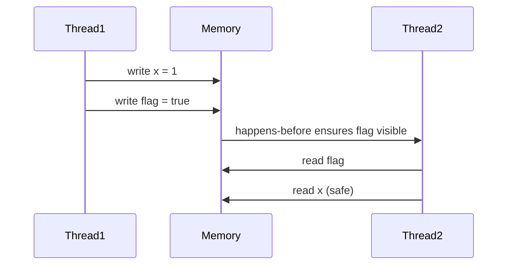

# Java Memory Model and Concurrency

## Overview

The Java Memory Model (JMM) defines how threads interact through memory. It ensures visibility and ordering of operations in concurrent programs. Key for writing thread-safe code in MAANG interviews.

## STAR Summary

**Situation:** Fixing race conditions in a multi-threaded server.

**Task:** Ensure thread safety without performance loss.

**Action:** Used volatile and synchronized, applied JMM principles.

**Result:** Eliminated data races, maintained throughput.

## Detailed Explanation

### JMM Concepts

- **Happens-Before:** Ordering of operations.

- **Visibility:** Changes by one thread visible to others.

- **Atomicity:** Operations as single units.

### Primitives

- **volatile:** Ensures visibility, no reordering.

- **synchronized:** Mutual exclusion, visibility.

- **Atomic Classes:** java.util.concurrent.atomic

## Real-world Examples & Use Cases

- Producer-consumer patterns.

- Caching with multiple readers.

- Shared counters in analytics.

## Code Examples

### Volatile Example

```java
public class VolatileExample {
    private volatile boolean flag = false;

    public void writer() {
        flag = true;
    }

    public void reader() {
        if (flag) {
            // Safe to read other variables
        }
    }
}
```

### Synchronized Block

```java
public class SynchronizedExample {
    private int count = 0;

    public synchronized void increment() {
        count++;
    }

    public int getCount() {
        synchronized (this) {
            return count;
        }
    }
}
```

### Atomic Integer

```java
import java.util.concurrent.atomic.AtomicInteger;

public class AtomicExample {
    private AtomicInteger count = new AtomicInteger(0);

    public void increment() {
        count.incrementAndGet();
    }

    public int getCount() {
        return count.get();
    }
}
```

## Data Models / Message Formats

Thread interaction diagram.

## Journey / Sequence



## Common Pitfalls & Edge Cases

- **Race Conditions:** Concurrent access without synchronization.

- **Deadlocks:** Circular waits.

- **Visibility Issues:** Stale reads.

- **Double-Checked Locking:** Without volatile.

## Tools & Libraries

- **java.util.concurrent:** Executors, locks.

- **Tools:** jstack for thread dumps.

## Github-README Links & Related Topics

Related: [Threads Executors Futures](../java/threads-executors-futures/README.md), [Concurrent Data Structures](../java/concurrent-data-structures/README.md), [Java Memory Model and Concurrency](../java/java-memory-model-and-concurrency/README.md)

## References

- [JMM Specification](https://docs.oracle.com/javase/specs/jls/se17/html/jls-17.html)

- [Java Concurrency in Practice](https://www.amazon.com/Java-Concurrency-Practice-Brian-Goetz/dp/0321349601)