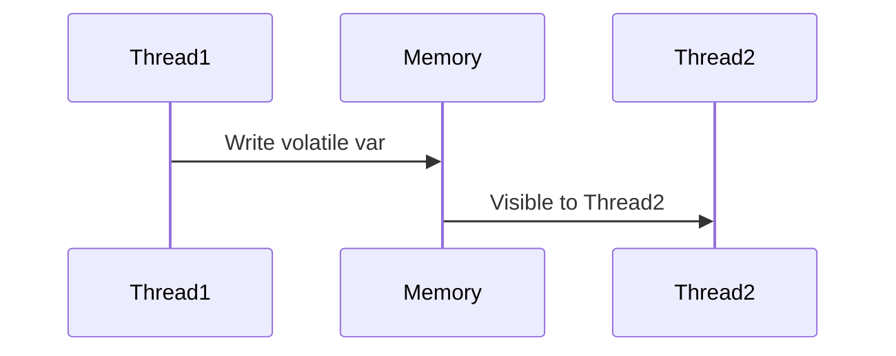

## Overview

The Java Memory Model (JMM) defines how threads interact with memory, ensuring visibility and ordering. Key concepts: happens-before, volatile, synchronized. Essential for concurrent programming in interviews, covering thread safety, race conditions, and performance.

## STAR Summary

**Situation:** Concurrent access to shared counter caused incorrect results.

**Task:** Fix race condition in multi-threaded code.

**Action:** Used AtomicInteger and synchronized blocks.

**Result:** Ensured thread safety, passed all tests.

## Detailed Explanation

### Threads and Synchronization

Threads: Lightweight processes. Use Runnable or Thread.

Synchronization: synchronized keyword for mutual exclusion.

Volatile: Ensures visibility of changes.

Atomic classes: For lock-free operations.

Happens-before: Guarantees order of operations.

## Real-world Examples & Use Cases

- Web servers handling concurrent requests.
- Producer-consumer patterns.
- Caching with thread-safe maps.

## Code Examples

### Synchronized Counter

```java
public class Counter {
    private int count = 0;
    public synchronized void increment() { count++; }
    public synchronized int getCount() { return count; }
}
```

### Volatile Example

```java
public class VolatileExample {
    private volatile boolean flag = false;
    public void setFlag() { flag = true; }
    public boolean isFlag() { return flag; }
}
```

### Atomic

```java
import java.util.concurrent.atomic.AtomicInteger;
AtomicInteger counter = new AtomicInteger(0);
counter.incrementAndGet();
```

## Data Models / Message Formats

Thread states: NEW, RUNNABLE, BLOCKED, WAITING, TIMED_WAITING, TERMINATED.

## Journey / Sequence



## Common Pitfalls & Edge Cases

- Deadlocks: Circular waits.
- Visibility issues without volatile.
- False sharing in arrays.

## Tools & Libraries

- java.util.concurrent package.
- Thread dumps with jstack.

## Github-README Links & Related Topics

[[threads-executors-futures]], [[concurrent-data-structures]], [[java-memory-model-and-concurrency]]

## References

- https://docs.oracle.com/javase/specs/jls/se11/html/jls-17.html
- https://www.oracle.com/technetwork/java/javase/memorymanagement-whitepaper-150215.pdf