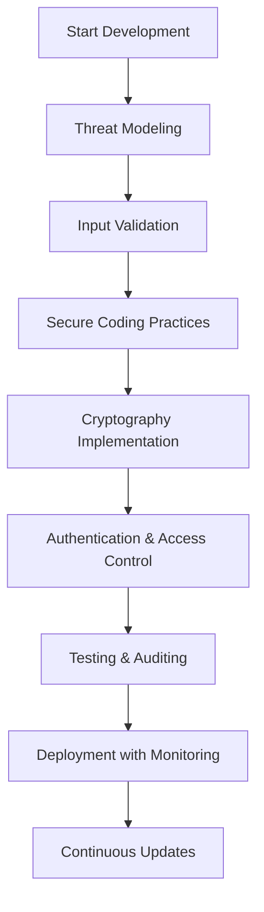

## Overview

Security best practices in Java are essential for developing robust, secure applications that protect against common vulnerabilities such as injection attacks, insecure cryptographic practices, and improper access controls. Java provides a comprehensive security framework through its APIs, tools, and built-in mechanisms, including the Java Cryptography Architecture (JCA), Java Authentication and Authorization Service (JAAS), and secure communication protocols like TLS. This guide outlines key practices drawn from authoritative sources like OWASP and Oracle's Java documentation, emphasizing prevention of injection, proper cryptography, authentication, and access control.

## Detailed Explanation

Java security encompasses multiple layers: language-level safety (e.g., type safety, garbage collection), runtime protections (e.g., bytecode verification), and APIs for cryptography, authentication, and secure communication. Key areas include:

- **Injection Prevention**: Avoid vulnerabilities like SQL injection, OS command injection, and XSS by using parameterized queries, input validation, and output sanitization.
- **Cryptography**: Use strong, standard algorithms (e.g., AES for encryption, SHA-256 for hashing) via JCA. Avoid custom implementations; prefer libraries like Google Tink for safety.
- **Authentication and Authorization**: Implement secure login mechanisms using JAAS, enforce least privilege, and validate user inputs.
- **Secure Communication**: Use TLS/SSL for data in transit, validate certificates, and avoid insecure protocols.
- **Access Control**: Employ Security Managers (though deprecated), permissions, and policies to restrict resource access.
- **Input Validation and Sanitization**: Always validate and sanitize user inputs using allowlists, escape outputs, and limit input sizes.
- **Error Handling and Logging**: Avoid leaking sensitive information in errors; use structured logging to prevent log injection.
- **Dependency Management**: Regularly update libraries to patch known vulnerabilities; use tools like OWASP Dependency-Check.

| Vulnerability | Best Practice | Example Tool/API |
|---------------|---------------|------------------|
| SQL Injection | Use PreparedStatement | java.sql.PreparedStatement |
| XSS | Sanitize outputs with OWASP Java Encoder | org.owasp.encoder.Encode |
| Weak Cryptography | Use AES-GCM via JCA | javax.crypto.Cipher |
| Insecure Authentication | Implement multi-factor authentication | JAAS LoginModules |
| Log Injection | Use parameterized logging | org.slf4j.Logger |

## Real-world Examples & Use Cases

- **Web Application Security**: In an e-commerce platform, prevent SQL injection by using JPA Criteria API instead of string concatenation for queries. This ensures user inputs like usernames are not executed as SQL commands.
- **API Security**: For REST APIs, enforce rate limiting and use OAuth2 for authentication. Validate JWT tokens securely using libraries like Nimbus JOSE.
- **Data Encryption**: In a healthcare app storing patient records, encrypt sensitive data at rest using AES-256 and manage keys via a Hardware Security Module (HSM) integrated with PKCS#11.
- **Microservices Communication**: Use mutual TLS (mTLS) for service-to-service authentication in a distributed system, preventing man-in-the-middle attacks.
- **Logging in Production**: Implement structured JSON logging with size limits to avoid log injection and ensure logs are tamper-proof.

## Code Examples

### Preventing SQL Injection with PreparedStatement

```java
import java.sql.Connection;
import java.sql.DriverManager;
import java.sql.PreparedStatement;
import java.sql.ResultSet;

// Secure query using parameterized statements
String query = "SELECT * FROM users WHERE username = ?";
try (Connection conn = DriverManager.getConnection(url);
     PreparedStatement stmt = conn.prepareStatement(query)) {
    stmt.setString(1, userInput);
    ResultSet rs = stmt.executeQuery();
    // Process results
} catch (Exception e) {
    // Handle exception securely
}
```

### Input Validation and Sanitization

```java
import org.owasp.encoder.Encode;

// Validate input
if (userInput.matches("[a-zA-Z0-9]{1,50}")) {
    // Sanitize output for HTML
    String safeOutput = Encode.forHtml(userInput);
    // Use safeOutput in response
}
```

### Secure Encryption with JCA

```java
import javax.crypto.Cipher;
import javax.crypto.KeyGenerator;
import javax.crypto.SecretKey;
import javax.crypto.spec.GCMParameterSpec;
import java.security.SecureRandom;

// Generate AES key
KeyGenerator keyGen = KeyGenerator.getInstance("AES");
keyGen.init(256);
SecretKey key = keyGen.generateKey();

// Encrypt data
Cipher cipher = Cipher.getInstance("AES/GCM/NoPadding");
byte[] iv = new byte[12];
new SecureRandom().nextBytes(iv);
GCMParameterSpec spec = new GCMParameterSpec(128, iv);
cipher.init(Cipher.ENCRYPT_MODE, key, spec);
byte[] encrypted = cipher.doFinal(plaintext.getBytes());
```

### Secure Logging with SLF4J

```java
import org.slf4j.Logger;
import org.slf4j.LoggerFactory;

Logger logger = LoggerFactory.getLogger(MyClass.class);
// Parameterized logging to prevent injection
logger.info("User {} logged in from {}", username, ipAddress);
```

## References

- [OWASP Java Security Cheat Sheet](https://cheatsheetseries.owasp.org/cheatsheets/Java_Security_Cheat_Sheet.html)
- [Oracle Java Security Overview](https://docs.oracle.com/en/java/javase/21/security/java-security-overview1.html)
- [Oracle Java SE Security](https://www.oracle.com/java/technologies/javase/javase-tech-security.html)
- [OWASP Top Ten](https://owasp.org/www-project-top-ten/)
- [Java Cryptography Architecture](https://docs.oracle.com/en/java/javase/21/security/java-cryptography-architecture-jca-reference-guide.html)

## Github-README Links & Related Topics

- [Java Fundamentals](../java-fundamentals/)
- [Java Authentication Methods](../api-authentication-methods/)
- [API Security Best Practices](../api-security-best-practices/)
- [Cryptography Basics](../cryptography-basics/)
- [Logging Frameworks](../logging-frameworks/)

## STAR Summary

**Situation**: Developing a Java web application handling user data and payments, vulnerable to injection and weak encryption.  
**Task**: Implement security best practices to prevent breaches.  
**Action**: Applied input validation, used PreparedStatement for queries, encrypted data with AES-GCM, and enforced TLS.  
**Result**: Reduced vulnerabilities, passed security audits, and ensured compliance with standards like PCI-DSS.

## Journey / Sequence

1. **Assessment**: Identify assets and threats using threat modeling.
2. **Design**: Incorporate security in architecture (e.g., defense in depth).
3. **Implementation**: Follow practices like parameterized queries and secure crypto.
4. **Testing**: Use static analysis tools (e.g., SpotBugs) and penetration testing.
5. **Deployment**: Enable security headers, monitor logs, and update dependencies.
6. **Maintenance**: Regularly review and patch based on CVE alerts.

## Data Models / Message Formats

- **JWT for Tokens**: Use compact JSON format for claims, signed with HMAC or RSA.
- **X.509 Certificates**: Standard for PKI, containing public key and identity.
- **Policy Files**: Java policy syntax for permissions, e.g., `grant { permission java.io.FilePermission "/tmp/*", "read"; };`

## Common Pitfalls & Edge Cases

- **Hardcoded Secrets**: Never embed keys in code; use environment variables or key stores.
- **Weak Randomness**: Use SecureRandom instead of Random for crypto operations.
- **Certificate Validation**: Always check certificate chains and revocation status via OCSP.
- **Thread Safety**: Ensure crypto operations are thread-safe; avoid sharing Cipher instances.
- **Legacy Code**: Refactor deprecated APIs like SecurityManager to modern alternatives.

## Tools & Libraries

- **OWASP Java Encoder**: For output encoding.
- **Google Tink**: Simplified crypto library.
- **Bouncy Castle**: Extended crypto provider.
- **SpotBugs/FindSecBugs**: Static analysis for security issues.
- **Keytool/Jarsigner**: For key and certificate management.

