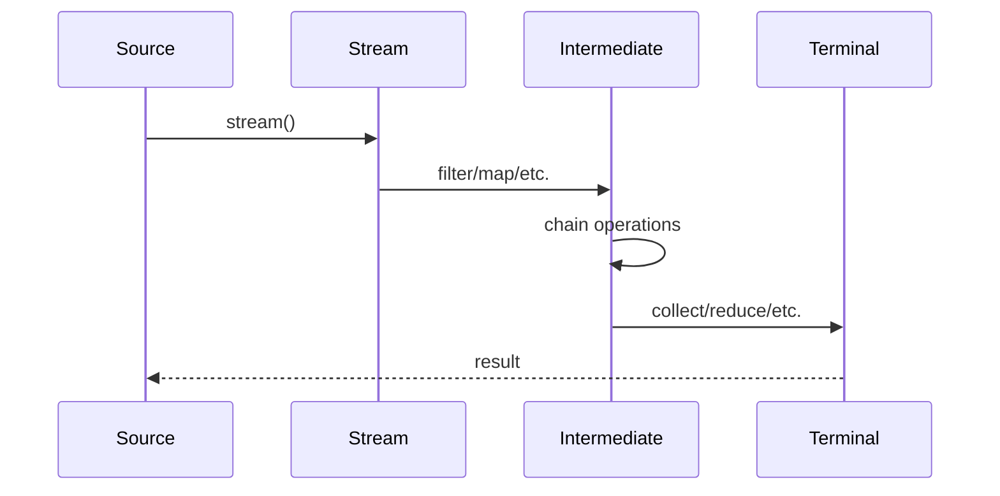
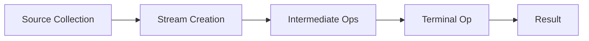

## Overview
The Java Stream API, introduced in Java 8, revolutionizes data processing by providing a functional programming approach to collections. It enables declarative, composable operations like filtering, mapping, and reducing, making code more readable, maintainable, and amenable to parallel execution.

## Detailed Explanation
Streams represent a sequence of elements supporting sequential and parallel aggregate operations. Key characteristics:
- **Lazy Evaluation:** Intermediate operations are not executed until a terminal operation is invoked.
- **Non-Mutating:** Streams don't modify the source collection.
- **Composable:** Operations can be chained fluently.

### Stream Operations
- **Intermediate Operations:** Return a new stream (lazy).
  - `filter(Predicate)`: Select elements matching a condition.
  - `map(Function)`: Transform elements.
  - `flatMap(Function)`: Flatten nested structures.
  - `sorted(Comparator)`: Sort elements.
  - `distinct()`: Remove duplicates.
  - `limit(long)`: Truncate stream.
  - `skip(long)`: Skip initial elements.
- **Terminal Operations:** Produce a result or side-effect.
  - `forEach(Consumer)`: Perform action on each element.
  - `collect(Collector)`: Accumulate elements into a collection.
  - `reduce(BinaryOperator)`: Combine elements.
  - `count()`: Count elements.
  - `anyMatch(Predicate)`: Check if any element matches.
  - `allMatch(Predicate)`: Check if all elements match.
  - `noneMatch(Predicate)`: Check if no elements match.
  - `findFirst()`: Get first element.
  - `findAny()`: Get any element.

### Parallel Streams
Streams can be executed in parallel using `parallelStream()` or `stream().parallel()`, leveraging multiple cores for better performance on large datasets.

## Real-world Examples & Use Cases
- **Data Filtering and Transformation:** Process user lists, filter active users, transform to DTOs.
- **Aggregation:** Calculate statistics like average salary from employee data.
- **Grouping and Partitioning:** Group products by category, partition into expensive/cheap.
- **File Processing:** Read and process large files line-by-line.
- **Database Query Simulation:** Chain operations mimicking SQL queries.

## Code Examples
### Basic Filtering and Mapping
```java
import java.util.Arrays;
import java.util.List;
import java.util.stream.Collectors;

List<String> names = Arrays.asList("Alice", "Bob", "Charlie", "David");
List<String> filteredNames = names.stream()
    .filter(name -> name.length() > 3)
    .map(String::toUpperCase)
    .collect(Collectors.toList());
System.out.println(filteredNames); // [ALICE, CHARLIE, DAVID]
```

### Aggregation with Reduce
```java
List<Integer> numbers = Arrays.asList(1, 2, 3, 4, 5);
int sum = numbers.stream()
    .reduce(0, Integer::sum);
System.out.println(sum); // 15
```

### Grouping and Collecting
```java
import java.util.Map;
import static java.util.stream.Collectors.groupingBy;

class Product {
    String name;
    String category;
    double price;
    Product(String name, String category, double price) {
        this.name = name; this.category = category; this.price = price;
    }
}

List<Product> products = Arrays.asList(
    new Product("Laptop", "Electronics", 1000),
    new Product("Book", "Education", 20),
    new Product("Phone", "Electronics", 500)
);

Map<String, List<Product>> grouped = products.stream()
    .collect(groupingBy(p -> p.category));
System.out.println(grouped); // {Electronics=[Laptop, Phone], Education=[Book]}
```

### Parallel Stream for Performance
```java
List<Integer> largeList = // ... large list of integers
long count = largeList.parallelStream()
    .filter(n -> n % 2 == 0)
    .count();
```

### Custom Collector
```java
import java.util.stream.Collector;
import static java.util.stream.Collectors.*;

String joined = names.stream()
    .collect(Collectors.joining(", "));
System.out.println(joined); // Alice, Bob, Charlie, David
```

## Journey / Sequence


## Data Models / Message Formats
### Stream Pipeline Flow


### JSON-like Stream Processing
```json
{
  "pipeline": [
    {"operation": "filter", "condition": "age > 18"},
    {"operation": "map", "transform": "toUpperCase"},
    {"operation": "collect", "type": "toList"}
  ]
}
```

## Common Pitfalls & Edge Cases
- **Stateful Operations:** Avoid modifying external state in lambdas; use stateless operations.
- **Infinite Streams:** `iterate()` or `generate()` can create infinite streams; use `limit()`.
- **Null Handling:** Streams throw NPE on null sources; handle nulls explicitly.
- **Parallel Pitfalls:** Side effects in parallel streams can cause race conditions.
- **Performance:** For small datasets, streams may be slower due to overhead; benchmark.
- **Edge Case:** Empty streams, single-element streams, large datasets.

## Tools & Libraries
- Java Stream API (java.util.stream)
- Apache Commons Lang for functional utilities
- Vavr for functional programming extensions
- Reactor for reactive streams

## Github-README Links & Related Topics
- [java/java-language-basics](../java-language-basics/)
- [java/threads-executors-futures](../threads-executors-futures/)
- [java/java-streams-advanced](../java-streams-advanced/)

## References
- Oracle Java Streams Tutorial: https://docs.oracle.com/javase/8/docs/api/java/util/stream/package-summary.html
- "Functional Programming in Java" by Venkat Subramaniam
- Baeldung Streams Guide: https://www.baeldung.com/java-8-streams
- https://github.com/eugenp/tutorials/tree/master/core-java-modules/core-java-streams