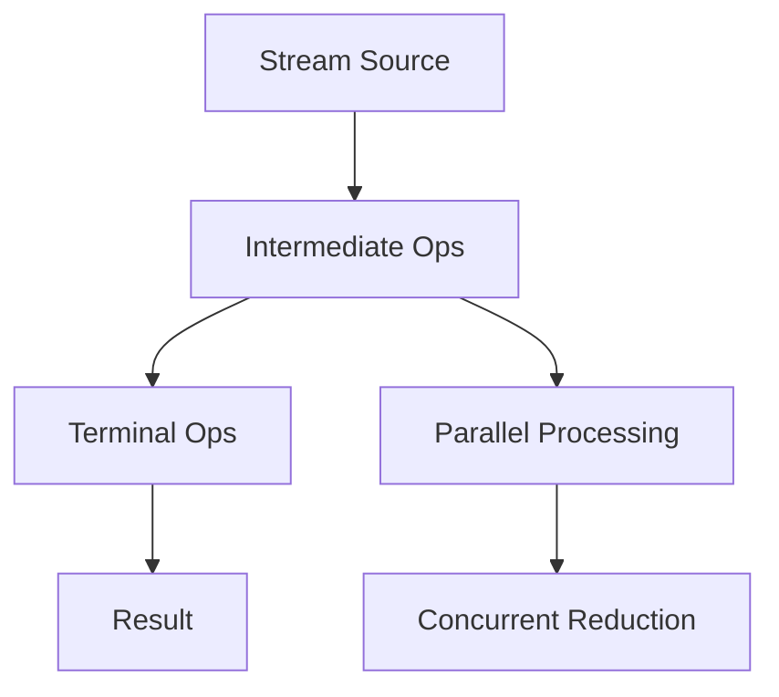
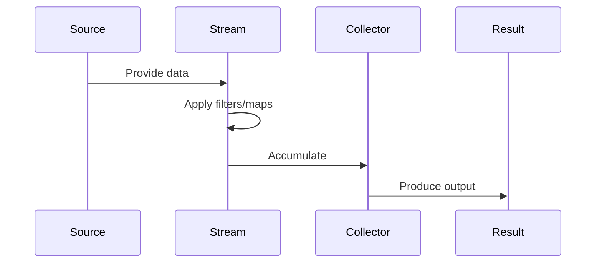

# Overview

Advanced Java Streams API features enable complex data transformations, aggregations, and parallel processing. Crucial for efficient functional programming in Java.

Canonical Interview Prompt: Implement a solution using streams to group a list of transactions by category and sum amounts, handling parallel execution.

# Detailed Explanation

## High-Level Design

Streams provide lazy evaluation, allowing efficient processing of large datasets. Advanced features include custom collectors, parallel streams, and reduction operations.



## Key Concepts

- **Collectors**: Accumulate stream elements into collections, maps, or custom structures.
- **Parallel Streams**: Automatic parallelization for CPU-intensive tasks.
- **Reduction**: Combine elements into a single result (e.g., sum, max).
- **Grouping/Partitioning**: Organize data by criteria.

## Capacity and Throughput Targets

- Sequential streams: Process 10k-100k elements/second depending on operation complexity.
- Parallel streams: Scale with CPU cores; up to 10x speedup for CPU-bound tasks.

## Tradeoffs

- **Parallel vs Sequential**: Parallel adds overhead; use for large datasets or CPU-intensive ops.
- **Stateful Operations**: Collectors like groupingBy can be memory-intensive.
- **Order Preservation**: Some operations don't guarantee order in parallel streams.

# Real-world Examples & Use Cases

- **Data Analytics**: Grouping sales data by region and calculating totals.
- **Log Processing**: Filtering and aggregating log entries by severity.
- **Batch Processing**: Parallel transformation of large datasets.

# Code Examples

**Grouping and Summing:**

```java
import java.util.stream.Collectors;
import java.util.List;

List<Transaction> transactions = // ... load data

Map<String, Double> categorySums = transactions.stream()
    .collect(Collectors.groupingBy(Transaction::getCategory,
             Collectors.summingDouble(Transaction::getAmount)));
```

**Custom Collector:**

```java
Collector<Transaction, ?, Map<String, List<Transaction>>> customCollector =
    Collectors.groupingBy(Transaction::getCategory);

Map<String, List<Transaction>> grouped = transactions.stream()
    .collect(customCollector);
```

**Parallel Stream Reduction:**

```java
double total = transactions.parallelStream()
    .mapToDouble(Transaction::getAmount)
    .sum();
```

**Partitioning:**

```java
Map<Boolean, List<Transaction>> partitioned = transactions.stream()
    .collect(Collectors.partitioningBy(t -> t.getAmount() > 1000));
```

# Data Models / Message Formats

**Transaction Class:**

```java
public class Transaction {
    private String category;
    private double amount;
    // getters
}
```

**Stream Pipeline:**

Source -> Filter -> Map -> Collect

# Journey / Sequence



# Common Pitfalls & Edge Cases

- **Infinite Streams**: Avoid with limit() to prevent memory issues.
- **Side Effects**: Pure functions only; avoid modifying external state.
- **Parallel Pitfalls**: Ensure thread-safety in custom operations.

# Tools & Libraries

- Java Stream API
- StreamEx library for additional utilities

# Github-README Links & Related Topics

[streams-functional-java](../streams-functional-java/README.md), [collections-framework](../collections-framework/README.md)

# References

- https://docs.oracle.com/javase/8/docs/api/java/util/stream/package-summary.html
- https://www.baeldung.com/java-8-streams
- https://docs.oracle.com/javase/tutorial/collections/streams/