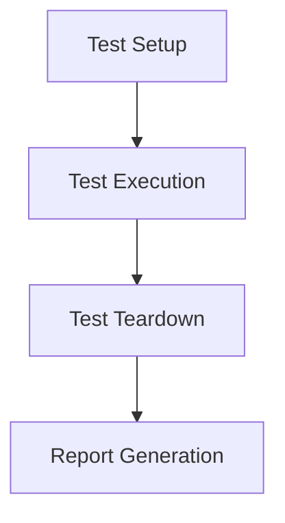

## Overview

Advanced Java testing encompasses sophisticated techniques for unit, integration, and performance testing. This includes parameterized tests, mocking frameworks, containerized testing, and microbenchmarking to ensure robust, maintainable code.

## Detailed Explanation

### JUnit 5

JUnit 5 introduces modern testing features:

- **Parameterized Tests**: Run the same test with different inputs using @ParameterizedTest and sources like @ValueSource.
- **Dynamic Tests**: Generate tests at runtime using @TestFactory.
- **Nested Tests**: Organize tests hierarchically with @Nested.
- **Extensions**: Customize test behavior with extensions API.
- **Conditional Execution**: Run tests based on conditions with @EnabledIf.
- **Parallel Execution**: Run tests in parallel for faster suites.

### Mockito

Mockito provides powerful mocking capabilities:

- **Mocking**: Create mock objects to simulate dependencies.
- **Stubbing**: Define behavior for mock methods.
- **Verification**: Check interactions with mocks.
- **Spies**: Partially mock real objects.
- **Annotations**: Use @Mock, @InjectMocks for declarative mocking.

### TestNG

TestNG offers advanced testing features:

- **Data Providers**: Supply test data with @DataProvider.
- **Groups**: Categorize tests with groups.
- **Dependencies**: Control test execution order with dependsOnMethods.
- **Listeners**: Implement custom listeners for test events.

### Spring Boot Testing

Spring Boot provides testing support for integration tests, including @SpringBootTest, test slices, and embedded databases.

### JMH (Java Microbenchmark Harness)

JMH is used for accurate microbenchmarking:

- **Setup**: Annotate methods with @Benchmark.
- **Modes**: Throughput, AverageTime, etc.
- **Profiling**: Analyze performance bottlenecks.

### Testcontainers

Testcontainers enable integration testing with real dependencies in containers:

- **Containerized Testing**: Spin up databases, message queues in Docker.
- **Lifecycle Management**: Automatic start/stop of containers.
- **Modules**: Pre-built modules for common services.

## Real-world Examples & Use Cases

- Parameterized tests for validating algorithms with multiple inputs.
- Mocking external services in microservices.
- Containerized integration tests for database interactions.
- Microbenchmarking critical performance paths.

## Code Examples

```java
// JUnit 5 Parameterized Test
@ParameterizedTest
@ValueSource(ints = {1, 2, 3})
void testIsPositive(int number) {
    assertTrue(number > 0);
}
```

```java
// Mockito with Annotations
@ExtendWith(MockitoExtension.class)
public class ServiceTest {
    @Mock
    private Repository repo;
    @InjectMocks
    private Service service;

    @Test
    void test() {
        when(repo.find()).thenReturn("data");
        assertEquals("data", service.get());
    }
}
```

```java
// TestNG Data Provider
@DataProvider
public Object[][] data() {
    return new Object[][] {{1, 2}, {3, 4}};
}

@Test(dataProvider = "data")
public void testAdd(int a, int b) {
    assertEquals(a + b, calc.add(a, b));
}
```

```java
// JMH Benchmark
@Benchmark
public void testMethod() {
    // code to benchmark
}
```

```java
// Testcontainers Example
@Testcontainers
public class DatabaseTest {
    @Container
    PostgreSQLContainer<?> postgres = new PostgreSQLContainer<>("postgres:13");

    @Test
    void test() {
        // test with real DB
    }
}
```

## Mermaid Diagram



## Common Pitfalls & Edge Cases

- Ignoring test isolation leading to flaky tests.
- Overusing mocks instead of integration tests.
- Not handling asynchronous code in tests.
- Benchmarking without proper warmup.

## Tools & Libraries

| Tool | Purpose |
|------|---------|
| JUnit 5 | Unit testing framework |
| Mockito | Mocking library |
| TestNG | Advanced testing framework |
| JMH | Microbenchmarking |
| Testcontainers | Containerized testing |

## References

- [JUnit 5 User Guide](https://junit.org/junit5/docs/current/user-guide/)
- [Mockito Docs](https://javadoc.io/doc/org.mockito/mockito-core/latest/org/mockito/Mockito.html)
- [TestNG Docs](https://testng.org/doc/)
- [JMH](https://openjdk.org/projects/code-tools/jmh/)
- [Testcontainers](https://www.testcontainers.org/)

## Github-README Links & Related Topics

- [Java Fundamentals](../java-fundamentals/README.md)
- [Spring Framework](../spring-framework/README.md)
- [Microservices Architecture](../microservices-architecture/README.md)