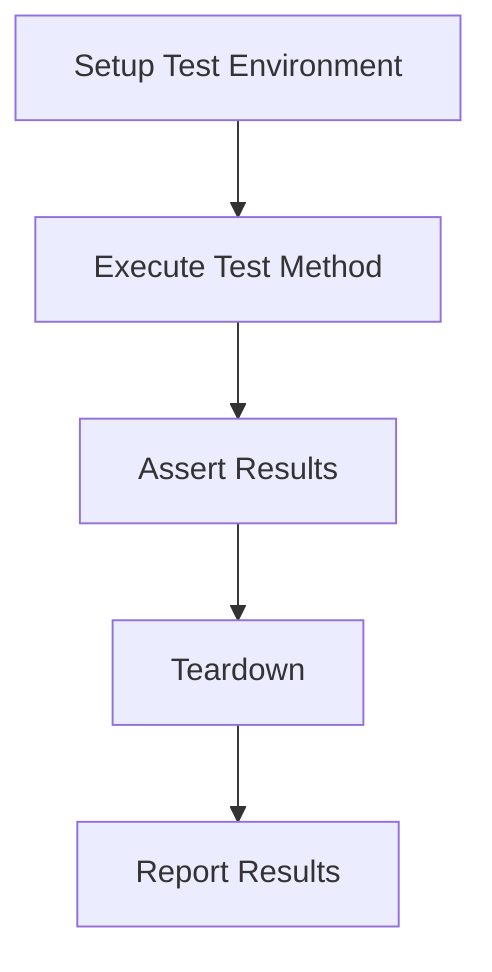

# Overview

Java testing frameworks are essential tools for writing, executing, and managing automated tests in Java applications. They help ensure code reliability, facilitate refactoring, and support continuous integration. Popular frameworks include JUnit, TestNG, and Mockito for mocking.

# Detailed Explanation

## JUnit
JUnit is the de facto standard for unit testing in Java. It provides annotations for test methods and assertions for verifying expected behavior.

Key features:
- Annotations: @Test, @BeforeEach, @AfterEach, @BeforeAll, @AfterAll
- Assertions: assertEquals, assertTrue, assertThrows
- Test suites and parameterized tests

## TestNG
TestNG is an advanced testing framework inspired by JUnit but with additional features like parallel execution, data-driven testing, and dependency management.

Key features:
- XML configuration for test suites
- Groups and dependencies
- Parallel test execution
- Built-in reporting

## Mockito
Mockito is a mocking framework used to create mock objects for testing. It allows isolating the code under test by simulating dependencies.

Key features:
- Easy mock creation with @Mock annotation
- Verification of interactions
- Stubbing methods

## Comparison Table

| Framework | Purpose | Key Features |
|-----------|---------|--------------|
| JUnit | Unit Testing | Annotations, Assertions, Parameterized Tests |
| TestNG | Advanced Testing | Parallel Execution, Data Providers, Groups |
| Mockito | Mocking | Mock Creation, Verification, Stubbing |

## Test Lifecycle



# Real-world Examples & Use Cases

- **E-commerce Application**: Use JUnit for testing business logic like price calculations, Mockito for mocking payment gateways.
- **Microservices**: TestNG for integration tests with parallel execution to simulate concurrent requests.
- **Legacy Code Refactoring**: Mockito to mock dependencies when testing isolated components.

# Code Examples

## JUnit Example

```java
import org.junit.jupiter.api.Test;
import static org.junit.jupiter.api.Assertions.*;

public class CalculatorTest {
    private Calculator calculator = new Calculator();

    @Test
    void testAddition() {
        assertEquals(5, calculator.add(2, 3));
    }

    @Test
    void testDivisionByZero() {
        assertThrows(ArithmeticException.class, () -> calculator.divide(1, 0));
    }
}
```

## TestNG Example

```java
import org.testng.annotations.Test;
import org.testng.annotations.DataProvider;

public class CalculatorTestNG {
    @DataProvider(name = "additionData")
    public Object[][] additionData() {
        return new Object[][] {{2, 3, 5}, {0, 0, 0}, {-1, 1, 0}};
    }

    @Test(dataProvider = "additionData")
    public void testAddition(int a, int b, int expected) {
        Calculator calc = new Calculator();
        assert calc.add(a, b) == expected;
    }
}
```

## Mockito Example

```java
import org.junit.jupiter.api.Test;
import org.mockito.Mockito;
import static org.mockito.Mockito.*;

public class UserServiceTest {
    @Test
    void testCreateUser() {
        UserRepository mockRepo = mock(UserRepository.class);
        UserService service = new UserService(mockRepo);

        User user = new User("John");
        service.createUser(user);

        verify(mockRepo).save(user);
    }
}
```

# Common Pitfalls & Edge Cases

- Forgetting to reset mocks between tests
- Testing implementation details instead of behavior
- Not handling asynchronous code properly in tests

# Tools & Libraries

- JUnit: https://junit.org/
- TestNG: https://testng.org/
- Mockito: https://site.mockito.org/

# References

- [JUnit 5 User Guide](https://junit.org/junit5/docs/current/user-guide/)
- [TestNG Documentation](https://testng.org/doc/)
- [Mockito Documentation](https://javadoc.io/doc/org.mockito/mockito-core/latest/org/mockito/Mockito.html)

# Github-README Links & Related Topics

- [JUnit GitHub](https://github.com/junit-team/junit5)
- [TestNG GitHub](https://github.com/cbeust/testng)
- [Mockito GitHub](https://github.com/mockito/mockito)
- Related: [Java Fundamentals](../java-fundamentals/)
- Related: [Java Multithreading and Concurrency](../java-multithreading-and-concurrency/)