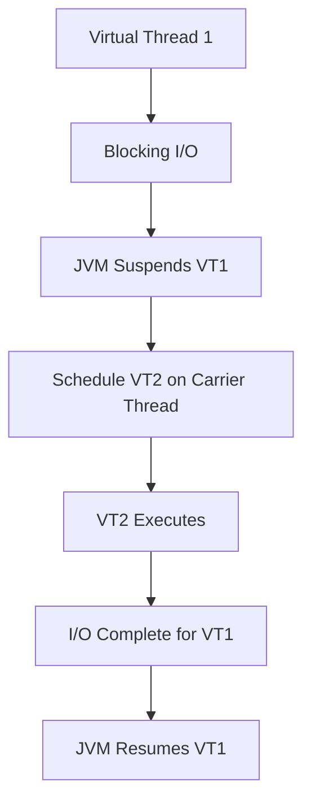

## Overview

Java Virtual Threads, introduced as part of Project Loom in Java 21, represent a revolutionary approach to concurrency in the Java platform. Unlike traditional platform threads that map directly to OS threads, virtual threads are lightweight, managed by the JVM, and allow for efficient handling of high-concurrency applications without the overhead of native threads.

Virtual threads enable writing concurrent code using familiar thread-based APIs while achieving scalability comparable to asynchronous programming models. They are particularly beneficial for I/O-bound applications where threads spend significant time waiting for external resources.

## Detailed Explanation

### How Virtual Threads Work

Virtual threads are implemented as a continuation-based mechanism within the JVM. When a virtual thread encounters a blocking operation, the JVM can suspend the virtual thread and schedule another one to run on the same platform thread. This is known as "carrier thread" scheduling.



### Key Characteristics

1. **Lightweight**: Virtual threads have minimal memory footprint (typically ~1KB vs ~1MB for platform threads)
2. **Cheap to Create**: Instantiation is fast and doesn't require OS resources
3. **Unlimited Scalability**: Applications can create millions of virtual threads without exhausting system resources
4. **Familiar API**: Uses standard `Thread` and `ExecutorService` APIs

### Thread Scheduling

Virtual threads use a work-stealing fork-join pool as the default scheduler. The JVM automatically manages the mapping of virtual threads to platform threads based on available parallelism.

## Real-world Examples & Use Cases

### High-Concurrency Web Servers

Virtual threads excel in scenarios where servers need to handle thousands of concurrent connections:

```java
public class VirtualThreadWebServer {
    public static void main(String[] args) throws IOException {
        var server = HttpServer.create(new InetSocketAddress(8080), 0);
        server.createContext("/api", exchange -> {
            // Each request runs on a virtual thread
            try (var input = exchange.getRequestBody();
                 var output = exchange.getResponseBody()) {
                
                // Simulate I/O-bound work
                Thread.sleep(100); // Blocking operations are cheap
                
                var response = "Hello from virtual thread: " + Thread.currentThread();
                exchange.sendResponseHeaders(200, response.length());
                output.write(response.getBytes());
            } catch (InterruptedException e) {
                Thread.currentThread().interrupt();
            }
        });
        server.start();
    }
}
```

### Database Connection Pooling

Traditional connection pooling with platform threads can be inefficient. Virtual threads allow creating connection-per-request patterns:

```java
public class DatabaseService {
    private final DataSource dataSource;
    
    public CompletableFuture<List<User>> getUsersAsync() {
        return CompletableFuture.supplyAsync(() -> {
            try (var conn = dataSource.getConnection();
                 var stmt = conn.createStatement();
                 var rs = stmt.executeQuery("SELECT * FROM users")) {
                
                var users = new ArrayList<User>();
                while (rs.next()) {
                    users.add(new User(rs.getString("name"), rs.getString("email")));
                }
                return users;
            } catch (SQLException e) {
                throw new RuntimeException(e);
            }
        });
    }
}
```

### Microservices Communication

In microservices architectures, virtual threads simplify inter-service communication:

```java
public class MicroserviceClient {
    private final HttpClient client = HttpClient.newHttpClient();
    
    public List<Order> getOrdersForUser(String userId) {
        var futures = List.of(
            fetchOrdersFromServiceA(userId),
            fetchOrdersFromServiceB(userId),
            fetchOrdersFromServiceC(userId)
        );
        
        return futures.stream()
            .map(CompletableFuture::join)
            .flatMap(List::stream)
            .collect(Collectors.toList());
    }
    
    private CompletableFuture<List<Order>> fetchOrdersFromServiceA(String userId) {
        return CompletableFuture.supplyAsync(() -> {
            // Virtual thread handles blocking HTTP call efficiently
            var request = HttpRequest.newBuilder()
                .uri(URI.create("http://service-a/orders?user=" + userId))
                .build();
            
            try {
                var response = client.send(request, HttpResponse.BodyHandlers.ofString());
                return parseOrders(response.body());
            } catch (IOException | InterruptedException e) {
                throw new RuntimeException(e);
            }
        });
    }
}
```

## Code Examples

### Basic Virtual Thread Creation

```java
// Using Thread.ofVirtual()
Thread virtualThread = Thread.ofVirtual().start(() -> {
    System.out.println("Running on virtual thread: " + Thread.currentThread());
});

// Using Thread.startVirtualThread() (Java 21+)
Thread virtualThread2 = Thread.startVirtualThread(() -> {
    System.out.println("Another virtual thread");
});

// Using ExecutorService
try (var executor = Executors.newVirtualThreadPerTaskExecutor()) {
    executor.submit(() -> {
        System.out.println("Task on virtual thread");
    });
}
```

### Structured Concurrency with Virtual Threads

```java
public class StructuredConcurrencyExample {
    public static void main(String[] args) throws InterruptedException {
        try (var scope = new StructuredTaskScope.ShutdownOnFailure()) {
            var task1 = scope.fork(() -> fetchData("service1"));
            var task2 = scope.fork(() -> fetchData("service2"));
            
            scope.join();
            scope.throwIfFailed();
            
            var result1 = task1.get();
            var result2 = task2.get();
            
            System.out.println("Results: " + result1 + ", " + result2);
        }
    }
    
    private static String fetchData(String service) {
        // Simulate network call
        try {
            Thread.sleep(100);
        } catch (InterruptedException e) {
            Thread.currentThread().interrupt();
        }
        return "Data from " + service;
    }
}
```

### Migration from Platform Threads

```java
// Before: Platform threads
ExecutorService executor = Executors.newCachedThreadPool();
Future<String> future = executor.submit(() -> {
    // Blocking I/O
    return httpClient.get("http://api.example.com/data");
});

// After: Virtual threads
ExecutorService executor = Executors.newVirtualThreadPerTaskExecutor();
Future<String> future = executor.submit(() -> {
    // Same blocking I/O, but efficient
    return httpClient.get("http://api.example.com/data");
});
```

## Common Pitfalls & Edge Cases

### Thread-Local Variables

Virtual threads do not inherit thread-local variables from parent threads by default. This can cause issues with frameworks that rely on thread-local storage:

```java
// Problematic: Thread-local not propagated
ThreadLocal<String> userContext = new ThreadLocal<>();
userContext.set("user123");

Thread.ofVirtual().start(() -> {
    System.out.println(userContext.get()); // null
});
```

**Solution**: Use structured concurrency or explicitly pass context.

### Pinning Issues

Virtual threads can get "pinned" to platform threads when executing native code or synchronized blocks, reducing efficiency:

```java
// Potential pinning
synchronized (this) {
    // Long-running synchronized block pins virtual thread
    Thread.sleep(1000);
}
```

**Mitigation**: Prefer `ReentrantLock` or avoid long synchronized blocks.

### Debugging Challenges

Virtual thread stack traces can be complex due to frequent suspension/resumption:

```java
// Enable virtual thread debugging
java -Djdk.traceVirtualThreadLocals=true -jar app.jar
```

## Tools & Libraries

### JDK Tools

- **jcmd**: Monitor virtual thread usage
  ```bash
  jcmd <pid> Thread.dump_to_file -format=json threads.json
  ```

- **jstack**: Enhanced to show virtual thread information
  ```bash
  jstack -V <pid>
  ```

### Frameworks Supporting Virtual Threads

- **Spring Boot 3.2+**: Native support for virtual threads in web controllers
- **Quarkus**: Integration with virtual threads for reactive programming
- **Micronaut**: Virtual thread support in HTTP clients

### Monitoring

- **JDK Flight Recorder**: Events for virtual thread lifecycle
- **Micrometer**: Metrics for virtual thread pools

## References

- [JEP 444: Virtual Threads](https://openjdk.org/jeps/444)
- [Project Loom Documentation](https://wiki.openjdk.org/display/loom/Main)
- [Java Virtual Threads: Under the Hood](https://www.infoq.com/articles/java-virtual-threads/)
- [Virtual Threads in Action](https://www.manning.com/books/virtual-threads-in-action)

## Github-README Links & Related Topics

- [java-multithreading-and-concurrency](java-multithreading-and-concurrency/README.md)
- [java-structured-concurrency](java-structured-concurrency/README.md)
- [concurrency-and-parallelism](concurrency-and-parallelism/README.md)
- [java-executorservice](java-executorservice/README.md)
