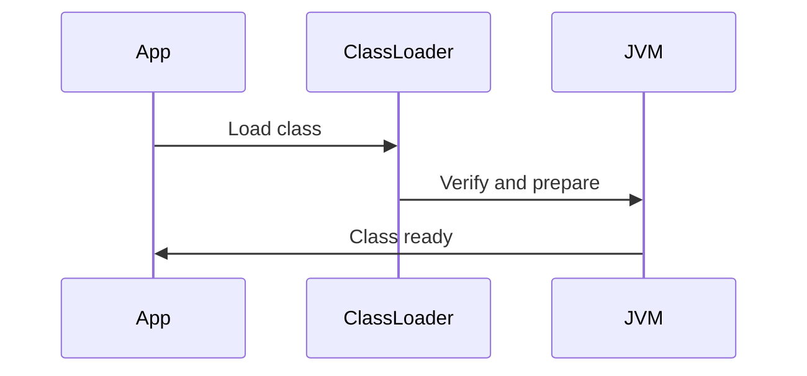

## Overview

The Java Virtual Machine (JVM) is the runtime environment that executes Java bytecode. Key components include class loading, memory management, and execution. Classloading loads .class files into memory, resolving dependencies. Understanding JVM internals is crucial for performance tuning, debugging, and interviews, as it explains portability and memory models.

## STAR Summary

**Situation:** A microservice was experiencing OutOfMemory errors in production.

**Task:** Diagnose and fix JVM memory issues.

**Action:** Analyzed heap dumps, adjusted GC settings, and optimized classloading.

**Result:** Reduced memory usage by 40%, stabilized the service.

## Detailed Explanation

### JVM Architecture

- **Class Loader Subsystem:** Loads classes, verifies bytecode, prepares runtime data.

- **Runtime Data Areas:** Method area, heap, stack, PC registers, native method stacks.

- **Execution Engine:** Interprets or JIT-compiles bytecode.

- **Native Interface:** Interacts with native libraries.

### Class Loading Process

1. Loading: Find and load .class file.

2. Linking: Verification, preparation, resolution.

3. Initialization: Execute static blocks.

Class loaders: Bootstrap, Extension, System (Application).

## Real-world Examples & Use Cases

- Custom class loaders for plugin systems.
- Hotswapping in development tools.
- Security: Isolating untrusted code.

## Code Examples

### Custom Class Loader

```java
public class CustomClassLoader extends ClassLoader {
    @Override
    public Class<?> findClass(String name) throws ClassNotFoundException {
        // Load bytecode from custom source
        byte[] b = loadClassData(name);
        return defineClass(name, b, 0, b.length);
    }
}
```

### JVM Flags

Run with: `java -Xms512m -Xmx1024m -XX:+UseG1GC Main`

## Data Models / Message Formats

Class loading sequence as table:

| Step | Description |
|------|-------------|
| Loading | Load class file |
| Verification | Check bytecode validity |
| Preparation | Allocate memory for static fields |
| Resolution | Resolve symbolic references |
| Initialization | Run static initializers |

## Journey / Sequence



## Common Pitfalls & Edge Cases

- ClassNotFoundException vs NoClassDefFoundError.
- PermGen/Metaspace exhaustion.
- Class loader leaks in application servers.

## Common Interview Questions

1. What is the JVM?

   Java Virtual Machine, executes bytecode.

2. Explain class loading.

   Loading, linking, initialization.

3. What are the types of class loaders?

   Bootstrap, Extension, System.

4. What is the difference between JDK and JRE?

   JDK includes development tools, JRE for running.

5. What is bytecode?

   Intermediate code compiled from Java source.

## Tools & Libraries

- VisualVM for monitoring.
- JConsole for JMX.
- Bytecode viewers like javap.

## Github-README Links & Related Topics

[[java-language-basics]], [[garbage-collection-algorithms]], [[java-memory-model-and-concurrency]], [[performance-tuning-and-profiling]]

## References

- https://docs.oracle.com/javase/specs/jvms/se11/html/
- https://www.oracle.com/technetwork/java/javase/tech/index-jsp-136373.html