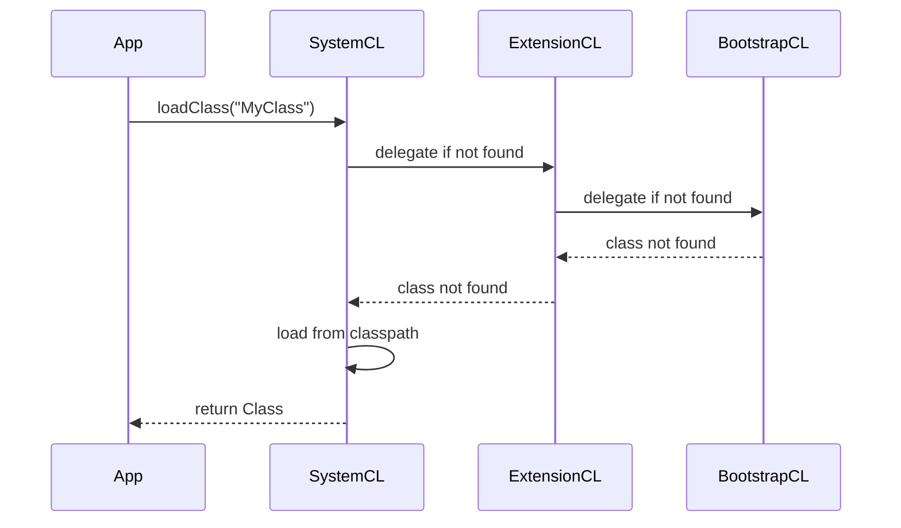

# JVM Internals and Classloading

## Overview

The Java Virtual Machine (JVM) is the runtime environment for Java bytecode. Classloading is the process by which the JVM loads, links, and initializes classes at runtime. Understanding JVM internals is crucial for performance tuning and debugging in MAANG interviews.

## STAR Summary

**Situation:** Debugging a production issue where a class was not loading correctly in a microservice.

**Task:** Identify and fix the classloading problem causing ClassNotFoundException.

**Action:** Analyzed the classloader hierarchy, checked classpath, and used JVM tools to inspect loaded classes.

**Result:** Resolved the issue by adjusting the deployment configuration, preventing downtime.

## Detailed Explanation

### JVM Architecture

- **Class Loader Subsystem:** Loads classes, verifies bytecode, prepares runtime data.

- **Runtime Data Areas:** Method area, heap, stack, PC registers, native method stacks.

- **Execution Engine:** Interprets or JIT-compiles bytecode.

- **Native Interface:** Interacts with native libraries.

### Class Loading Phases

1. **Loading:** Find and load the binary data of the class.

2. **Linking:** Verification, Preparation, Resolution.

3. **Initialization:** Execute static initializers.

### Class Loader Types

- **Bootstrap Class Loader:** Loads core Java classes (rt.jar).

- **Extension Class Loader:** Loads extension classes (jre/lib/ext).

- **System/Application Class Loader:** Loads application classes.

- **Custom Class Loaders:** User-defined for special loading (e.g., hotswap).

## Real-world Examples & Use Cases

- Dynamic loading of plugins in applications like Eclipse.

- Hotswapping in development tools.

- Security: Isolating untrusted code.

## Code Examples

### Custom Class Loader

```java
public class CustomClassLoader extends ClassLoader {
    @Override
    public Class<?> findClass(String name) throws ClassNotFoundException {
        byte[] b = loadClassData(name);
        return defineClass(name, b, 0, b.length);
    }

    private byte[] loadClassData(String name) {
        // Load bytes from file or network
        // Simplified: assume file
        try {
            File file = new File(name + ".class");
            byte[] bytes = Files.readAllBytes(file.toPath());
            return bytes;
        } catch (IOException e) {
            throw new ClassNotFoundException(name);
        }
    }
}

public class Main {
    public static void main(String[] args) throws Exception {
        CustomClassLoader loader = new CustomClassLoader();
        Class<?> clazz = loader.loadClass("MyClass");
        Object obj = clazz.newInstance();
        // Use obj
    }
}
```

### Inspecting Class Loaders

```java
public class ClassLoaderExample {
    public static void main(String[] args) {
        ClassLoader cl = ClassLoaderExample.class.getClassLoader();
        while (cl != null) {
            System.out.println(cl);
            cl = cl.getParent();
        }
    }
}
```

## Data Models / Message Formats

Class loading sequence as a state diagram.

## Journey / Sequence



## Common Pitfalls & Edge Cases

- **ClassNotFoundException:** Class not in classpath.

- **NoClassDefFoundError:** Class present at compile but not runtime.

- **ClassLoader Leaks:** Holding references preventing GC.

- **Visibility Issues:** Classes loaded by different loaders can't see each other.

- **Security:** Custom loaders can bypass security if not careful.

## Tools & Libraries

- **JVM Tools:** jcmd, jmap for inspecting loaded classes.

- **Libraries:** Byte Buddy for bytecode manipulation.

- **Profilers:** VisualVM for heap and class analysis.

## Github-README Links & Related Topics

Related: [Garbage Collection Algorithms](garbage-collection-algorithms/README.md), [Java Memory Model and Concurrency](java/java-memory-model-and-concurrency/README.md), [JVM Performance Tuning](java/advanced-java-concepts/jvm-performance-tuning/README.md)

## References

- [JVM Specification](https://docs.oracle.com/javase/specs/jvms/se17/html/index.html)

- [Oracle Class Loading](https://docs.oracle.com/javase/tutorial/ext/basics/load.html)

- [Java Class Loading Mechanism](https://www.baeldung.com/java-classloaders)