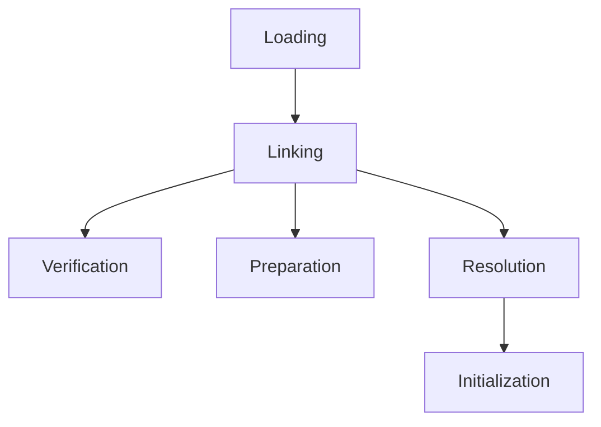

# JVM Internals & Class Loading

## Overview

The Java Virtual Machine (JVM) is the runtime environment for Java applications. Understanding JVM internals and the class loading mechanism is crucial for performance tuning, debugging, and advanced Java development.

# STAR Summary

**SITUATION:** Java applications run on the JVM, but without knowledge of its internals, developers struggle with performance issues, memory leaks, and class loading problems.

**TASK:** Understand JVM architecture, class loading process, and memory management to optimize and troubleshoot Java applications.

**ACTION:** Study JVM components like class loaders, memory areas, and execution engine; analyze class loading phases and delegation hierarchy.

**RESULT:** Ability to diagnose JVM-related issues, tune performance, and implement advanced features like custom class loaders in enterprise applications.

# Detailed Explanation

### JVM Architecture

The JVM consists of several components:

1. **Class Loader Subsystem**: Loads class files
2. **Runtime Data Areas**: Method area, heap, stack, PC registers, native method stack
3. **Execution Engine**: Interprets or compiles bytecode
4. **JNI & Native Method Libraries**: Interfaces with native code

### Class Loading Process

Class loading happens in three phases:

1. **Loading**: Finding and importing the binary data
2. **Linking**: Verification, preparation, resolution
3. **Initialization**: Executing static initializers



### Class Loaders

- **Bootstrap Class Loader**: Loads core Java classes
- **Extension Class Loader**: Loads extension classes
- **System/Application Class Loader**: Loads application classes

### Memory Areas

- **Heap**: Runtime data area for objects
- **Stack**: Thread-specific, stores method calls
- **Method Area**: Stores class metadata
- **PC Registers**: Holds address of current instruction

## Real-world Examples & Use Cases

- Troubleshooting OutOfMemoryError
- Optimizing application startup time
- Implementing custom class loaders for plugin systems

## Code Examples

```java
// Custom Class Loader Example
public class CustomClassLoader extends ClassLoader {
    @Override
    public Class<?> findClass(String name) throws ClassNotFoundException {
        byte[] b = loadClassFromFile(name);
        return defineClass(name, b, 0, b.length);
    }
    
    private byte[] loadClassFromFile(String fileName) {
        // Implementation to load class bytes from file
        return new byte[0];
    }
}
```

# Message Formats / Data Models

N/A.

# Journey of a Trade

N/A.

# Common Pitfalls & Edge Cases

- **Class Loading Deadlocks:** Circular dependencies between classes.

- **PermGen/Metaspace OutOfMemory:** Class metadata exhaustion; monitor with JVM tools.

- **Class Loader Leaks:** Holding references to class loaders prevents garbage collection.

- **Incompatible Class Changes:** Hotswapping limitations in production.

- **Native Method Issues:** JNI calls can corrupt JVM state.

# Tools & Libraries

- **JVM Tools:** jps, jstat, jmap, jstack for monitoring.

- **Profilers:** VisualVM, JProfiler for analysis.

- **Libraries:** Byte Buddy for runtime class manipulation.

## References

- [JVM Specification](https://docs.oracle.com/javase/specs/jvms/se17/html/)
- "Inside the Java Virtual Machine" by Bill Venners

# Github-README Links & Related Topics

[[Garbage Collection Algorithms]]
[[JVM Performance Tuning]]
[[Java Class Loaders]]
[[JVM Memory Management]]
