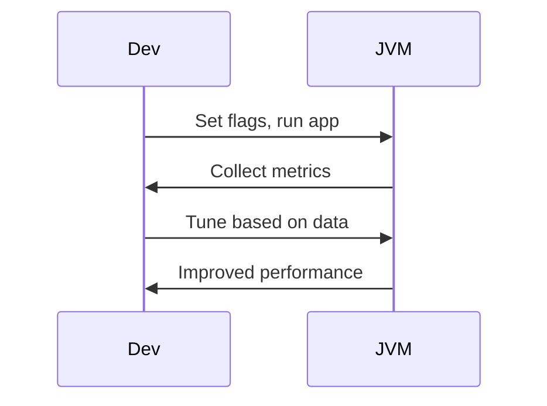

## Overview
JVM performance tuning optimizes Java applications by configuring heap, garbage collection, JIT compilation, and threading for low latency, high throughput, or memory efficiency. Involves flags like -Xms, -Xmx, GC selection (G1, ZGC), and profiling.

Key metrics: latency, throughput, memory usage.

## STAR Summary
**Situation:** Microservice with 500ms GC pauses.  
**Task:** Reduce to <50ms.  
**Action:** Switched to ZGC, tuned heap.  
**Result:** Pauses <10ms, 30% better throughput.

## Detailed Explanation
- **Heap:** Young (Eden, Survivor), Old gen. Tune with -Xms/-Xmx, -XX:NewRatio.
- **GC:** Serial (single-thread), Parallel (multi-thread old), CMS (concurrent), G1 (regions), ZGC/Shenandoah (low-pause).
- **JIT:** C1 (client), C2 (server). Tune with -XX:CompileThreshold.
- **Flags:** -XX:+UseG1GC, -XX:MaxGCPauseMillis=100, -XX:G1HeapRegionSize=16m.

Monitor with JMX, VisualVM.

## Real-world Examples & Use Cases
- Trading platforms: Low latency with ZGC.
- Web apps: High throughput with Parallel GC.
- Embedded: Memory constrained with Serial.

## Code Examples
### JVM Flags Example
```bash
java -Xms4g -Xmx8g -XX:+UseZGC -XX:ZAllocationSpikeTolerance=5 -XX:+UnlockExperimentalVMOptions MyApp.jar
```

### JMX Monitoring
```java
import java.lang.management.*;

public class JVMMetrics {
    public static void main(String[] args) {
        MemoryMXBean mem = ManagementFactory.getMemoryMXBean();
        GarbageCollectorMXBean[] gcs = ManagementFactory.getGarbageCollectorMXBeans();
        System.out.println("Heap: " + mem.getHeapMemoryUsage().getUsed() / 1024 / 1024 + "MB");
        for (GarbageCollectorMXBean gc : gcs) {
            System.out.println(gc.getName() + " time: " + gc.getCollectionTime() + "ms");
        }
    }
}
```

Compile and run: `javac JVMMetrics.java && java JVMMetrics`

### Custom GC Logging
```bash
java -Xlog:gc*:file=gc.log:time,uptime,level,tags MyApp
```

## Data Models / Message Formats
| Metric | Type | Description |
|--------|------|-------------|
| Heap Usage | long | Bytes used |
| GC Time | long | Total GC time ms |
| Throughput | double | App time / total time |

## Journey / Sequence


## Common Pitfalls & Edge Cases
- Heap too large: Long GC.
- Ignoring app patterns: Wrong GC.
- Not profiling: Blind tuning.

## Tools & Libraries
- VisualVM: Free.
- JProfiler: Paid.
- JMX, Micrometer for metrics.

## Github-README Links & Related Topics
Related: [[garbage-collection-algorithms]], [[performance-tuning-and-profiling]], [[jvm-internals-and-classloading]]

## References
- https://docs.oracle.com/en/java/javase/17/gctuning/
- "Java Performance" by Scott Oaks
- Oracle JVM Tuning Guide

### Common Interview Questions
- Tune JVM for low latency?
- G1 vs ZGC?
- Heap sizing flags?