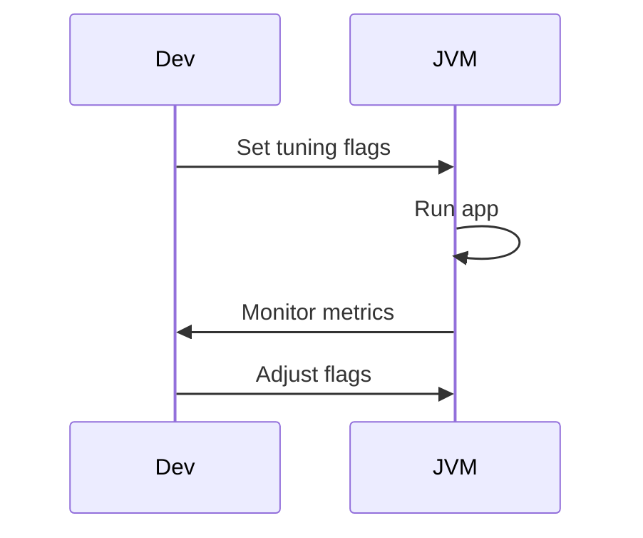

## Overview
JVM performance tuning involves configuring JVM parameters for optimal heap, GC, and thread management to achieve low latency, high throughput, or balanced performance. Key areas include heap sizing, GC selection, and monitoring with tools like VisualVM.

## STAR Summary
**Situation:** Java app with frequent GC pauses causing 2s delays.  
**Task:** Reduce pauses to <100ms.  
**Action:** Tuned G1GC with -XX:MaxGCPauseMillis=100 and increased heap.  
**Result:** Pauses dropped to 50ms, throughput up 20%.

## Detailed Explanation
- **Heap Tuning:** -Xms (initial), -Xmx (max), -XX:NewRatio.
- **GC Algorithms:** Serial, Parallel, CMS, G1, ZGC for low-pause.
- **Flags:** -XX:+UseG1GC, -XX:MaxGCPauseMillis, -XX:G1HeapRegionSize.

## Real-world Examples & Use Cases
- Low-latency trading systems.
- High-throughput web servers.
- Memory-constrained microservices.

## Code Examples
### Example JVM Flags
```bash
java -Xms2g -Xmx4g -XX:+UseG1GC -XX:MaxGCPauseMillis=200 -XX:G1HeapRegionSize=16m MyApp
```

### Monitoring with JMX
```java
import java.lang.management.*;

public class JVMMonitor {
    public static void main(String[] args) {
        MemoryMXBean mem = ManagementFactory.getMemoryMXBean();
        System.out.println("Heap: " + mem.getHeapMemoryUsage());
    }
}
```

Compile and run: `javac JVMMonitor.java && java JVMMonitor`

## Data Models / Message Formats
| Metric | Description |
|--------|-------------|
| Heap Usage | Current heap memory |
| GC Time | Time spent in GC |
| Throughput | App time vs GC time |

## Journey / Sequence


## Common Pitfalls & Edge Cases
- Over-sizing heap leading to long GC.
- Ignoring app-specific patterns.
- Not testing under load.

## Tools & Libraries
- VisualVM: Free profiler.
- JProfiler: Commercial.
- JMX for monitoring.

## Github-README Links & Related Topics
Related: [[garbage-collection-algorithms]], [[performance-tuning-and-profiling]], [[jvm-internals-and-classloading]]

## References
- https://docs.oracle.com/javase/8/docs/technotes/guides/vm/gctuning/
- "Java Performance" by Scott Oaks

### Common Interview Questions
- How to tune JVM for low latency?
- Difference between G1 and CMS GC?
- What are JVM flags for heap sizing?