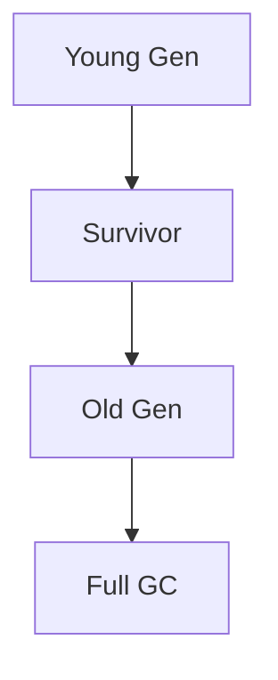

# Overview

Garbage Collection (GC) tuning optimizes JVM memory management for low-latency and high-throughput applications. In interviews, discuss algorithms, flags, and monitoring.

# STAR Summary

**Situation:** High GC pause times in a trading app.

**Task:** Reduce pauses to <10ms.

**Action:** Switched to G1GC, tuned heap sizes.

**Result:** 50% reduction in pauses.

# Detailed Explanation

GC algorithms: Serial, Parallel, CMS, G1, ZGC.

Tuning: Heap sizes, GC threads.

# Real-world Examples & Use Cases

- Low-latency services: ZGC.
- Batch processing: Parallel GC.

# Code Examples

JVM flags:

```bash
java -Xms4g -Xmx4g -XX:+UseG1GC -XX:MaxGCPauseMillis=200 -jar app.jar
```

# Data Models / Message Formats

GC logs: [GC pause (young) 10ms]

# Journey / Sequence



# Common Pitfalls & Edge Cases

- Over-tuning causes thrashing.
- Ignoring application patterns.

# Tools & Libraries

- VisualVM
- GCViewer

# Github-README Links & Related Topics

Related: [garbage-collection-algorithms](../garbage-collection-algorithms/), [performance-tuning-and-profiling](../../profiling/performance-tuning-and-profiling/), [[jvm-internals-and-classloading]]

# References

- [JVM GC Tuning Guide](https://docs.oracle.com/javase/8/docs/technotes/guides/vm/gctuning/)