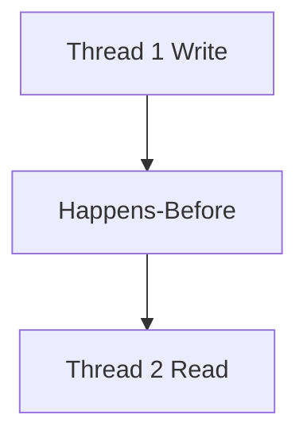

# Overview

The Java Memory Model (JMM) defines how threads interact through memory, ensuring visibility and ordering of operations. Critical for concurrent programming in interviews, covering happens-before, volatile, and synchronization.

# STAR Summary

**Situation:** Debugging race conditions in a multi-threaded cache.

**Task:** Ensure thread-safe updates.

**Action:** Applied JMM principles with volatile and synchronized blocks.

**Result:** Eliminated data races, improved performance.

# Detailed Explanation

JMM provides guarantees for shared variables.

Happens-before: Program order, monitor locks, volatile reads/writes.

Visibility: Changes visible to other threads.

# Real-world Examples & Use Cases

- Concurrent collections.
- Producer-consumer patterns.

# Code Examples

```java
public class SharedState {
    private volatile int value;

    public void update(int newValue) {
        this.value = newValue; // Volatile write
    }

    public int get() {
        return value; // Volatile read
    }
}
```

# Data Models / Message Formats

N/A

# Journey / Sequence



# Common Pitfalls & Edge Cases

- Reordering by compiler/CPU.
- Double-checked locking without volatile.

# Tools & Libraries

- Java Concurrency Utilities

# Github-README Links & Related Topics

Related: [[java-memory-model-and-concurrency]], [[threads-executors-futures]], [[concurrent-data-structures]]

# References

- [JMM Specification](https://docs.oracle.com/javase/specs/jls/se17/html/jls-17.html)