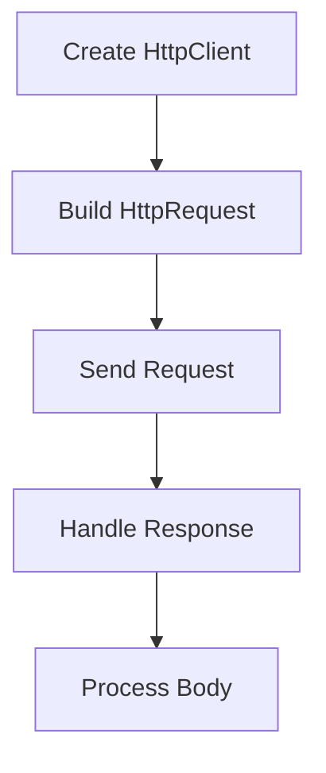

# Java HTTP Client

## Overview

The Java HTTP Client, introduced in Java 11 and enhanced in later versions, provides a modern, asynchronous API for HTTP requests. It supports HTTP/1.1, HTTP/2, and WebSocket protocols.

## Detailed Explanation

HttpClient is designed for high performance and ease of use. It supports synchronous and asynchronous operations, connection pooling, and automatic handling of redirects.

Key features:
- Asynchronous by default
- HTTP/2 support
- WebSocket support
- Connection pooling
- Reactive streams integration

### Request Flow



## Real-world Examples & Use Cases

- REST API clients
- Microservices communication
- Web scraping
- File downloads/uploads
- Real-time data streaming

## Code Examples

### Synchronous GET Request

```java
import java.net.http.*;
import java.net.URI;

public class SyncHttpClient {
    public static void main(String[] args) throws Exception {
        HttpClient client = HttpClient.newHttpClient();
        HttpRequest request = HttpRequest.newBuilder()
                .uri(URI.create("https://api.example.com/data"))
                .build();
        
        HttpResponse<String> response = client.send(request, HttpResponse.BodyHandlers.ofString());
        System.out.println(response.body());
    }
}
```

### Asynchronous POST Request

```java
HttpRequest request = HttpRequest.newBuilder()
        .uri(URI.create("https://api.example.com/submit"))
        .POST(HttpRequest.BodyPublishers.ofString("{\"key\":\"value\"}"))
        .header("Content-Type", "application/json")
        .build();

client.sendAsync(request, HttpResponse.BodyHandlers.ofString())
        .thenApply(HttpResponse::body)
        .thenAccept(System.out::println)
        .join();
```

### WebSocket Connection

```java
WebSocket webSocket = HttpClient.newHttpClient().newWebSocketBuilder()
        .buildAsync(URI.create("ws://echo.websocket.org"), new WebSocket.Listener() {
            @Override
            public CompletionStage<?> onText(WebSocket webSocket, CharSequence data, boolean last) {
                System.out.println("Received: " + data);
                return null;
            }
        }).join();
```

## References

- [Oracle HTTP Client Guide](https://docs.oracle.com/en/java/javase/21/core/java-net-http-client.html)
- [JEP 321: HTTP Client (Standard)](https://openjdk.org/jeps/321)

## Github-README Links & Related Topics

- [RESTful APIs](../restful-apis/README.md)
- [WebSocket Protocols](../websocket-protocols/README.md)
- [Networking TCP IP HTTP2 TLS](../networking/networking-tcp-ip-http2-tls/README.md)