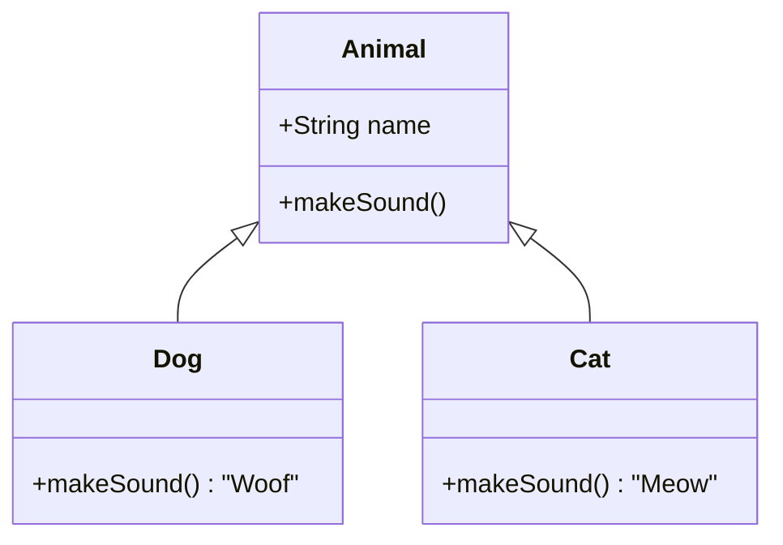

# Overview

Object-Oriented Programming (OOP) in Java revolves around four core principles: Encapsulation, Inheritance, Polymorphism, and Abstraction. These principles enable modular, reusable, and maintainable code by modeling real-world entities as objects with properties (fields) and behaviors (methods). Java is inherently object-oriented, requiring all code to be within classes, with everything treated as objects except primitives.

# STAR Summary

**SITUATION:** Procedural programming leads to code that is hard to maintain and scale, with data and logic scattered across functions.

**TASK:** Implement OOP principles to organize code into cohesive units that mirror real-world concepts.

**ACTION:** Apply encapsulation to hide data, inheritance for code reuse, polymorphism for flexibility, and abstraction for simplification.

**RESULT:** Cleaner, more extensible codebases that are easier to debug, test, and extend, as seen in large Java applications like enterprise systems.

# Detailed Explanation

- **Encapsulation:** Bundling data and methods into classes, with access modifiers (`private`, `protected`, `public`) to control visibility. Getters/setters provide controlled access.

- **Inheritance:** Creating new classes (subclasses) from existing ones (superclasses) to inherit properties and methods. Uses `extends` keyword. Supports method overriding.

- **Polymorphism:** Ability of objects to take many forms. Achieved through method overriding (runtime) and overloading (compile-time). Enables dynamic method dispatch.

- **Abstraction:** Hiding complex implementation details, showing only essential features. Implemented via abstract classes and interfaces. Interfaces define contracts without implementation.

Java supports single inheritance for classes but multiple inheritance via interfaces. The `Object` class is the root of all classes, providing methods like `toString()`, `equals()`, `hashCode()`.

## Detailed Explanation

### Encapsulation

Encapsulation is the bundling of data and methods that operate on that data within a single unit (class).

```java
public class Person {
    private String name;
    private int age;
    
    public String getName() {
        return name;
    }
    
    public void setName(String name) {
        this.name = name;
    }
}
```

### Inheritance

Inheritance allows a class to inherit properties and methods from another class.

```java
public class Animal {
    public void eat() {
        System.out.println("Eating...");
    }
}

public class Dog extends Animal {
    public void bark() {
        System.out.println("Woof!");
    }
}
```

### Polymorphism

Polymorphism allows objects of different classes to be treated as objects of a common superclass.

```java
public class Shape {
    public void draw() {
        System.out.println("Drawing shape");
    }
}

public class Circle extends Shape {
    @Override
    public void draw() {
        System.out.println("Drawing circle");
    }
}

public class Square extends Shape {
    @Override
    public void draw() {
        System.out.println("Drawing square");
    }
}

// Usage
Shape shape1 = new Circle();
Shape shape2 = new Square();
shape1.draw(); // Drawing circle
shape2.draw(); // Drawing square
```

### Abstraction

Abstraction is the process of hiding implementation details and showing only the necessary information.

```java
abstract class Vehicle {
    abstract void start();
    
    public void stop() {
        System.out.println("Vehicle stopped");
    }
}

class Car extends Vehicle {
    @Override
    void start() {
        System.out.println("Car started");
    }
}
```

## Real-world Examples & Use Cases

- Designing a banking system with Account classes
- Creating a game with Player and Enemy classes
- Building a GUI framework with Window and Button classes

## Code Examples

```java
// Complete example
public class BankAccount {
    private String accountNumber;
    private double balance;
    
    public BankAccount(String accountNumber, double initialBalance) {
        this.accountNumber = accountNumber;
        this.balance = initialBalance;
    }
    
    public void deposit(double amount) {
        if (amount > 0) {
            balance += amount;
        }
    }
    
    public void withdraw(double amount) {
        if (amount > 0 && amount <= balance) {
            balance -= amount;
        }
    }
    
    public double getBalance() {
        return balance;
    }
}

public class SavingsAccount extends BankAccount {
    private double interestRate;
    
    public SavingsAccount(String accountNumber, double initialBalance, double interestRate) {
        super(accountNumber, initialBalance);
        this.interestRate = interestRate;
    }
    
    public void addInterest() {
        double interest = getBalance() * interestRate / 100;
        deposit(interest);
    }
}
```

# Message Formats / Data Models

N/A.

# Journey of a Trade

N/A.



This diagram illustrates inheritance and polymorphism with a simple animal hierarchy.

# Common Pitfalls & Edge Cases

- **Tight Coupling:** Overusing inheritance creates rigid hierarchies; prefer composition.

- **Method Overriding Issues:** Forgetting `@Override` or mismatching signatures.

- **Abstract Class vs Interface:** Use interfaces for multiple inheritance; abstract classes for shared state.

- **Encapsulation Violations:** Exposing fields directly; use accessors.

- **Diamond Problem:** Avoided in Java by single class inheritance, but interfaces can have default methods.

- **Null Checks:** Polymorphic calls on null objects throw exceptions.

# Tools & Libraries

- **IDEs:** IntelliJ IDEA for refactoring and code generation.

- **Libraries:** Lombok for reducing boilerplate with annotations for getters/setters.

## References

- [Oracle OOP Concepts](https://docs.oracle.com/javase/tutorial/java/concepts/)
- "Design Patterns: Elements of Reusable Object-Oriented Software" by Gang of Four

# Github-README Links & Related Topics

[[Java Fundamentals]]
[[Inheritance In Java]]
[[Polymorphism In Java]]
[[Abstraction In Java]]
[[Encapsulation In Java]]
