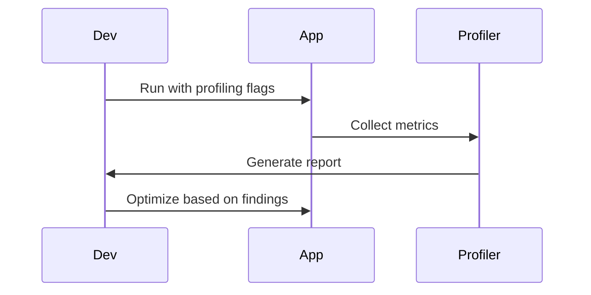

## Overview
Performance tuning involves optimizing JVM and application code for better speed, memory usage, and throughput. Profiling identifies bottlenecks using tools like VisualVM, JProfiler, and Java Flight Recorder (JFR).

## STAR Summary
**Situation:** Application experiencing high latency under load.  
**Task:** Identify and fix performance bottlenecks.  
**Action:** Used VisualVM to profile CPU and memory, optimized GC and code paths.  
**Result:** Reduced response time by 40%, improved throughput by 25%.

## Detailed Explanation
- **JVM Tuning:** Heap size (-Xms, -Xmx), GC algorithms (G1, CMS), flags for low-latency.
- **Profiling:** CPU sampling, memory heap dumps, thread analysis.
- **Tools:** VisualVM (free), JProfiler (commercial), JFR (built-in).

## Real-world Examples & Use Cases
- Optimizing web servers for high concurrency.
- Reducing memory leaks in long-running apps.
- Tuning databases and caches.

## Code Examples
### Basic JVM Tuning Flags
```bash
java -Xms512m -Xmx2g -XX:+UseG1GC -XX:MaxGCPauseMillis=200 MyApp
```

### Using JFR for Profiling
```java
import jdk.jfr.*;

@Event(name = "com.example.CustomEvent")
public class CustomEvent extends Event {
    public String message;
}

public class ProfilingExample {
    public static void main(String[] args) {
        CustomEvent event = new CustomEvent();
        event.message = "Starting profiling";
        event.commit();
        // Application code
    }
}
```

Compile and run: `javac -cp $JAVA_HOME/lib/jfr.jar *.java && java -XX:StartFlightRecording:filename=recording.jfr,duration=10s ProfilingExample`

## Data Models / Message Formats
| Metric | Tool | Description |
|--------|------|-------------|
| CPU Time | VisualVM | Time spent in methods |
| Heap Usage | JProfiler | Memory allocation |
| GC Pauses | JFR | Garbage collection events |

## Journey / Sequence


## Common Pitfalls & Edge Cases
- Over-tuning leading to instability.
- Profiling in production environments.
- Ignoring warm-up periods.

## Tools & Libraries
- VisualVM: Free JVM profiler.
- JProfiler: Advanced commercial tool.
- JFR: Built-in Oracle JDK tool.

## Github-README Links & Related Topics
Related: [[jvm-internals-and-classloading]], [[garbage-collection-algorithms]], [[testing-and-mocking-junit-mockito]]

## References
- https://docs.oracle.com/javase/8/docs/technotes/tools/unix/jvisualvm.html