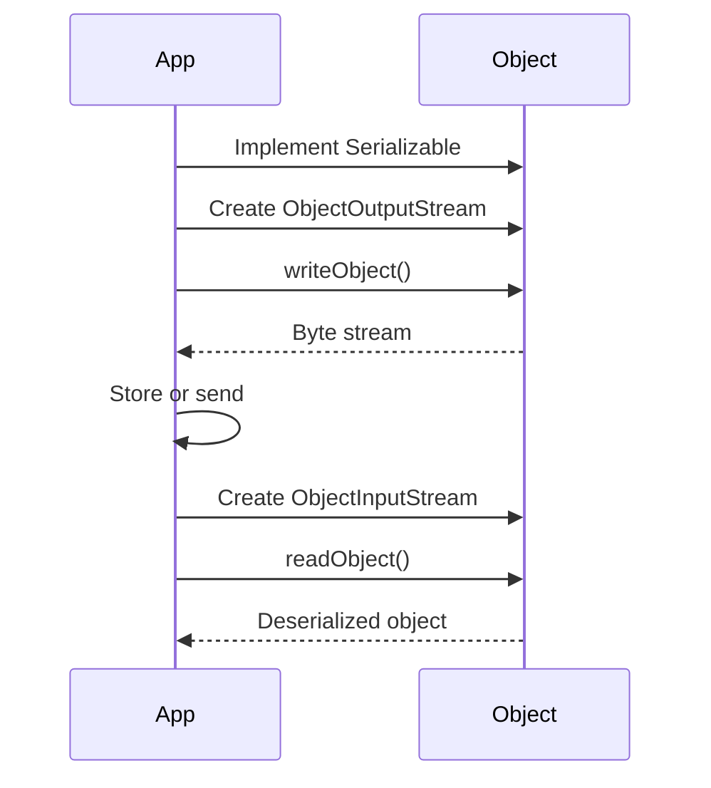

## Overview
Serialization is the process of converting an object into a byte stream, and deserialization is the reverse. In Java, it's used for persisting objects, sending over network, or caching.

## STAR Summary
**Situation:** Building a distributed session store for web app.  
**Task:** Persist user sessions across server restarts.  
**Action:** Implemented Serializable on session objects and used ObjectOutputStream for storage.  
**Result:** Sessions persisted reliably, reducing user re-authentications by 90%.

## Detailed Explanation
- **Serializable Interface:** Classes must implement Serializable to be serialized.
- **Transient Keyword:** Fields marked transient are not serialized.
- **Custom Serialization:** Override writeObject/readObject for control.
- **Versioning:** serialVersionUID for compatibility.

## Real-world Examples & Use Cases
- Caching objects in Redis.
- RMI (Remote Method Invocation).
- Storing objects in files or databases.

## Code Examples
### Serializable Class
```java
import java.io.Serializable;

public class Person implements Serializable {
    private static final long serialVersionUID = 1L;
    private String name;
    private int age;
    private transient String password; // Not serialized

    // Constructors, getters, setters
}
```

### Serialization
```java
import java.io.*;

public class SerializeExample {
    public static void main(String[] args) {
        Person p = new Person("John", 30, "secret");
        try (ObjectOutputStream oos = new ObjectOutputStream(new FileOutputStream("person.ser"))) {
            oos.writeObject(p);
        } catch (IOException e) {
            e.printStackTrace();
        }
    }
}
```

### Deserialization
```java
import java.io.*;

public class DeserializeExample {
    public static void main(String[] args) {
        try (ObjectInputStream ois = new ObjectInputStream(new FileInputStream("person.ser"))) {
            Person p = (Person) ois.readObject();
            System.out.println(p.getName());
        } catch (IOException | ClassNotFoundException e) {
            e.printStackTrace();
        }
    }
}
```

Compile and run: `javac *.java && java SerializeExample && java DeserializeExample`

## Data Models / Message Formats
| Field | Type | Description |
|-------|------|-------------|
| serialVersionUID | long | Version identifier |
| Object | Serializable | The object to serialize |

## Journey / Sequence


## Common Pitfalls & Edge Cases
- Missing serialVersionUID causes InvalidClassException.
- Non-serializable fields cause NotSerializableException.
- Security risks with deserializing untrusted data.

## Tools & Libraries
- java.io.ObjectOutputStream/ObjectInputStream
- Kryo, Jackson for alternative serialization.

## Github-README Links & Related Topics
Related: [[io-and-nio]], [[jvm-internals-and-classloading]], [[networking-tcp-ip-http2-tls]]

## References
- https://docs.oracle.com/javase/tutorial/essential/io/objectstreams.html