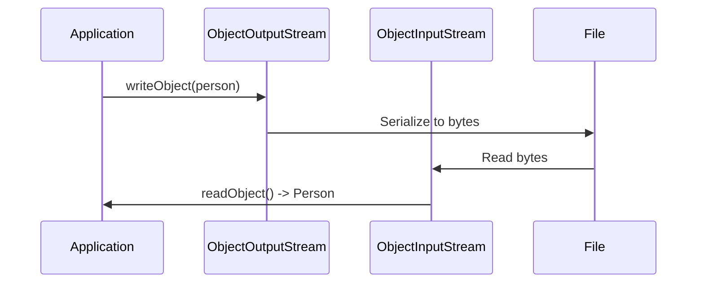

## Overview
Java Serialization is the process of converting an object into a byte stream for storage or transmission, and Deserialization is the reverse. It uses the `Serializable` interface and `ObjectOutputStream`/`ObjectInputStream`.

## STAR Summary
**Situation:** Needed to persist user session data across server restarts in a web application.  
**Task:** Implement object serialization to save and restore session objects.  
**Action:** Marked classes as `Serializable`, handled transient fields, and used try-with-resources for streams.  
**Result:** Achieved reliable state persistence with minimal data loss during restarts.

## Detailed Explanation
Objects implement `Serializable` to be serialized. The JVM writes the object's state, including superclass fields. Use `transient` for non-serializable fields. Custom serialization via `writeObject`/`readObject`. Versioning with `serialVersionUID` prevents incompatibility.

JVM internals: Serialization uses reflection; deserialization creates new instances. Externalizable offers more control but requires manual implementation.

GC: Serialized objects are heap-independent; deserialization allocates new objects.

Memory visibility: Not thread-safe; synchronize if needed.

Common libraries: Built-in Java; alternatives like Kryo for performance.

## Common Interview Questions
- What is the purpose of the `Serializable` interface?
- How does `transient` keyword work in serialization?
- Explain `serialVersionUID` and its importance.
- What are the differences between `Serializable` and `Externalizable`?
- How to handle serialization of objects with non-serializable fields?

## Real-world Examples & Use Cases
- **Caching:** Serialize objects to disk or Redis.
- **RMI:** Transmit objects over network.
- **Session Management:** Persist user sessions.
- **Data Transfer:** Send objects via sockets or files.

## Code Examples
```java
import java.io.*;

class Person implements Serializable {
    private static final long serialVersionUID = 1L;
    String name;
    transient int age; // Not serialized

    Person(String name, int age) {
        this.name = name;
        this.age = age;
    }
}

public class SerializationExample {
    public static void main(String[] args) {
        Person p = new Person("Alice", 30);
        
        // Serialize
        try (ObjectOutputStream oos = new ObjectOutputStream(new FileOutputStream("person.ser"))) {
            oos.writeObject(p);
        } catch (IOException e) {
            e.printStackTrace();
        }
        
        // Deserialize
        try (ObjectInputStream ois = new ObjectInputStream(new FileInputStream("person.ser"))) {
            Person restored = (Person) ois.readObject();
            System.out.println("Name: " + restored.name + ", Age: " + restored.age);
        } catch (IOException | ClassNotFoundException e) {
            e.printStackTrace();
        }
    }
}
```

Compile and run:
```bash
javac SerializationExample.java && java SerializationExample
```

## Data Models / Message Formats
| Method | Purpose | Example |
|--------|---------|---------|
| writeObject | Serialize object | oos.writeObject(obj) |
| readObject | Deserialize object | (MyClass) ois.readObject() |
| writeExternal | Custom externalizable | obj.writeExternal(oos) |
| readExternal | Custom externalizable | obj.readExternal(ois) |

## Journey / Sequence


## Common Pitfalls & Edge Cases
- **NotSerializableException:** Ensure all fields are serializable or transient.
- **Version mismatch:** Update serialVersionUID on incompatible changes.
- **Security:** Deserialization can execute code; validate inputs.
- **Performance:** Serialization is slow; use alternatives for large objects.

## Tools & Libraries
- **Java Serialization:** Built-in.
- **Kryo:** Fast alternative.
- **Jackson:** JSON serialization.

## Github-README Links & Related Topics
- [io-and-nio](../io-and-nio/)
- [exception-handling-and-errors](../exception-handling-and-errors/)
- [jvm-internals-and-classloading](../jvm-internals-and-classloading/)

## References
- https://docs.oracle.com/javase/tutorial/jndi/objects/serial.html
- https://www.baeldung.com/java-serialization