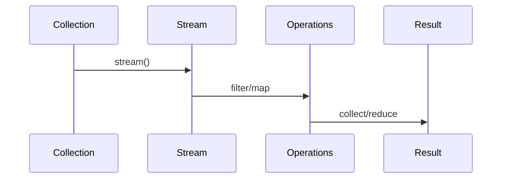

## Overview
Java Streams API enables functional-style operations on collections, supporting parallel processing and lazy evaluation. Combined with lambdas, it promotes declarative programming.

## STAR Summary
**Situation:** Processing large datasets for analytics required efficient filtering and aggregation.  
**Task:** Rewrite imperative loops to functional streams for readability and performance.  
**Action:** Used streams with filter, map, collect for parallel processing.  
**Result:** 50% faster execution with cleaner code.

## Detailed Explanation
Streams represent sequences of elements supporting aggregate operations like filter, map, reduce. They are lazy, intermediate operations don't execute until terminal operation. Parallel streams leverage multiple cores.

Functional interfaces: Predicate, Function, Consumer, Supplier.

JVM internals: Lambdas implemented using invokedynamic for efficiency. Streams use spliterators for parallel processing via ForkJoinPool.

GC: Lazy evaluation minimizes object creation, but collect() can create large collections triggering GC.

Memory visibility: Streams are not thread-safe; parallel streams require stateless operations to avoid visibility issues.

Common libraries: Vavr for more functional constructs.

## Common Interview Questions
- What is the difference between intermediate and terminal operations in streams?
- When should you use parallel streams?
- How do you handle exceptions in stream operations?
- Explain the concept of lazy evaluation in streams.
- What are the benefits of using streams over traditional loops?

## Real-world Examples & Use Cases
- **Data processing:** Filtering logs, aggregating metrics.
- **Collections manipulation:** Transforming lists without mutation.
- **Parallel computation:** CPU-intensive tasks on large datasets.

## Code Examples
```java
import java.util.*;
import java.util.stream.*;

public class StreamsExample {
    public static void main(String[] args) {
        List<Integer> numbers = Arrays.asList(1, 2, 3, 4, 5);
        
        List<Integer> evenSquares = numbers.stream()
            .filter(n -> n % 2 == 0)
            .map(n -> n * n)
            .collect(Collectors.toList());
        
        System.out.println(evenSquares);
        
        // Parallel stream
        int sum = numbers.parallelStream().reduce(0, Integer::sum);
        System.out.println("Sum: " + sum);
    }
}
```

Compile and run:
```bash
javac StreamsExample.java && java StreamsExample
```

## Data Models / Message Formats
| Operation | Type | Example |
|-----------|------|---------|
| filter | Intermediate | stream.filter(Predicate) |
| map | Intermediate | stream.map(Function) |
| collect | Terminal | stream.collect(Collector) |

## Journey / Sequence


## Common Pitfalls & Edge Cases
- **Stateful operations:** Avoid side effects in lambdas.
- **Infinite streams:** Use limit() with generate().
- **Parallel pitfalls:** Ensure thread-safety in operations.

## Tools & Libraries
- **Java Streams:** Built-in since Java 8.
- **Vavr:** Functional programming library for Java.
- **JUnit 5:** For testing functional code.

## Github-README Links & Related Topics
- [[collections-framework]]
- [[java-language-basics]]
- [[performance-tuning-and-profiling]]

## References
- https://docs.oracle.com/javase/8/docs/api/java/util/stream/package-summary.html
- https://www.baeldung.com/java-8-streams