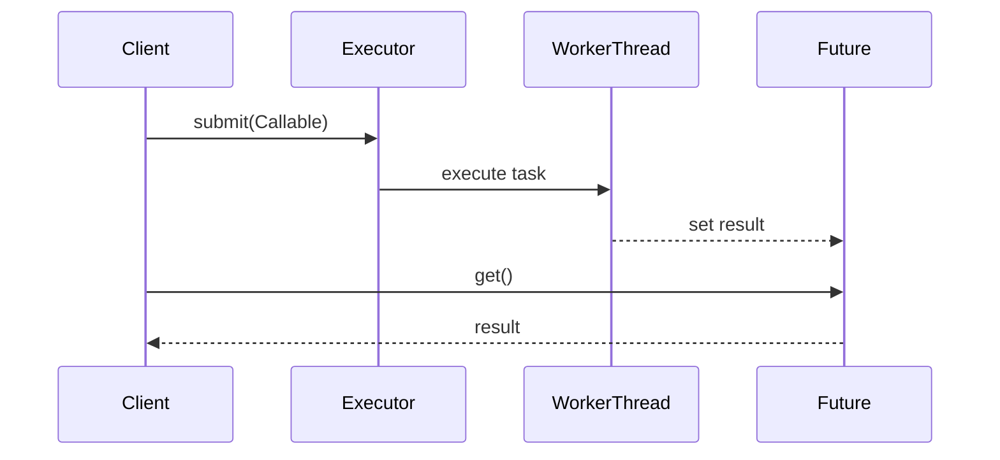

## Overview
Java's threading model, Executor framework, and Future API provide mechanisms for concurrent and asynchronous programming. They enable efficient task execution, resource management, and non-blocking operations in multi-threaded applications.

## STAR Summary
**Situation**: A web service was experiencing thread exhaustion under high load, causing timeouts and degraded performance.

**Task**: Implement efficient thread management and asynchronous processing to handle variable workloads.

**Action**: Replaced manual thread creation with ExecutorService, used CompletionService for batch processing, and implemented Future-based async operations.

**Result**: Reduced thread count by 60%, improved response times by 35%, and eliminated thread-related crashes.

## Detailed Explanation
Java threads are lightweight processes managed by the JVM. The Executor framework provides higher-level abstractions for thread management, while Futures represent asynchronous computation results.

Key components:
- **Threads**: Basic units of execution with shared memory
- **Executors**: Factories and utilities for thread pool management
- **Futures**: Representations of pending results from async operations
- **CompletionService**: Decouples task submission from result retrieval

Thread lifecycle: New → Runnable → Running → Blocked/Waiting → Terminated.

Executor types: FixedThreadPool, CachedThreadPool, ScheduledThreadPoolExecutor.

JVM internals: Threads map to OS threads, managed by the JVM's thread scheduler. Memory model ensures visibility through synchronization.

GC: Thread-local objects may require special handling; daemon threads don't prevent JVM shutdown.

Concurrency primitives: synchronized blocks, volatile variables, atomic classes.

Memory visibility: Happens-before relationships established by synchronization.

## Real-world Examples & Use Cases
- **Web servers**: Handling HTTP requests with thread pools
- **Batch processing**: Parallel data processing with ForkJoinPool
- **Scheduled tasks**: Cron-like jobs with ScheduledExecutorService
- **Async I/O**: Non-blocking operations in network clients
- **Background services**: Maintenance tasks without blocking main threads

## Code Examples
### Basic ExecutorService Usage
```java
import java.util.concurrent.ExecutorService;
import java.util.concurrent.Executors;
import java.util.concurrent.TimeUnit;

public class ExecutorExample {
    private final ExecutorService executor = Executors.newFixedThreadPool(4);

    public void submitTask(Runnable task) {
        executor.submit(task);
    }

    public void shutdown() throws InterruptedException {
        executor.shutdown();
        executor.awaitTermination(1, TimeUnit.MINUTES);
    }
}
```

### Future for Asynchronous Computation
```java
import java.util.concurrent.Callable;
import java.util.concurrent.ExecutionException;
import java.util.concurrent.ExecutorService;
import java.util.concurrent.Executors;
import java.util.concurrent.Future;

public class FutureExample {
    private final ExecutorService executor = Executors.newCachedThreadPool();

    public Future<Integer> computeAsync(int input) {
        return executor.submit(() -> {
            // Simulate computation
            Thread.sleep(1000);
            return input * 2;
        });
    }

    public int getResult(Future<Integer> future) throws ExecutionException, InterruptedException {
        return future.get(); // Blocking call
    }
}
```

### CompletionService for Ordered Results
```java
import java.util.concurrent.CompletionService;
import java.util.concurrent.ExecutorCompletionService;
import java.util.concurrent.ExecutorService;
import java.util.concurrent.Executors;
import java.util.concurrent.Future;

public class CompletionServiceExample {
    private final ExecutorService executor = Executors.newFixedThreadPool(4);
    private final CompletionService<Integer> completionService = new ExecutorCompletionService<>(executor);

    public void submitTasks() {
        for (int i = 0; i < 10; i++) {
            final int taskId = i;
            completionService.submit(() -> {
                Thread.sleep((long) (Math.random() * 1000));
                return taskId * 10;
            });
        }
    }

    public void processResults() throws InterruptedException, ExecutionException {
        for (int i = 0; i < 10; i++) {
            Future<Integer> future = completionService.take();
            System.out.println("Result: " + future.get());
        }
    }
}
```

Compile and run:
```bash
javac ExecutorExample.java
java ExecutorExample
```

## Data Models / Message Formats
Task submission payload:

| Field | Type | Description |
|-------|------|-------------|
| taskId | String | Unique task identifier |
| payload | Object | Task input data |
| priority | int | Execution priority |
| timeout | long | Maximum execution time |

## Journey / Sequence


## Common Pitfalls & Edge Cases
- **Thread leaks**: Always shutdown executors properly
- **Deadlocks**: Avoid circular wait conditions
- **RejectedExecutionException**: Handle when thread pool is full
- **Blocking get() calls**: Use timeouts or non-blocking alternatives
- **Memory leaks**: Futures hold references to results

## Tools & Libraries
- **Java Executors**: Built-in java.util.concurrent
- **Guava**: ListenableFuture for enhanced futures
- **RxJava**: Reactive programming extensions
- **Project Reactor**: Reactive streams implementation
- **VisualVM/JConsole**: Thread monitoring and profiling

## Github-README Links & Related Topics
Related: [[concurrent-data-structures]], [[java-memory-model-and-concurrency]], [[performance-tuning-and-profiling]]

## References
- [Java Concurrency in Practice](https://www.amazon.com/Java-Concurrency-Practice-Brian-Goetz/dp/0321349601)
- [Oracle Executor Framework](https://docs.oracle.com/javase/8/docs/api/java/util/concurrent/Executor.html)
- [Future API Documentation](https://docs.oracle.com/javase/8/docs/api/java/util/concurrent/Future.html)
- [Threading Best Practices](https://www.baeldung.com/java-executor-service-tutorial)