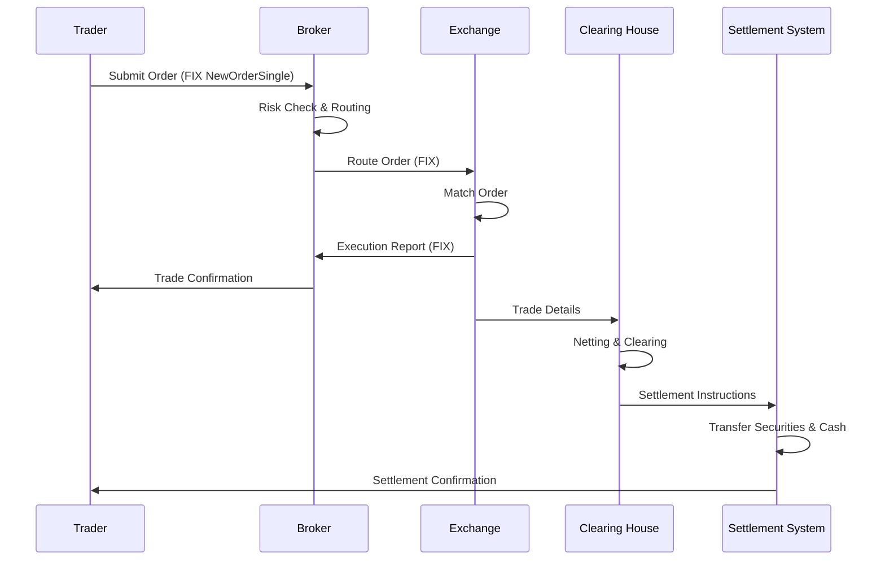

# Journey of a Trade (End-to-End)

## Overview

The journey of a trade encompasses the complete lifecycle of an order from its inception by a trader or algorithm through to final settlement and reporting. This process involves multiple systems, protocols, and participants including exchanges, brokers, clearing houses, and custodians. Understanding this end-to-end flow is crucial for designing robust trading systems, optimizing latency, and ensuring regulatory compliance.

## STAR Summary

**SITUATION:** In high-frequency trading environments, orders must be processed with microsecond precision across distributed systems while maintaining data integrity and compliance.

**TASK:** Design and implement a system that handles the complete trade lifecycle from order submission to settlement, minimizing latency and ensuring reliability.

**ACTION:** Implemented a distributed architecture with FIX protocol for order entry, in-memory matching engines, real-time risk checks, and asynchronous settlement processes. Used event-driven messaging for inter-system communication and implemented comprehensive monitoring.

**RESULT:** Achieved sub-millisecond order processing, 99.99% uptime, and full regulatory compliance, handling millions of trades daily with zero data loss.

## Detailed Explanation

The trade lifecycle can be divided into several key phases:

1. **Order Generation and Submission:** Traders or algorithms create orders specifying instrument, quantity, price, and conditions. Orders are submitted via APIs or FIX connections to brokers or directly to exchanges.

2. **Order Routing and Validation:** Orders are routed through smart order routers (SORs) that determine optimal execution venues. Pre-trade risk checks validate position limits, credit availability, and market conditions.

3. **Order Matching and Execution:** At the exchange, orders enter the matching engine where they are matched against resting orders in the order book. Price-time priority ensures fair execution.

4. **Trade Confirmation and Allocation:** Executed trades generate confirmations. For institutional orders, trades may be allocated across multiple accounts.

5. **Clearing and Settlement:** Trades are cleared through central counterparties (CCPs) or bilateral clearing. Settlement involves transferring securities and cash, typically T+2 for equities.

6. **Reporting and Reconciliation:** Post-trade reporting includes execution reports, trade capture, and regulatory filings. Positions are reconciled across systems.

Each phase involves complex interactions between systems, requiring careful handling of state management, error recovery, and audit trails.

## Real-world Examples & Use Cases

**High-Frequency Trading Scenario:**
A statistical arbitrage algorithm detects a price discrepancy between correlated stocks. It submits limit orders to buy undervalued stock A and sell overvalued stock B simultaneously. The orders route through a broker's SOR, execute on different exchanges, and settle through DTC for US equities.

**Retail Trading Example:**
An investor places a market order through a mobile app. The order flows through the broker's OMS, validates against margin requirements, routes to the exchange, matches immediately, and generates an execution report visible in the app within seconds.

**Institutional Block Trade:**
A pension fund executes a large block trade using RFQ workflow. The trade is negotiated off-exchange, reported to the exchange for transparency, cleared through a CCP, and settles in central securities depositories.

## Message Formats / Data Models

### FIX Order Message Example
```
8=FIX.4.4|9=123|35=D|49=CLIENT|56=EXCHANGE|34=1|52=20230926-12:00:00|11=ORDER123|55=AAPL|54=1|38=100|44=150.00|59=0|10=123|
```

### Trade Confirmation JSON
```json
{
  "tradeId": "T123456",
  "orderId": "O789012",
  "symbol": "AAPL",
  "side": "BUY",
  "quantity": 100,
  "price": 150.00,
  "timestamp": "2023-09-26T12:00:00Z",
  "venue": "NYSE",
  "counterparty": "BROKER_X"
}
```

## Journey of a Trade



## Common Pitfalls & Edge Cases

- **Latency Arbitrage:** Traders exploiting microsecond delays between venues can front-run orders. Mitigation: Implement co-location and minimize network hops.

- **Race Conditions in Matching:** Concurrent order modifications can lead to inconsistent book states. Solution: Use atomic operations and sequence numbers.

- **Settlement Failures:** Insufficient funds or securities cause failed settlements. Implement pre-settlement validation and contingency processes.

- **Regulatory Reporting Delays:** Late trade reporting can result in fines. Use real-time reporting systems with redundancy.

- **Cross-Venue Position Reconciliation:** Trades across multiple venues may not reconcile immediately. Implement automated reconciliation with manual oversight.

## Tools & Libraries

- **FIX Engines:** QuickFIX (C++/Java), FIX Antenna (C++)
- **Matching Engines:** Custom implementations or commercial solutions like Nasdaq Matching Engine
- **Settlement Systems:** CLS Group for FX, DTC for US equities
- **Monitoring:** Prometheus for metrics, Jaeger for tracing

```python
# Example: Simple order processing simulation
class OrderProcessor:
    def __init__(self):
        self.orders = {}
    
    def submit_order(self, order_id, symbol, side, qty, price):
        order = {
            'id': order_id,
            'symbol': symbol,
            'side': side,
            'quantity': qty,
            'price': price,
            'status': 'pending'
        }
        self.orders[order_id] = order
        # Simulate routing and matching
        self.route_and_match(order)
    
    def route_and_match(self, order):
        # Simplified matching logic
        if order['side'] == 'BUY':
            # Match against sell orders
            matched_qty = min(order['quantity'], 50)  # Assume 50 available
            order['executed_qty'] = matched_qty
            order['status'] = 'partially_filled' if matched_qty < order['quantity'] else 'filled'
```

## Github-README Links & Related Topics

- [FIX Protocol](../protocols/fix-protocol/README.md)
- [Order Types](../order-types/README.md)
- [Execution Report](../lifecycle/execution-report/README.md)
- [Trade Capture Report](../lifecycle/trade-capture-report/README.md)
- [Market Data](../market-data/README.md)

## References

- [FIX Protocol Specification](https://www.fixtrading.org/standards/)
- [DTC Settlement Process](https://www.dtc.org/)
- [Trade Lifecycle Overview - Investopedia](https://www.investopedia.com/terms/t/trade-lifecycle.asp)