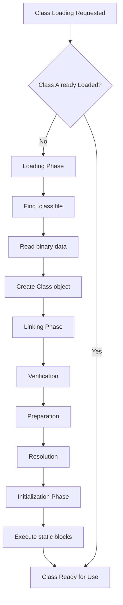

# JVM Internals & Class Loading

## Overview

The Java Virtual Machine (JVM) is the runtime environment that executes Java bytecode. JVM internals encompass the architecture, memory management, and execution model. Class loading is the process by which the JVM loads, links, and initializes classes at runtime, enabling dynamic loading and modularity.

## Detailed Explanation

### JVM Architecture

The JVM consists of several key components:

- **Class Loader Subsystem**: Responsible for loading class files into memory.
- **Runtime Data Areas**: Memory areas used during program execution.

| Area | Description | Thread-shared | Stores |
|------|-------------|---------------|--------|
| Method Area | Stores class-level information | Yes | Class data, method info, static variables |
| Heap | Runtime data area for objects | Yes | Objects, arrays |
| Java Stack | Stores method calls | No | Local variables, method calls |
| PC Register | Current instruction pointer | No | Address of executing instruction |
| Native Method Stack | For native methods | No | Native method calls |
- **Execution Engine**: Interprets or compiles bytecode into machine code.
- **JNI and Native Libraries**: For interfacing with native code.

### Class Loading Process

Class loading occurs in three phases:

1. **Loading**: The class loader finds and loads the binary data of the class.
2. **Linking**: Involves verification, preparation, and resolution.
3. **Initialization**: Executes static initializers and assigns initial values.



#### Types of Class Loaders

| Class Loader Type | Parent | Description | Example Classes |
|-------------------|--------|-------------|-----------------|
| Bootstrap Class Loader | None | Loads core Java classes from rt.jar and other bootstrap classpath | java.lang.*, java.util.* |
| Extension Class Loader | Bootstrap | Loads classes from jre/lib/ext or java.ext.dirs | Security extensions, XML parsers |
| System/Application Class Loader | Extension | Loads classes from application classpath | User-defined classes, third-party libraries |

### Class Loading Delegation Model

When loading a class, the JVM follows a delegation hierarchy: Application Class Loader → Extension Class Loader → Bootstrap Class Loader.

## Real-world Examples & Use Cases

- **Dynamic Plugin Systems**: Frameworks like OSGi use custom class loaders for modular applications.
- **Hot Swapping in Development**: IDEs reload classes without restarting the JVM.
- **Application Servers**: Load web applications in isolated class loaders for security and versioning.

## Code Examples

### Custom Class Loader

```java
public class CustomClassLoader extends ClassLoader {
    @Override
    public Class<?> findClass(String name) throws ClassNotFoundException {
        // Custom loading logic
        return super.findClass(name);
    }
}
```

### Class Loading Example

```java
public class Main {
    public static void main(String[] args) {
        try {
            Class<?> clazz = Class.forName("com.example.MyClass");
            Object instance = clazz.newInstance();
        } catch (Exception e) {
            e.printStackTrace();
        }
    }
}
```

## Common Pitfalls & Edge Cases

- **Class Loading Deadlocks**: Circular dependencies between classes can cause deadlocks during initialization.
- **ClassNotFoundException**: Ensure classpath is correct; use try-catch for dynamic loading.
- **Memory Leaks from Class Loaders**: Custom class loaders can hold references, preventing GC.
- **Security Issues**: Malicious code in loaded classes; use security managers.
- **Performance Overhead**: Excessive class loading can slow startup; use lazy loading.

## Tools & Libraries

- **JVM Tools**: jmap, jstack for monitoring class loading.
- **IDEs**: IntelliJ IDEA with class loader visualization.
- **Libraries**: OSGi for modular class loading.

## References

- [Oracle JVM Documentation](https://docs.oracle.com/javase/specs/jvms/se21/html/)
- [Baeldung: JVM Internals](https://www.baeldung.com/jvm)

## Github-README Links & Related Topics

- [Garbage Collection Algorithms](../garbage-collection-algorithms/README.md)
- [Multithreading & Concurrency in Java](../multithreading-and-concurrency-in-java/README.md)
- [Java Fundamentals](../java-fundamentals/README.md)
