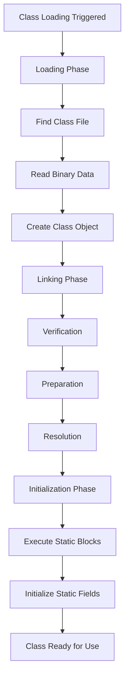
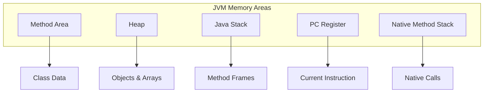

# JVM Internals & Class Loading

## Overview

The Java Virtual Machine (JVM) is the cornerstone of Java's "write once, run anywhere" philosophy, providing a platform-independent execution environment. JVM internals encompass the architecture, memory management, and execution mechanisms that enable Java applications to run efficiently. Class loading is a critical component, responsible for dynamically loading, linking, and initializing classes at runtime. This process ensures type safety, security, and flexibility in Java applications.

## Detailed Explanation

### JVM Architecture

The JVM architecture is divided into several key components that work together to execute Java bytecode:

- **Class Loader Subsystem**: Loads class files and creates Class objects.
- **Runtime Data Areas**: Memory areas for storing data during execution.
- **Execution Engine**: Interprets or compiles bytecode into machine code.
- **Native Method Interface (JNI)**: Allows interaction with native libraries.

```mermaid
graph TD
    A[Java Source Code] --> B[Java Compiler]
    B --> C[Bytecode (.class files)]
    C --> D[Class Loader Subsystem]
    D --> E[Runtime Data Areas]
    E --> F[Execution Engine]
    F --> G[Hardware]
```

### Class Loading Process

Class loading occurs in three main phases:

1. **Loading**: The class loader finds the binary representation of a class and creates a Class object.
2. **Linking**: This phase includes verification, preparation, and resolution.
   - Verification: Ensures the bytecode is valid and doesn't violate security constraints.
   - Preparation: Allocates memory for static fields and initializes them to default values.
   - Resolution: Replaces symbolic references with direct references.
3. **Initialization**: Executes static initializers and assigns initial values to static fields.



### Class Loaders Hierarchy

Java uses a hierarchical class loading mechanism with delegation:

| Class Loader | Description | Location |
|--------------|-------------|----------|
| Bootstrap Class Loader | Loads core Java classes (rt.jar, etc.) | JRE/lib |
| Extension Class Loader | Loads extension classes | JRE/lib/ext |
| System/Application Class Loader | Loads application classes | CLASSPATH |
| Custom Class Loaders | User-defined for specific needs | Application-specific |

The delegation model follows: System → Extension → Bootstrap.

### Runtime Data Areas

JVM memory is organized into several runtime data areas:

- **Method Area**: Stores class-level information, including static variables, method data, and the constant pool.
- **Heap**: Shared memory area for object instances and arrays.
- **Java Stack**: Thread-specific stack for method calls, local variables, and partial results.
- **Program Counter (PC) Register**: Holds the address of the currently executing JVM instruction.
- **Native Method Stack**: Supports native method execution.



## Data Models

### Class File Structure

A Java class file contains metadata and bytecode. Key components include:

- **Magic Number**: 0xCAFEBABE to identify as a class file.
- **Version Information**: Major and minor version numbers.
- **Constant Pool**: Array of constants used by the class.
- **Access Flags**: Modifiers like public, private, etc.
- **This Class/Index**: Reference to this class in the constant pool.
- **Super Class/Index**: Reference to the superclass.
- **Interfaces**: Array of implemented interfaces.
- **Fields**: Instance and static fields.
- **Methods**: Method definitions and bytecode.
- **Attributes**: Additional metadata.

## Real-world Examples & Use Cases

### Dynamic Plugin Loading

Web servers like Tomcat use custom class loaders to load web applications dynamically without restarting the server. Each web app gets its own class loader, enabling hot deployment.

### OSGi Framework

OSGi uses sophisticated class loading to provide modularity. Each bundle has its own class loader, allowing for dynamic installation, update, and removal of modules at runtime.

### Application Servers

Enterprise application servers employ custom class loaders for:
- Isolating applications to prevent classpath conflicts.
- Implementing hot swapping for development.
- Supporting multiple versions of the same library.

### Security and Sandboxing

Applets and early Java web applications used class loaders to sandbox untrusted code, restricting access to sensitive APIs.

### Performance Monitoring

Understanding class loading helps in diagnosing:
- Class loading bottlenecks in startup time.
- Memory leaks from class loader leaks in long-running applications.
- PermGen/Metaspace exhaustion in older JVM versions.

## Code Examples

### Custom Class Loader Implementation

```java
import java.io.FileInputStream;
import java.io.IOException;

public class FileSystemClassLoader extends ClassLoader {
    private String classPath;

    public FileSystemClassLoader(String classPath) {
        this.classPath = classPath;
    }

    @Override
    protected Class<?> findClass(String name) throws ClassNotFoundException {
        try {
            byte[] data = loadClassData(name);
            return defineClass(name, data, 0, data.length);
        } catch (IOException e) {
            throw new ClassNotFoundException("Class not found: " + name, e);
        }
    }

    private byte[] loadClassData(String name) throws IOException {
        String fileName = classPath + "/" + name.replace('.', '/') + ".class";
        try (FileInputStream fis = new FileInputStream(fileName)) {
            byte[] data = new byte[fis.available()];
            fis.read(data);
            return data;
        }
    }
}
```

### Using Custom Class Loader

```java
public class ClassLoaderExample {
    public static void main(String[] args) throws Exception {
        FileSystemClassLoader loader = new FileSystemClassLoader("/path/to/classes");
        Class<?> clazz = loader.loadClass("com.example.MyClass");
        Object instance = clazz.getDeclaredConstructor().newInstance();
        System.out.println("Loaded class: " + clazz.getName());
    }
}
```

### Monitoring Class Loading

```java
import java.lang.management.ClassLoadingMXBean;
import java.lang.management.ManagementFactory;

public class ClassLoadingMonitor {
    public static void main(String[] args) {
        ClassLoadingMXBean classLoadingMXBean = ManagementFactory.getClassLoadingMXBean();
        
        System.out.println("Total classes loaded: " + classLoadingMXBean.getTotalLoadedClassCount());
        System.out.println("Currently loaded classes: " + classLoadingMXBean.getLoadedClassCount());
        System.out.println("Unloaded classes: " + classLoadingMXBean.getUnloadedClassCount());
    }
}
```

### Runtime Memory Monitoring

```java
public class JVMMemoryMonitor {
    public static void main(String[] args) {
        Runtime runtime = Runtime.getRuntime();
        
        long totalMemory = runtime.totalMemory();
        long freeMemory = runtime.freeMemory();
        long usedMemory = totalMemory - freeMemory;
        long maxMemory = runtime.maxMemory();
        
        System.out.println("Max Memory: " + maxMemory / 1024 / 1024 + " MB");
        System.out.println("Total Memory: " + totalMemory / 1024 / 1024 + " MB");
        System.out.println("Free Memory: " + freeMemory / 1024 / 1024 + " MB");
        System.out.println("Used Memory: " + usedMemory / 1024 / 1024 + " MB");
    }
}
```

### Inspecting Loaded Classes

```java
import java.util.Set;
import java.util.stream.Collectors;
import javax.management.MBeanServer;
import javax.management.ObjectName;
import java.lang.management.ManagementFactory;

public class LoadedClassesInspector {
    public static void main(String[] args) throws Exception {
        MBeanServer mbs = ManagementFactory.getPlatformMBeanServer();
        ObjectName name = new ObjectName("java.lang:type=ClassLoading");
        
        Long loadedClassCount = (Long) mbs.getAttribute(name, "LoadedClassCount");
        System.out.println("Currently loaded classes: " + loadedClassCount);
        
        // Note: Getting the actual list of loaded classes requires Instrumentation API
        // This is a simplified example
    }
}
```

## References

- [The Java Virtual Machine Specification](https://docs.oracle.com/javase/specs/jvms/se21/html/)
- [Oracle JVM Internals Documentation](https://docs.oracle.com/javase/8/docs/technotes/guides/vm/)
- [Understanding the JVM Internals](https://www.oracle.com/technetwork/java/javase/tech/index-jsp-140228.html)
- [Class Loading in Java](https://www.baeldung.com/java-classloaders)
- [JVM Architecture Overview](https://www.geeksforgeeks.org/jvm-works-jvm-architecture/)

## Github-README Links & Related Topics

- [Garbage Collection Algorithms](../java/garbage-collection-algorithms/README.md)
- [JVM Performance Tuning](../java/jvm-performance-tuning/README.md)
- [Java Memory Management](../java-memory-management/README.md)
- [Java Class Loaders](../java-class-loaders/README.md)
- [Java Reflection](../java-reflection/README.md)
