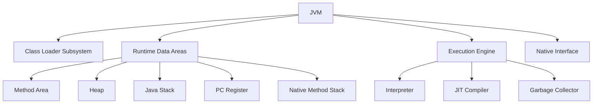
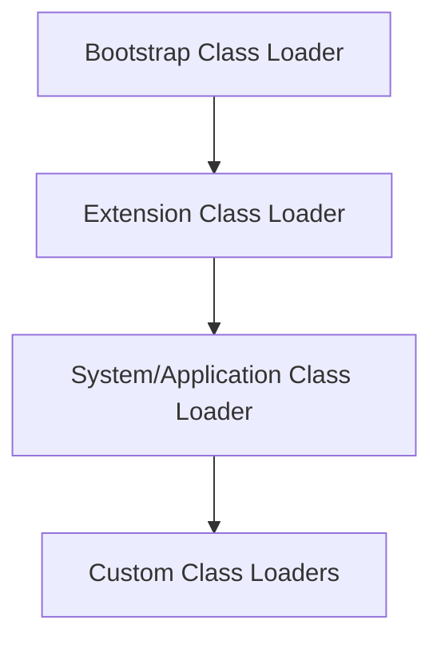

# Overview

The Java Virtual Machine (JVM) is the runtime environment that executes Java bytecode. Understanding JVM internals and the class loading mechanism is crucial for Java developers to optimize performance, troubleshoot issues, and implement advanced features like custom class loaders.

# Detailed Explanation

### JVM Architecture

The JVM consists of several key components:



#### Class Loader Subsystem

Responsible for loading class files into the JVM.

#### Runtime Data Areas

- **Method Area**: Stores class-level information, constants, static variables
- **Heap**: Runtime data area where objects are allocated
- **Java Stack**: Stores method call frames, local variables, partial results
- **PC Register**: Holds address of currently executing JVM instruction
- **Native Method Stack**: Supports native methods

#### Execution Engine

- **Interpreter**: Executes bytecode line by line
- **JIT Compiler**: Compiles bytecode to native code for better performance
- **Garbage Collector**: Automatically manages memory

### Class Loading Process

Class loading occurs in three phases:

1. **Loading**: Finding and importing the binary data for a class
2. **Linking**: 
   - Verification: Ensuring the correctness of the bytecode
   - Preparation: Allocating memory for class variables and initializing to default values
   - Resolution: Replacing symbolic references with direct references
3. **Initialization**: Executing static initializers and assigning initial values to static variables

### Class Loader Hierarchy

Java uses a hierarchical class loading mechanism:



#### Bootstrap Class Loader

- Written in native code (C/C++)
- Loads core Java classes from `rt.jar`
- No parent class loader

#### Extension Class Loader

- Loads classes from `jre/lib/ext` directory
- Parent is Bootstrap Class Loader

#### System/Application Class Loader

- Loads classes from classpath
- Parent is Extension Class Loader
- Default class loader for applications

### Class Loading Delegation Model

When a class loader is asked to load a class:

1. It delegates the request to its parent
2. If parent can't load, it attempts to load itself
3. This ensures core classes are loaded by bootstrap loader

# Real-world Examples & Use Cases

1. **Application Servers**: Custom class loaders for hot deployment
2. **OSGi Frameworks**: Modular class loading
3. **Plugin Systems**: Isolated class loading for plugins
4. **Web Applications**: WAR file class loading
5. **Testing Frameworks**: Custom class loaders for mocking
6. **Bytecode Manipulation**: Loading modified classes at runtime

# Code Examples

### Understanding Class Loading

```java
public class ClassLoadingDemo {
    public static void main(String[] args) {
        // Get class loader for this class
        ClassLoader classLoader = ClassLoadingDemo.class.getClassLoader();
        System.out.println("Class Loader: " + classLoader);
        
        // Get parent class loaders
        while (classLoader != null) {
            System.out.println("Parent: " + classLoader.getParent());
            classLoader = classLoader.getParent();
        }
        
        // Load a class dynamically
        try {
            Class<?> stringClass = Class.forName("java.lang.String");
            System.out.println("String class loaded: " + stringClass.getName());
        } catch (ClassNotFoundException e) {
            e.printStackTrace();
        }
    }
}
```

### Custom Class Loader

```java
public class CustomClassLoader extends ClassLoader {
    private String classPath;
    
    public CustomClassLoader(String classPath) {
        this.classPath = classPath;
    }
    
    @Override
    protected Class<?> findClass(String name) throws ClassNotFoundException {
        try {
            // Convert class name to file path
            String fileName = name.replace('.', '/') + ".class";
            File classFile = new File(classPath, fileName);
            
            if (!classFile.exists()) {
                throw new ClassNotFoundException("Class file not found: " + fileName);
            }
            
            // Read class file
            byte[] classBytes = Files.readAllBytes(classFile.toPath());
            
            // Define class
            return defineClass(name, classBytes, 0, classBytes.length);
        } catch (IOException e) {
            throw new ClassNotFoundException("Error loading class: " + name, e);
        }
    }
    
    public static void main(String[] args) {
        // Create custom class loader
        CustomClassLoader loader = new CustomClassLoader("path/to/classes");
        
        try {
            // Load class using custom loader
            Class<?> customClass = loader.loadClass("com.example.CustomClass");
            System.out.println("Loaded class: " + customClass.getName());
            
            // Create instance
            Object instance = customClass.getDeclaredConstructor().newInstance();
            System.out.println("Created instance: " + instance);
        } catch (Exception e) {
            e.printStackTrace();
        }
    }
}
```

### Class Loading with Reflection

```java
public class ReflectionDemo {
    public static void main(String[] args) {
        try {
            // Load class
            Class<?> clazz = Class.forName("java.util.ArrayList");
            
            // Get class information
            System.out.println("Class Name: " + clazz.getName());
            System.out.println("Package: " + clazz.getPackage().getName());
            System.out.println("Superclass: " + clazz.getSuperclass().getName());
            
            // Get constructors
            Constructor<?>[] constructors = clazz.getConstructors();
            System.out.println("Constructors:");
            for (Constructor<?> constructor : constructors) {
                System.out.println("  " + constructor);
            }
            
            // Get methods
            Method[] methods = clazz.getMethods();
            System.out.println("Public Methods:");
            for (Method method : methods) {
                System.out.println("  " + method.getName());
            }
            
            // Create instance and invoke method
            Object list = clazz.getDeclaredConstructor().newInstance();
            Method addMethod = clazz.getMethod("add", Object.class);
            addMethod.invoke(list, "Hello World");
            
            Method sizeMethod = clazz.getMethod("size");
            int size = (Integer) sizeMethod.invoke(list);
            System.out.println("List size: " + size);
            
        } catch (Exception e) {
            e.printStackTrace();
        }
    }
}
```

### JVM Memory Areas Demo

```java
public class MemoryDemo {
    // Static variable - stored in Method Area
    private static String staticVar = "Static Variable";
    
    public static void main(String[] args) {
        // Local variable - stored in Java Stack
        int localVar = 42;
        
        // Object - reference in stack, object in heap
        String heapObject = new String("Heap Object");
        
        System.out.println("Static: " + staticVar);
        System.out.println("Local: " + localVar);
        System.out.println("Heap: " + heapObject);
        
        // Call method - creates new frame in stack
        methodCall();
    }
    
    private static void methodCall() {
        // Another local variable
        double methodLocal = 3.14;
        System.out.println("Method local: " + methodLocal);
    }
}
```

# Common Pitfalls & Edge Cases

1. **ClassNotFoundException**: Class not found in classpath
2. **NoClassDefFoundError**: Class found at compile time but not runtime
3. **ClassCastException**: Invalid casting between classes
4. **LinkageError**: Incompatible class change
5. **StackOverflowError**: Deep recursion exceeding stack size
6. **OutOfMemoryError**: Heap space exhausted

# Tools & Libraries

- **jvisualvm**: Visual tool for JVM monitoring
- **jconsole**: JMX-based monitoring
- **javap**: Disassembler for class files
- **ASM**: Bytecode manipulation library
- **Byte Buddy**: Code generation library

# References

- [Oracle JVM Specification](https://docs.oracle.com/javase/specs/jvms/se21/html/)
- [Oracle Class Loading](https://docs.oracle.com/javase/tutorial/ext/basics/load.html)
- [Baeldung JVM Internals](https://www.baeldung.com/jvm)
- [JVM Anatomy](https://shipilev.net/jvm/anatomy/)

# Github-README Links & Related Topics

- [java-fundamentals/README.md](../java-fundamentals/README.md)
- [garbage-collection-algorithms/README.md](../garbage-collection-algorithms/README.md)
- [jvm-performance-tuning/README.md](../java/jvm-performance-tuning/README.md)
- [java-reflection/README.md](../java-reflection/README.md)
