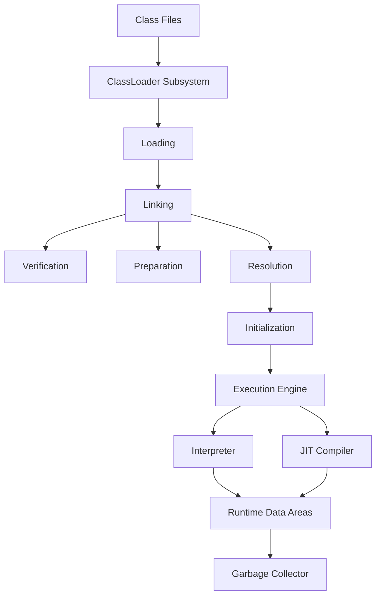

# Overview

JVM Internals & Class Loading covers the architecture of the Java Virtual Machine, including class loading, memory management, and execution processes. Understanding these internals is crucial for performance tuning and debugging Java applications.

# Detailed Explanation

The JVM is the runtime environment for Java bytecode. Key components:

- **Class Loading**: Process of loading, linking, and initializing classes using ClassLoaders (Bootstrap, Extension, System).
- **Memory Areas**: Heap (objects), Stack (method calls), Method Area (class metadata), PC Register, Native Method Stack.
- **Execution Engine**: Interprets or JIT-compiles bytecode.
- **Garbage Collection**: Automatic memory management.

### JVM Memory Areas

| Area | Purpose | Lifetime |
|------|---------|----------|
| Heap | Storage for objects and arrays | Application lifetime |
| Stack | Storage for method calls and local variables | Thread lifetime |
| Method Area | Storage for class metadata, constants, static variables | Application lifetime |
| PC Register | Holds address of current instruction | Thread lifetime |
| Native Method Stack | Storage for native method calls | Thread lifetime |

Class loading follows a delegation hierarchy to ensure security and avoid conflicts.



# Real-world Examples & Use Cases

- **Application Servers**: Tomcat uses custom ClassLoaders for web applications.
- **Plugin Systems**: IDEs load plugins dynamically.
- **Microservices**: Isolated class loading in containers.

Example: Custom ClassLoader for loading encrypted classes.

# Code Examples

Simple ClassLoader example:

```java
public class CustomClassLoader extends ClassLoader {
    @Override
    public Class<?> findClass(String name) throws ClassNotFoundException {
        // Custom loading logic
        return super.findClass(name);
    }
}
```

Memory management illustration:

```java
public class MemoryExample {
    public static void main(String[] args) {
        // Objects created in heap
        String str = new String("Hello");
        // Method calls use stack
        printMessage(str);
    }
    
    public static void printMessage(String msg) {
        System.out.println(msg);
    }
}
```

Custom ClassLoader implementation:

```java
import java.io.FileInputStream;
import java.io.IOException;

public class FileClassLoader extends ClassLoader {
    private String classPath;

    public FileClassLoader(String classPath) {
        this.classPath = classPath;
    }

    @Override
    protected Class<?> findClass(String name) throws ClassNotFoundException {
        try {
            byte[] bytes = loadClassData(name);
            return defineClass(name, bytes, 0, bytes.length);
        } catch (IOException e) {
            throw new ClassNotFoundException(name);
        }
    }

    private byte[] loadClassData(String name) throws IOException {
        String fileName = classPath + "/" + name.replace('.', '/') + ".class";
        try (FileInputStream fis = new FileInputStream(fileName)) {
            return fis.readAllBytes();
        }
    }
}
```

# Journey / Sequence

## Class Loading Process

1. **Loading**: The ClassLoader locates and reads the .class file, creating a Class object in memory.
2. **Linking**:
   - **Verification**: Checks the bytecode for correctness and security.
   - **Preparation**: Allocates memory for static fields and initializes them to default values.
   - **Resolution**: Resolves symbolic references to actual references.
3. **Initialization**: Executes static blocks and initializes static variables to their specified values.

# References

- [Oracle JVM Architecture](https://docs.oracle.com/javase/specs/jvms/se21/html/index.html)
- [Baeldung Class Loading](https://www.baeldung.com/java-classloaders)
- [JVM Internals by Aleksey Shipilëv](https://shipilev.net/jvm/)

# Common Pitfalls & Edge Cases

- **ClassLoader Conflicts**: Multiple ClassLoaders loading the same class can cause ClassCastException.
- **Memory Leaks**: Static references holding onto objects prevent GC.
- **PermGen/Metaspace OutOfMemory**: Excessive class loading without unloading.
- **ClassNotFoundException**: Incorrect classpath or delegation issues.

# Tools & Libraries

- **Monitoring Tools**: VisualVM, JConsole, Java Mission Control for JVM introspection.
- **Profiling Tools**: YourKit, JProfiler for performance analysis.
- **Libraries**: Byte Buddy for runtime class manipulation.

# Github-README Links & Related Topics

- [Garbage Collection Algorithms](../garbage-collection-algorithms/)
- [JVM Performance Tuning](../jvm-performance-tuning/)