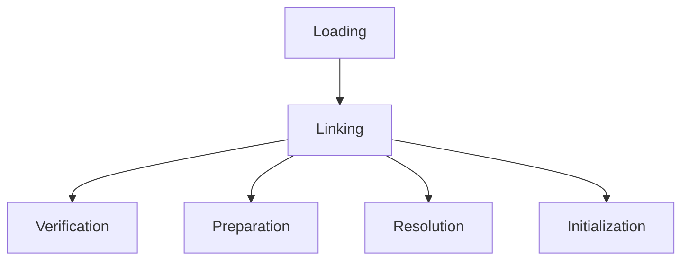

# Overview

JVM Internals & Class Loading delve into the Java Virtual Machine's architecture, focusing on how Java bytecode is executed and classes are loaded, linked, and initialized. Understanding these mechanisms is crucial for optimizing performance, troubleshooting issues, and developing efficient Java applications.

# Detailed Explanation

## JVM Architecture

The JVM consists of the Class Loader Subsystem, Runtime Data Areas (Heap, Stack, Method Area, etc.), Execution Engine (Interpreter, JIT Compiler), and Native Method Interface. It provides platform independence by interpreting bytecode on any OS.

## Class Loading Process

Class loading involves three main phases: Loading, Linking (Verification, Preparation, Resolution), and Initialization. The Class Loader Hierarchy includes Bootstrap, Extension, and Application Class Loaders.



This flowchart illustrates the class loading phases.

## Runtime Data Areas

- **Heap**: Shared memory for objects; managed by Garbage Collector.
- **Stack**: Thread-specific for method calls and local variables.
- **Method Area**: Stores class metadata, constants, and static variables.
- **PC Register**: Holds the address of the current instruction.
- **Native Method Stack**: For native code execution.

## Execution Engine

Interprets bytecode or compiles it to native code using JIT for performance.

## Class Loader Types

| Class Loader | Description | Loads Classes From |
|--------------|-------------|---------------------|
| Bootstrap   | Loads core Java classes | rt.jar, etc.       |
| Extension   | Loads extension classes | jre/lib/ext         |
| Application | Loads application classes | CLASSPATH          |

# Real-world Examples & Use Cases

- **Web Applications**: Use custom class loaders to isolate web apps in servers like Tomcat, preventing conflicts.
- **Plugin Systems**: Dynamic loading of plugins without restarting the app.
- **Hot Swapping**: In development tools, reloading classes for faster iteration.
- **Security**: Sandboxing untrusted code with custom loaders.

# Code Examples

## Custom Class Loader
```java
public class CustomClassLoader extends ClassLoader {
    @Override
    public Class<?> findClass(String name) throws ClassNotFoundException {
        byte[] b = loadClassData(name);
        return defineClass(name, b, 0, b.length);
    }
    
    private byte[] loadClassData(String name) {
        // Load bytecode from file or network
        return new byte[0]; // Placeholder
    }
}
```

## Class Loading Example
```java
public class Main {
    public static void main(String[] args) {
        try {
            Class<?> clazz = Class.forName("java.lang.String");
            System.out.println("Class loaded: " + clazz.getName());
        } catch (ClassNotFoundException e) {
            e.printStackTrace();
        }
    }
}
```

# Common Pitfalls & Edge Cases

- **ClassNotFoundException**: Ensure correct classpath and class names.
- **NoClassDefFoundError**: Missing dependencies or corrupted JARs.
- **Class Loader Leaks**: In long-running apps, prevent memory leaks from unused loaders.
- **Incompatible Class Changes**: Loading different versions of the same class can cause `LinkageError` or `ClassCastException`.
- **Security Risks**: Custom loaders bypassing delegation can load malicious code; always validate bytecode.

# References

- [JVM Architecture](https://docs.oracle.com/javase/specs/jvms/se8/html/jvms-2.html)
- [Class Loading](https://docs.oracle.com/javase/tutorial/ext/basics/load.html)
- [Understanding the JVM](https://www.oracle.com/technetwork/java/javase/tech/index-jsp-140228.html)

# Github-README Links & Related Topics

- [Garbage Collection Algorithms](./garbage-collection-algorithms/README.md)
- [Java Fundamentals](./java-fundamentals/README.md)
- [JVM Tuning](./jvm-tuning/README.md)