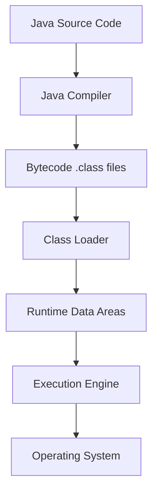

# JVM Internals & Class Loading

## Overview

The Java Virtual Machine (JVM) is the runtime environment that executes Java bytecode. Understanding JVM internals and the class loading mechanism is crucial for Java developers to optimize performance, troubleshoot issues, and write efficient code. This topic covers JVM architecture, memory management, and the class loading process.

## Detailed Explanation

### JVM Architecture

The JVM consists of several key components:

- **Class Loader Subsystem**: Loads class files into memory
- **Runtime Data Areas**: Method area, heap, stack, PC registers, native method stacks
- **Execution Engine**: Interprets or JIT-compiles bytecode
- **Native Interface**: Interacts with native libraries



### Class Loading Process

Class loading is performed by the Class Loader Subsystem in three phases:

1. **Loading**: Finding and importing the binary data of a class
2. **Linking**: 
   - Verification: Ensuring the bytecode is valid
   - Preparation: Allocating memory for class variables
   - Resolution: Converting symbolic references to direct references
3. **Initialization**: Executing static initializers and assigning initial values

### Types of Class Loaders

- **Bootstrap Class Loader**: Loads core Java classes (rt.jar)
- **Extension Class Loader**: Loads extension classes (jre/lib/ext)
- **System/Application Class Loader**: Loads application classes
- **Custom Class Loaders**: User-defined for specific needs

### Memory Areas

- **Method Area**: Stores class-level information, constants, static variables
- **Heap**: Runtime data area for objects and arrays
- **Stack**: Stores method calls, local variables, partial results
- **PC Registers**: Holds address of current executing instruction
- **Native Method Stacks**: For native method calls

## Real-world Examples & Use Cases

- **Application Servers**: Understanding class loading for deploying multiple applications
- **Plugin Systems**: Custom class loaders for dynamic plugin loading
- **Hot Deployment**: Reloading classes without restarting the application
- **Security**: Isolating classes from different sources using custom loaders

## Code Examples

### Custom Class Loader

```java
public class CustomClassLoader extends ClassLoader {
    @Override
    public Class<?> findClass(String name) throws ClassNotFoundException {
        byte[] b = loadClassFromFile(name);
        return defineClass(name, b, 0, b.length);
    }
    
    private byte[] loadClassFromFile(String fileName) {
        // Implementation to load bytecode from file
        return new byte[0]; // Placeholder
    }
}
```

### Demonstrating Class Loading

```java
public class ClassLoadingDemo {
    public static void main(String[] args) {
        try {
            Class<?> clazz = Class.forName("java.lang.String");
            System.out.println("Class loaded: " + clazz.getName());
            System.out.println("Class loader: " + clazz.getClassLoader());
        } catch (ClassNotFoundException e) {
            e.printStackTrace();
        }
    }
}
```

### Memory Management Example

```java
public class MemoryDemo {
    public static void main(String[] args) {
        // Stack allocation
        int x = 10;
        
        // Heap allocation
        String str = new String("Hello");
        
        // Method area (static)
        System.out.println(MemoryDemo.class.getName());
    }
}
```

## Common Pitfalls & Edge Cases

- **ClassNotFoundException**: When class loader cannot find the class
- **NoClassDefFoundError**: When class was available at compile time but not at runtime
- **ClassCastException**: Due to multiple class loaders loading the same class
- **Memory Leaks**: Improper object references in heap
- **StackOverflowError**: Deep recursion exceeding stack size

## Tools & Libraries

- **VisualVM**: For monitoring JVM memory and performance
- **JConsole**: Built-in JVM monitoring tool
- **JVM Tools**: jps, jstat, jmap, jstack for diagnostics

## References

- [JVM Specification](https://docs.oracle.com/javase/specs/jvms/se17/html/)
- [Oracle JVM Internals](https://docs.oracle.com/javase/8/docs/technotes/guides/vm/)
- [Java Class Loading](https://www.oracle.com/technetwork/java/javase/classloaders-140200.html)

## Github-README Links & Related Topics

- [Java Fundamentals](../java-fundamentals)
- [Garbage Collection Algorithms](../garbage-collection-algorithms)
- [JVM Performance Tuning](../java/jvm-performance-tuning)
