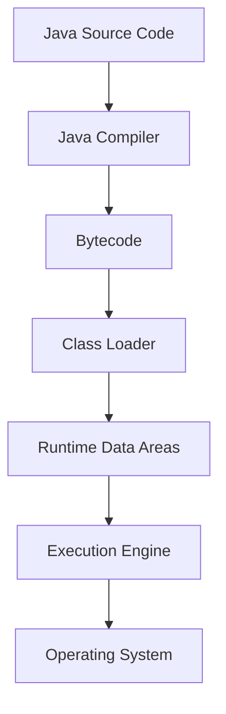
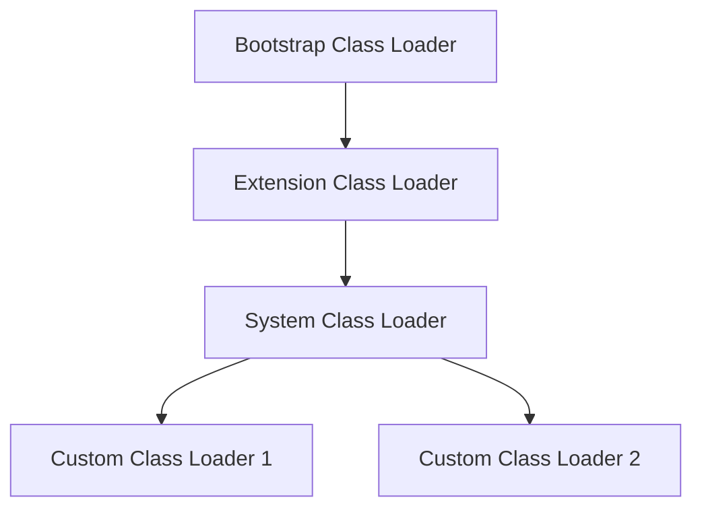

# JVM Internals & Class Loading

## Overview

The Java Virtual Machine (JVM) is the runtime environment that executes Java bytecode. Understanding JVM internals and the class loading mechanism is crucial for Java developers to write efficient, secure, and optimized applications. The class loading process involves loading, linking, and initializing classes at runtime, enabling dynamic loading and hot-swapping of code.

## Detailed Explanation

### JVM Architecture

The JVM consists of several key components:

1. **Class Loader Subsystem**: Loads class files into memory
2. **Runtime Data Areas**: Method area, heap, stack, PC registers, native method stacks
3. **Execution Engine**: Interprets or compiles bytecode
4. **Native Interface**: Interacts with native libraries



### Class Loading Process

The class loading process consists of three main phases:

#### 1. Loading
- Finding and importing the binary data of a class
- Creating a Class object in the heap
- Performed by ClassLoader and its subclasses

#### 2. Linking
- **Verification**: Ensures the bytecode is valid and safe
- **Preparation**: Allocates memory for static variables and sets default values
- **Resolution**: Replaces symbolic references with direct references

#### 3. Initialization
- Executes static initializers and assigns initial values to static variables
- Happens in the order of class hierarchy

### Types of Class Loaders

Java uses a hierarchical class loading mechanism:

1. **Bootstrap Class Loader**: Loads core Java classes (rt.jar, etc.)
2. **Extension Class Loader**: Loads classes from extension directories
3. **System/Application Class Loader**: Loads classes from classpath
4. **Custom Class Loaders**: User-defined class loaders for specific needs



### Class Loading Delegation Model

When a class loader is asked to load a class:

1. It delegates the request to its parent class loader
2. If the parent can't load the class, it attempts to load it itself
3. This ensures security and prevents loading malicious classes

## Real-world Examples & Use Cases

1. **Web Application Servers**: Using custom class loaders to load web applications in isolation
2. **Plugin Systems**: Dynamically loading plugins without restarting the application
3. **Hot Swapping**: Loading updated classes in development environments
4. **OSGi Frameworks**: Modular class loading for enterprise applications
5. **JDBC Drivers**: Loading database drivers dynamically

## Code Examples

### Understanding Class Loading

```java
public class ClassLoadingExample {
    public static void main(String[] args) {
        // Get the class loader for this class
        ClassLoader classLoader = ClassLoadingExample.class.getClassLoader();
        System.out.println("Class Loader: " + classLoader);
        
        // Get the system class loader
        ClassLoader systemClassLoader = ClassLoader.getSystemClassLoader();
        System.out.println("System Class Loader: " + systemClassLoader);
        
        // Get the parent class loader
        ClassLoader parentClassLoader = classLoader.getParent();
        System.out.println("Parent Class Loader: " + parentClassLoader);
        
        // Bootstrap class loader (usually null)
        ClassLoader bootstrapClassLoader = parentClassLoader.getParent();
        System.out.println("Bootstrap Class Loader: " + bootstrapClassLoader);
    }
}
```

### Custom Class Loader

```java
import java.io.ByteArrayOutputStream;
import java.io.File;
import java.io.FileInputStream;
import java.io.IOException;

public class CustomClassLoader extends ClassLoader {
    
    private String classPath;
    
    public CustomClassLoader(String classPath) {
        this.classPath = classPath;
    }
    
    @Override
    protected Class<?> findClass(String name) throws ClassNotFoundException {
        byte[] classData = loadClassData(name);
        if (classData == null) {
            throw new ClassNotFoundException("Class " + name + " not found");
        }
        return defineClass(name, classData, 0, classData.length);
    }
    
    private byte[] loadClassData(String className) {
        String fileName = classPath + File.separator + className.replace('.', File.separatorChar) + ".class";
        try (FileInputStream fis = new FileInputStream(fileName);
             ByteArrayOutputStream baos = new ByteArrayOutputStream()) {
            
            int b;
            while ((b = fis.read()) != -1) {
                baos.write(b);
            }
            return baos.toByteArray();
        } catch (IOException e) {
            return null;
        }
    }
    
    public static void main(String[] args) {
        CustomClassLoader loader = new CustomClassLoader("/path/to/classes");
        try {
            Class<?> clazz = loader.loadClass("com.example.MyClass");
            System.out.println("Loaded class: " + clazz.getName());
        } catch (ClassNotFoundException e) {
            System.out.println("Class not found: " + e.getMessage());
        }
    }
}
```

### Static Initialization Example

```java
public class StaticInitializationExample {
    static {
        System.out.println("Static block executed");
    }
    
    static int staticVar = initializeStaticVar();
    
    private static int initializeStaticVar() {
        System.out.println("Static variable initialized");
        return 42;
    }
    
    public static void main(String[] args) {
        System.out.println("Main method executed");
        System.out.println("Static variable value: " + StaticInitializationExample.staticVar);
    }
}
```

## Common Pitfalls & Edge Cases

1. **ClassNotFoundException vs NoClassDefFoundError**: Understanding the difference between loading and linking failures
2. **Class Loader Leaks**: Preventing memory leaks in long-running applications
3. **Circular Dependencies**: Avoiding circular class loading dependencies
4. **Security Implications**: Understanding how class loaders affect security
5. **Performance Issues**: Optimizing class loading for better startup times

## Tools & Libraries

- **JVM Tools**: jcmd, jconsole, VisualVM for monitoring JVM internals
- **Bytecode Analysis**: ASM, Javassist for manipulating bytecode
- **Profiling Tools**: YourKit, JProfiler for analyzing class loading performance
- **Class Loader Libraries**: Custom class loader frameworks

## References

- [Oracle JVM Specification - Class Loading](https://docs.oracle.com/javase/specs/jvms/se21/html/jvms-5.html)
- [Oracle Class Loading Tutorial](https://docs.oracle.com/javase/tutorial/ext/basics/load.html)
- [Baeldung Class Loaders](https://www.baeldung.com/java-classloaders)
- [GeeksforGeeks JVM Internals](https://www.geeksforgeeks.org/jvm-works-jvm-architecture/)

## Github-README Links & Related Topics

- [java-fundamentals/](java-fundamentals/)
- [garbage-collection-algorithms/](garbage-collection-algorithms/)
- [jvm-memory-model/](jvm-memory-model/)
- [java-security-basics/](java-security-basics/)

# STAR Summary

- **Situation**: Need to optimize Java application performance and security.
- **Task**: Understand JVM internals.
- **Action**: Study class loading, memory management.
- **Result**: Better debugging and optimization.

# Journey / Sequence

1. Learn JVM architecture: class loaders, runtime areas.
2. Understand class loading phases: loading, linking, initialization.
3. Explore different class loader types.
4. Practice with custom class loaders.
5. Monitor and tune JVM in production.

# Data Models / Message Formats

- **Class File Format**: {magic, version, constant_pool, methods, fields}
- **Runtime Stack Frame**: {local_variables, operand_stack, frame_data}
