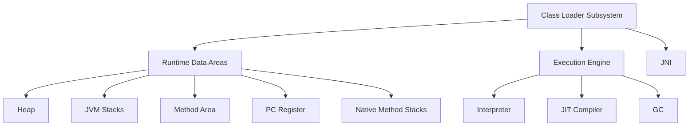
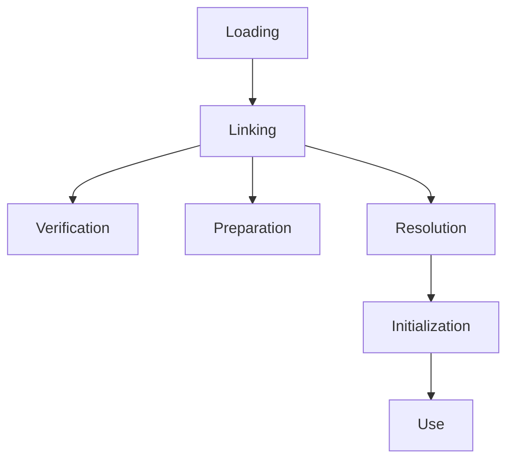

# Overview

JVM Internals & Class Loading encompass the core mechanisms of the Java Virtual Machine (JVM), including its architecture, memory management, and the process by which classes are loaded, linked, and initialized. This topic is essential for developers aiming to understand runtime behavior, optimize performance, and troubleshoot issues in Java applications. The JVM provides a platform-independent execution environment by interpreting or compiling bytecode into native machine code.

# Detailed Explanation

## JVM Architecture

The JVM is an abstract computing machine that enables Java programs to run on any device or operating system. Its architecture includes several key components:

- **Class Loader Subsystem**: Responsible for loading class files into memory.
- **Runtime Data Areas**: Memory areas used during execution, including Heap, JVM Stacks, Method Area, Program Counter (PC) Register, and Native Method Stacks.
- **Execution Engine**: Interprets bytecode or uses Just-In-Time (JIT) compilation for performance.
- **Native Method Interface (JNI)**: Allows interaction with native libraries.



This diagram outlines the high-level JVM architecture.

### Runtime Data Areas

| Area | Description | Scope | Key Details |
|------|-------------|-------|-------------|
| Heap | Shared memory for object instances and arrays | All threads | Managed by Garbage Collector (GC); divided into Young (Eden, Survivor), Old, and Permanent/Metaspace generations. |
| JVM Stacks | Thread-specific stacks for method execution | Per thread | Stores frames for method calls, including local variables and operand stacks. |
| Method Area | Stores class metadata, constants, static variables | Shared | Also known as PermGen (pre-Java 8) or Metaspace (Java 8+); holds run-time constant pool. |
| PC Register | Holds address of current JVM instruction | Per thread | Undefined for native methods. |
| Native Method Stacks | Supports native method execution | Per thread | Similar to JVM stacks but for native code. |

## Class Loading Process

Class loading is the mechanism by which the JVM locates, loads, and initializes classes. It occurs in three phases: Loading, Linking, and Initialization. The JVM uses a hierarchical class loader model with delegation.

### Class Loader Hierarchy

| Class Loader | Parent | Description | Loads From |
|--------------|--------|-------------|------------|
| Bootstrap Class Loader | None | Loads core JVM classes | JDK libraries (e.g., java.lang.*) |
| Extension Class Loader | Bootstrap | Loads extension classes | JRE/lib/ext or java.ext.dirs |
| Application Class Loader | Extension | Loads application classes | CLASSPATH |
| Custom Class Loaders | Application or others | User-defined for specific needs | Files, networks, databases |

The delegation model ensures classes are loaded by the appropriate loader, starting from the top (Bootstrap) and delegating downward if not found.

### Phases of Class Loading



1. **Loading**: Locates and reads the class file, creates a Class object in the Method Area.
2. **Linking**:
   - **Verification**: Ensures bytecode is structurally correct and safe (e.g., no stack overflows).
   - **Preparation**: Allocates memory for static fields and initializes them to default values.
   - **Resolution**: Replaces symbolic references with direct references (lazy for some).
3. **Initialization**: Executes static initializers and assigns initial values to static fields.

Loading is triggered by references to classes, such as `new`, `Class.forName()`, or accessing static members.

## Linking and Initialization Details

- **Verification**: Checks class file format, bytecode integrity, and security constraints using a 4-pass process.
- **Preparation**: Sets up static fields (e.g., `int x = 0;`).
- **Resolution**: Handles symbolic references to classes, fields, methods, etc.
- **Initialization**: Runs `<clinit>` method, ensuring thread-safety with locks.

## Execution Engine

- **Interpreter**: Executes bytecode line-by-line.
- **JIT Compiler**: Compiles hot bytecode to native code for speed.
- **Garbage Collector**: Reclaims unused memory; algorithms vary (e.g., Serial, Parallel, CMS, G1).

# Real-world Examples & Use Cases

- **Enterprise Applications**: Custom class loaders in application servers (e.g., Tomcat) isolate web applications, preventing class conflicts.
- **Plugin Architectures**: Frameworks like OSGi or Eclipse use custom loaders for dynamic plugin loading without restarts.
- **Hot Code Replacement**: IDEs and development tools reload classes during debugging.
- **Security Sandboxes**: Applet viewers or secure environments use custom loaders to restrict untrusted code.
- **Microservices**: Class loaders enable modular deployment and updates in containerized environments.

# Code Examples

## Basic Class Loading

```java
public class ClassLoadingExample {
    public static void main(String[] args) {
        try {
            // Loads and initializes the class
            Class<?> clazz = Class.forName("java.util.ArrayList");
            System.out.println("Loaded class: " + clazz.getName());
            
            // Creates an instance
            Object instance = clazz.getDeclaredConstructor().newInstance();
            System.out.println("Instance: " + instance);
        } catch (Exception e) {
            e.printStackTrace();
        }
    }
}
```

## Custom Class Loader

```java
import java.io.ByteArrayOutputStream;
import java.io.IOException;
import java.io.InputStream;
import java.net.URL;
import java.net.URLClassLoader;

public class NetworkClassLoader extends URLClassLoader {
    public NetworkClassLoader(URL[] urls) {
        super(urls);
    }

    @Override
    protected Class<?> findClass(String name) throws ClassNotFoundException {
        try {
            // Load bytecode from network
            byte[] b = loadClassData(name);
            return defineClass(name, b, 0, b.length);
        } catch (IOException e) {
            throw new ClassNotFoundException(name, e);
        }
    }

    private byte[] loadClassData(String name) throws IOException {
        String path = name.replace('.', '/') + ".class";
        try (InputStream is = getResourceAsStream(path);
             ByteArrayOutputStream baos = new ByteArrayOutputStream()) {
            if (is == null) throw new IOException("Class not found: " + name);
            byte[] buffer = new byte[4096];
            int bytesRead;
            while ((bytesRead = is.read(buffer)) != -1) {
                baos.write(buffer, 0, bytesRead);
            }
            return baos.toByteArray();
        }
    }
}
```

This custom loader fetches classes from URLs, useful for remote loading.

## Demonstrating Class Loader Delegation

```java
public class DelegationExample {
    public static void main(String[] args) {
        ClassLoader cl = Thread.currentThread().getContextClassLoader();
        System.out.println("Current ClassLoader: " + cl);
        System.out.println("Parent: " + cl.getParent());
        System.out.println("Grandparent: " + cl.getParent().getParent()); // Often null for Bootstrap
    }
}
```

# References

- [The Java Virtual Machine Specification, Chapter 2: The Structure of the Java Virtual Machine](https://docs.oracle.com/javase/specs/jvms/se21/html/jvms-2.html)
- [The Java Virtual Machine Specification, Chapter 5: Loading, Linking, and Initializing](https://docs.oracle.com/javase/specs/jvms/se21/html/jvms-5.html)
- [Understanding Class Loading in Java](https://www.oracle.com/java/technologies/javase/classloaders.html)
- [Java Tutorial: The Class Loading Process](https://docs.oracle.com/javase/tutorial/deployment/applet/classLoader.html)

# Github-README Links & Related Topics

- [Java Class Loaders](../java-class-loaders/)
- [Garbage Collection Algorithms](../garbage-collection-algorithms/)
- [JVM Memory Models](../jvm-memory-models/)
- [Multithreading and Concurrency in Java](../multithreading-and-concurrency-in-java/)