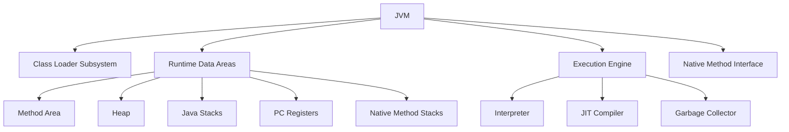

# JVM Internals & Class Loading

## Overview

The Java Virtual Machine (JVM) is the runtime environment that executes Java bytecode. Understanding JVM internals and the class loading mechanism is essential for Java developers to optimize performance, troubleshoot issues, and implement advanced features like custom class loaders.

## Detailed Explanation

### JVM Architecture

The JVM consists of several key components:



#### Class Loader Subsystem

Responsible for loading class files into the JVM.

#### Runtime Data Areas

- **Method Area:** Stores class-level information, constants, static variables.
- **Heap:** Stores objects and instance variables.
- **Java Stacks:** Stores method calls, local variables, partial results.
- **PC Registers:** Holds the address of the current instruction.
- **Native Method Stacks:** For native method calls.

#### Execution Engine

Converts bytecode to machine code using Interpreter or JIT Compiler.

### Class Loading Process

1. **Loading:** Class loader reads the .class file and creates a Class object.
2. **Linking:**
   - **Verification:** Ensures bytecode is valid and safe.
   - **Preparation:** Allocates memory for static variables.
   - **Resolution:** Replaces symbolic references with direct references.
3. **Initialization:** Executes static initializers and assigns initial values.

### Class Loaders

- **Bootstrap Class Loader:** Loads core Java classes (rt.jar).
- **Extension Class Loader:** Loads extension classes (jre/lib/ext).
- **System/Application Class Loader:** Loads application classes.

Class loaders follow the delegation model: a class loader delegates to its parent before loading itself.

## Real-world Examples & Use Cases

- **Plugin Systems:** Custom class loaders for loading plugins dynamically.
- **Application Servers:** Isolated class loading for different web applications.
- **Hot Swapping:** Reloading classes without restarting the JVM.
- **Troubleshooting:** Resolving ClassNotFoundException and NoClassDefFoundError.

## Code Examples

### Custom Class Loader

```java
import java.io.ByteArrayOutputStream;
import java.io.IOException;
import java.io.InputStream;

public class CustomClassLoader extends ClassLoader {
    @Override
    public Class<?> findClass(String name) throws ClassNotFoundException {
        byte[] bytes = loadClassData(name);
        return defineClass(name, bytes, 0, bytes.length);
    }

    private byte[] loadClassData(String name) throws ClassNotFoundException {
        try (InputStream is = getClass().getClassLoader().getResourceAsStream(name.replace('.', '/') + ".class");
             ByteArrayOutputStream baos = new ByteArrayOutputStream()) {
            int b;
            while ((b = is.read()) != -1) {
                baos.write(b);
            }
            return baos.toByteArray();
        } catch (IOException e) {
            throw new ClassNotFoundException(name);
        }
    }
}

// Usage
CustomClassLoader loader = new CustomClassLoader();
Class<?> clazz = loader.loadClass("com.example.MyClass");
Object instance = clazz.newInstance();
```

### Checking Class Loader

```java
public class ClassLoaderExample {
    public static void main(String[] args) {
        System.out.println("String class loader: " + String.class.getClassLoader());
        System.out.println("Custom class loader: " + ClassLoaderExample.class.getClassLoader());
    }
}
```

## Common Pitfalls & Edge Cases

- **Class Loader Leaks:** Classes not garbage collected due to strong references.
- **Version Conflicts:** Different versions of the same class loaded by different loaders.
- **Security Issues:** Malicious code in custom class loaders.
- **Performance:** Excessive class loading in loops.

## Tools & Libraries

- **JVM Tools:** jps, jstat, jmap for monitoring.
- **VisualVM:** GUI for inspecting loaded classes.
- **Bytecode Analysis:** Tools like javap, ASM library.

## References

- [Oracle JVM Specification](https://docs.oracle.com/javase/specs/jvms/se8/html/)
- [Baeldung: JVM Internals](https://www.baeldung.com/jvm)
- [GeeksforGeeks: JVM Class Loading](https://www.geeksforgeeks.org/class-loading-linking-initialization-java/)

## Github-README Links & Related Topics

- [Java Fundamentals](../java-fundamentals/README.md)
- [Garbage Collection Algorithms](../garbage-collection-algorithms/README.md)
- [Java Memory Management](../java-memory-management/README.md)
