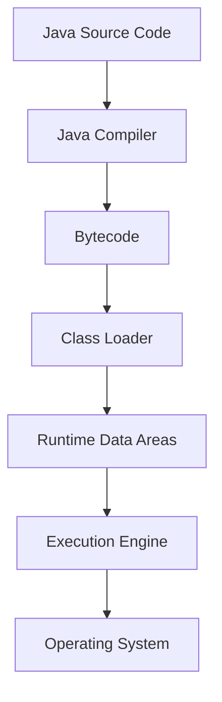

# JVM Internals & Class Loading

## Overview

The Java Virtual Machine (JVM) is the runtime environment that executes Java bytecode. Understanding JVM internals and the class loading mechanism is crucial for Java developers to optimize performance, troubleshoot issues, and write efficient code. This topic covers the JVM architecture, memory management, and how classes are loaded and linked.

## Detailed Explanation

### JVM Architecture

The JVM consists of several key components:

1. **Class Loader Subsystem**: Loads class files into memory
2. **Runtime Data Areas**: Memory areas used during program execution
3. **Execution Engine**: Executes the bytecode
4. **Native Method Interface**: Interface with native libraries
5. **Native Method Libraries**: Platform-specific libraries



### Class Loading Process

Class loading involves three main steps:

1. **Loading**: Finding and importing the binary data for a class
2. **Linking**: Performing verification, preparation, and resolution
3. **Initialization**: Executing static initializers and assigning initial values

**Class Loaders Hierarchy:**

- **Bootstrap Class Loader**: Loads core Java classes (rt.jar)
- **Extension Class Loader**: Loads extension classes
- **System/Application Class Loader**: Loads application classes

```java
public class ClassLoaderExample {
    public static void main(String[] args) {
        ClassLoader classLoader = ClassLoaderExample.class.getClassLoader();
        System.out.println("Class Loader: " + classLoader);
        System.out.println("Parent: " + classLoader.getParent());
    }
}
```

### Runtime Data Areas

1. **Method Area**: Stores class-level data (class name, methods, field info)
2. **Heap**: Stores objects and instance variables
3. **Stack**: Stores method calls and local variables
4. **PC Registers**: Stores current instruction address
5. **Native Method Stack**: Stores native method calls

### Just-In-Time (JIT) Compilation

The JVM uses JIT compilation to improve performance by compiling bytecode to native machine code at runtime.

## Real-world Examples & Use Cases

- **Performance Tuning**: Understanding memory areas helps in optimizing heap size
- **Troubleshooting**: Analyzing stack traces and memory dumps
- **Custom Class Loaders**: Implementing plugin systems or hot-swapping
- **Security**: Understanding class loading for sandboxing applications

## Code Examples

### Custom Class Loader

```java
public class CustomClassLoader extends ClassLoader {
    @Override
    public Class<?> findClass(String name) throws ClassNotFoundException {
        byte[] classData = loadClassData(name);
        if (classData == null) {
            throw new ClassNotFoundException();
        }
        return defineClass(name, classData, 0, classData.length);
    }
    
    private byte[] loadClassData(String name) {
        // Implementation to load class data from custom source
        // For example, from a database or encrypted file
        return null;
    }
}
```

### Memory Management Example

```java
public class MemoryExample {
    public static void main(String[] args) {
        // Stack allocation
        int localVar = 10;
        
        // Heap allocation
        String heapString = new String("Hello World");
        
        // Method area (static)
        System.out.println(MemoryExample.class.getName());
    }
}
```

## Common Pitfalls & Edge Cases

- **ClassNotFoundException**: When class loader cannot find the class
- **NoClassDefFoundError**: When class was available at compile time but not at runtime
- **OutOfMemoryError**: Heap or PermGen/Metaspace exhaustion
- **StackOverflowError**: Excessive recursion or deep call stacks

## Tools & Libraries

- **VisualVM**: For JVM monitoring and profiling
- **JConsole**: Built-in JVM monitoring tool
- **MAT (Memory Analyzer Tool)**: For heap dump analysis
- **jmap and jstack**: Command-line tools for memory and thread analysis

## References

- [JVM Specification](https://docs.oracle.com/javase/specs/jvms/se17/html/)
- [Oracle JVM Internals](https://docs.oracle.com/javase/8/docs/technotes/guides/vm/)
- [Understanding the JVM Internals](https://www.oracle.com/technetwork/java/javase/tech/index-jsp-140228.html)

## Github-README Links & Related Topics

- [Garbage Collection Algorithms](../garbage-collection-algorithms/README.md)
- [JVM Performance Tuning](../jvm-performance-tuning/README.md)
- [Java Memory Management](../java-memory-management/README.md)
