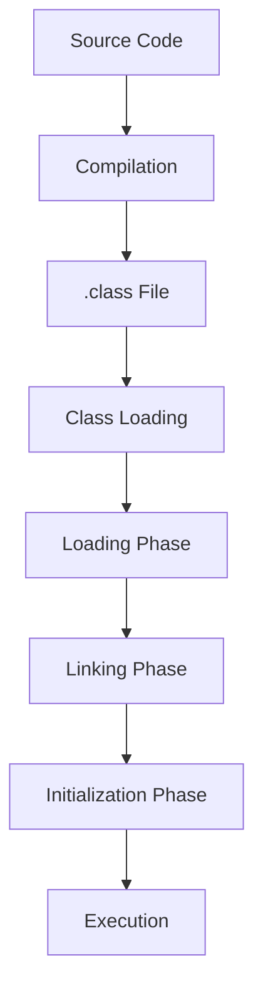

# JVM Internals & Class Loading

## Overview

The Java Virtual Machine (JVM) is the runtime environment for Java applications. Class loading is the process by which the JVM loads, links, and initializes classes at runtime.

## Detailed Explanation

### JVM Architecture

The JVM consists of:
- Class Loader Subsystem
- Runtime Data Areas (Heap, Stack, Method Area, etc.)
- Execution Engine (Interpreter, JIT Compiler)
- Native Method Interface

### Class Loading Process

Class loading occurs in three phases:
1. **Loading**: Finding and loading the class file into memory
2. **Linking**: Verifying, preparing, and resolving symbolic references
3. **Initialization**: Executing static initializers and assigning initial values

### Class Loaders

- **Bootstrap Class Loader**: Loads core Java classes
- **Extension Class Loader**: Loads extension classes
- **System/Application Class Loader**: Loads application classes

## Real-world Examples & Use Cases

- Dynamic loading of plugins in applications
- Hot-swapping classes in development tools
- Custom class loaders for security or modularity

## Code Examples

### Custom Class Loader

```java
public class CustomClassLoader extends ClassLoader {
    @Override
    public Class<?> findClass(String name) throws ClassNotFoundException {
        // Custom loading logic
        return super.findClass(name);
    }
}
```

### Static Initialization

```java
public class Example {
    static {
        System.out.println("Class initialized");
    }

    public static void main(String[] args) {
        System.out.println("Main method");
    }
}
```

## Journey / Sequence



## References

- [Oracle - The Java Virtual Machine](https://docs.oracle.com/javase/specs/jvms/se21/html/index.html)
- [GeeksforGeeks - JVM Class Loading](https://www.geeksforgeeks.org/jvm-class-loading/)

## Github-README Links & Related Topics

- [Java Fundamentals](./../java-fundamentals/README.md)
- [Garbage Collection Algorithms](./../garbage-collection-algorithms/README.md)
- [JVM Memory Model](./../java/memory-models/README.md)
