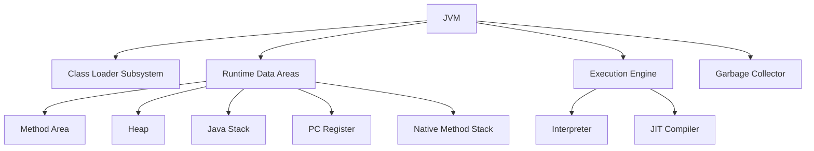

# JVM Internals & Class Loading

## Overview

The Java Virtual Machine (JVM) is the runtime environment that executes Java bytecode. Understanding JVM internals and the class loading mechanism is crucial for optimizing Java applications, debugging issues, and writing efficient code.

## Detailed Explanation

### JVM Architecture

The JVM consists of several key components:



### Class Loading Process

The class loading process follows these steps:

1. **Loading**: Finding and importing the binary data for a class
2. **Linking**: 
   - Verification: Ensuring the correctness of the imported type
   - Preparation: Allocating memory for class variables and initializing to default values
   - Resolution: Transforming symbolic references into direct references
3. **Initialization**: Executing static initializers and initializing static fields

### Class Loaders

Java uses a hierarchical class loading mechanism:

- **Bootstrap Class Loader**: Loads core Java classes from rt.jar
- **Extension Class Loader**: Loads classes from extension directories
- **System/Application Class Loader**: Loads classes from classpath

### Memory Management

JVM memory is divided into:
- **Heap**: For object storage
- **Stack**: For method execution
- **Method Area**: For class metadata and static variables
- **PC Register**: For current instruction
- **Native Method Stack**: For native method execution

## Real-world Examples & Use Cases

- **Application Servers**: Tomcat, JBoss managing multiple applications
- **Microservices**: Efficient resource utilization in containerized environments
- **Big Data Processing**: Spark and Hadoop JVM tuning for performance
- **Android Apps**: ART/Dalvik VM optimization for mobile devices
- **Enterprise Applications**: Memory leak detection and performance monitoring

## Code Examples

### Understanding Class Loading

```java
public class ClassLoadingExample {
    public static void main(String[] args) {
        // Class loading happens when we first reference the class
        System.out.println("Before loading MyClass");
        
        // This triggers class loading
        MyClass obj = new MyClass();
        obj.display();
        
        // Check class loader
        ClassLoader classLoader = ClassLoadingExample.class.getClassLoader();
        System.out.println("Class Loader: " + classLoader);
        
        // Check parent class loaders
        while (classLoader != null) {
            System.out.println("Parent: " + classLoader.getParent());
            classLoader = classLoader.getParent();
        }
    }
}

class MyClass {
    static {
        System.out.println("MyClass is being loaded");
    }
    
    public void display() {
        System.out.println("Hello from MyClass");
    }
}
```

### Custom Class Loader

```java
import java.io.ByteArrayOutputStream;
import java.io.IOException;
import java.io.InputStream;

public class CustomClassLoader extends ClassLoader {
    
    @Override
    public Class<?> findClass(String name) throws ClassNotFoundException {
        byte[] classData = loadClassData(name);
        if (classData == null) {
            throw new ClassNotFoundException("Class " + name + " not found");
        }
        return defineClass(name, classData, 0, classData.length);
    }
    
    private byte[] loadClassData(String className) {
        // In a real implementation, this would load from a custom source
        // For demonstration, we'll load from classpath
        String fileName = className.replace('.', '/') + ".class";
        try (InputStream is = getClass().getClassLoader().getResourceAsStream(fileName);
             ByteArrayOutputStream baos = new ByteArrayOutputStream()) {
            
            if (is == null) {
                return null;
            }
            
            int b;
            while ((b = is.read()) != -1) {
                baos.write(b);
            }
            
            return baos.toByteArray();
        } catch (IOException e) {
            return null;
        }
    }
    
    public static void main(String[] args) {
        CustomClassLoader loader = new CustomClassLoader();
        try {
            Class<?> clazz = loader.loadClass("java.lang.String");
            System.out.println("Loaded class: " + clazz.getName());
            System.out.println("Class loader: " + clazz.getClassLoader());
        } catch (ClassNotFoundException e) {
            e.printStackTrace();
        }
    }
}
```

### Memory Management Example

```java
public class MemoryManagementExample {
    
    public static void main(String[] args) {
        System.out.println("Starting memory management example");
        
        // Get current memory usage
        Runtime runtime = Runtime.getRuntime();
        long totalMemory = runtime.totalMemory();
        long freeMemory = runtime.freeMemory();
        long usedMemory = totalMemory - freeMemory;
        
        System.out.println("Total Memory: " + totalMemory / 1024 / 1024 + " MB");
        System.out.println("Free Memory: " + freeMemory / 1024 / 1024 + " MB");
        System.out.println("Used Memory: " + usedMemory / 1024 / 1024 + " MB");
        
        // Create objects to demonstrate heap usage
        createObjects();
        
        // Force garbage collection
        System.gc();
        
        freeMemory = runtime.freeMemory();
        usedMemory = totalMemory - freeMemory;
        
        System.out.println("After GC - Used Memory: " + usedMemory / 1024 / 1024 + " MB");
    }
    
    private static void createObjects() {
        // Create many objects to fill heap
        for (int i = 0; i < 100000; i++) {
            String obj = new String("Object " + i);
        }
    }
}
```

## Common Pitfalls & Edge Cases

- **ClassNotFoundException**: When classes are not found in classpath
- **NoClassDefFoundError**: When class was available at compile time but not runtime
- **OutOfMemoryError**: Insufficient heap or permgen space
- **StackOverflowError**: Deep recursion or large stack frames
- **Class loading deadlocks**: Circular dependencies between classes

## Tools & Libraries

- **JVM Monitoring Tools**: JVisualVM, JConsole
- **Memory Analyzers**: Eclipse MAT, YourKit
- **Profiling Tools**: JProfiler, VisualVM
- **GC Tuning Tools**: GCViewer, GCEasy

## References

- [JVM Specification](https://docs.oracle.com/javase/specs/jvms/se17/html/)
- [Understanding the JVM Internals](https://www.oracle.com/technetwork/java/javase/tech/index-jsp-140228.html)
- [Java Performance: The Definitive Guide](https://www.amazon.com/Java-Performance-Definitive-Guide/dp/1449358454)

## Github-README Links & Related Topics

- [Java Fundamentals](../java-fundamentals/README.md)
- [Garbage Collection Algorithms](../garbage-collection-algorithms/README.md)
- [JVM Performance Tuning](../java/jvm-performance-tuning/README.md)
- [Java Memory Management](../java-memory-management/README.md)
