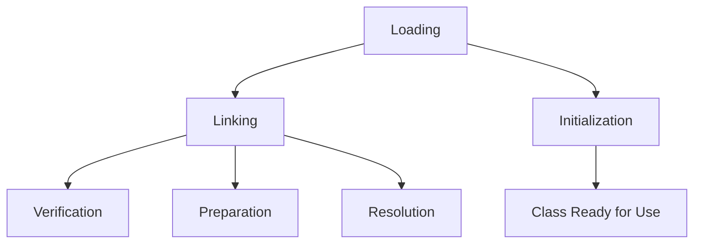

## Overview

The Java Virtual Machine (JVM) is responsible for executing Java bytecode. A key aspect of JVM internals is the class loading mechanism, which dynamically loads, links, and initializes classes and interfaces at runtime. This process ensures type safety, security, and modularity. Class loading involves finding binary representations (typically .class files), verifying their integrity, preparing runtime structures, resolving symbolic references, and executing initialization code. Understanding class loading is crucial for developers dealing with custom class loaders, modular applications, and performance optimization.

## Detailed Explanation

### JVM Architecture Overview

The JVM consists of several key components:
- **Class Loader Subsystem**: Handles loading classes.
- **Runtime Data Areas**: Method area for class metadata, heap for objects, etc.
- **Execution Engine**: Interprets or compiles bytecode.
- **Native Interface**: Interacts with native libraries.

Class loading is the first phase, followed by linking and initialization.

### Class Loading Process

The class loading process is divided into three main phases: Loading, Linking, and Initialization. This is illustrated in the following diagram:



#### Loading
Loading involves finding and reading the binary representation of a class or interface. The JVM uses class loaders to locate .class files from the file system, JAR files, or networks. There are three built-in class loaders:
- **Bootstrap Class Loader**: Loads core Java classes (e.g., java.lang.Object) from rt.jar.
- **Extension Class Loader**: Loads classes from the extensions directory (jre/lib/ext).
- **System/Application Class Loader**: Loads classes from the CLASSPATH.

Custom class loaders can be created by extending `java.lang.ClassLoader`.

#### Linking
Linking prepares the class for execution:
- **Verification**: Ensures the bytecode is structurally correct and adheres to JVM specifications. This includes checking for illegal operations, type safety, and stack overflows.
- **Preparation**: Allocates memory for static fields and initializes them to default values (e.g., 0 for integers).
- **Resolution**: Converts symbolic references (e.g., method names) into direct references. This may involve loading additional classes.

#### Initialization
Initialization executes the class's static initializer (`<clinit>` method), which runs static blocks and initializes static fields to their final values. This happens lazily, triggered by the first access to the class.

### Types of Class Loaders

| Class Loader | Description | Example Use |
|--------------|-------------|-------------|
| Bootstrap | Loads JDK core classes | java.lang.String |
| Extension | Loads extension libraries | Security providers |
| System/Application | Loads application classes | User-defined classes |
| Custom | User-defined for specific needs | Plugin systems, hot-swapping |

Class loaders follow a delegation model: a class loader delegates to its parent before attempting to load a class itself. This ensures class uniqueness and security.

### Custom Class Loaders

Custom class loaders allow loading classes from non-standard sources, such as encrypted files, networks, or databases. They must override `findClass(String)` or `loadClass(String)`. In Java SE 7+, class loaders can register as "parallel capable" to avoid deadlocks in multithreaded environments.

## Real-world Examples & Use Cases

- **Web Servers**: Tomcat uses custom class loaders to isolate web applications, allowing different versions of the same library per app.
- **OSGi Frameworks**: Enable modular applications with dynamic class loading and unloading.
- **Plugin Systems**: IDEs like Eclipse load plugins dynamically without restarting.
- **Hot Swapping**: Development tools reload modified classes at runtime.
- **Security**: Sandboxing untrusted code by loading it with restricted permissions.

In enterprise applications, custom class loaders prevent classpath conflicts in microservices architectures.

## Code Examples

### Simple Custom Class Loader

```java
import java.io.ByteArrayOutputStream;
import java.io.IOException;
import java.io.InputStream;
import java.net.URL;
import java.net.URLClassLoader;

public class CustomClassLoader extends URLClassLoader {
    public CustomClassLoader(URL[] urls) {
        super(urls);
    }

    @Override
    protected Class<?> findClass(String name) throws ClassNotFoundException {
        try {
            URL url = findResource(name.replace('.', '/') + ".class");
            if (url == null) {
                throw new ClassNotFoundException(name);
            }
            try (InputStream is = url.openStream();
                 ByteArrayOutputStream baos = new ByteArrayOutputStream()) {
                byte[] buffer = new byte[1024];
                int len;
                while ((len = is.read(buffer)) != -1) {
                    baos.write(buffer, 0, len);
                }
                byte[] bytes = baos.toByteArray();
                return defineClass(name, bytes, 0, bytes.length);
            }
        } catch (IOException e) {
            throw new ClassNotFoundException(name, e);
        }
    }

    public static void main(String[] args) throws Exception {
        URL[] urls = {new URL("file:///path/to/classes/")};
        CustomClassLoader loader = new CustomClassLoader(urls);
        Class<?> clazz = loader.loadClass("com.example.MyClass");
        System.out.println("Loaded class: " + clazz.getName());
    }
}
```

This example loads classes from a custom URL, demonstrating basic custom class loader functionality.

### Registering as Parallel Capable

```java
public class ParallelCapableClassLoader extends ClassLoader {
    static {
        registerAsParallelCapable();
    }

    // Override findClass, loadClass as needed
}
```

This prevents deadlocks in multithreaded scenarios.

### Using JarClassLoader (from Oracle Tutorial)

```java
import java.io.IOException;
import java.net.JarURLConnection;
import java.net.URL;
import java.util.jar.Attributes;

public class JarClassLoader extends java.net.URLClassLoader {
    public JarClassLoader(URL url) {
        super(new URL[]{url});
    }

    public String getMainClassName() throws IOException {
        URL u = new URL("jar", "", url + "!/");
        JarURLConnection uc = (JarURLConnection) u.openConnection();
        Attributes attr = uc.getMainAttributes();
        return attr != null ? attr.getValue(Attributes.Name.MAIN_CLASS) : null;
    }

    // Additional methods...
}
```

This loads classes from JAR files and retrieves the main class from the manifest.

## References

- [Java Virtual Machine Specification, Chapter 5: Loading, Linking, and Initializing](https://docs.oracle.com/javase/specs/jvms/se21/html/jvms-5.html)
- [Understanding Extension Class Loading](https://docs.oracle.com/javase/tutorial/deployment/jar/jarclassloader.html)
- [Multithreaded Custom Class Loaders in Java](https://docs.oracle.com/javase/8/docs/technotes/guides/lang/cl-mt.html)
- [Dynamic Class Loading in the Java Virtual Machine](https://www.oracle.com/technetwork/java/javase/tech/classloaders-141564.html)

## Github-README Links & Related Topics

- [Java Class Loaders](./java-class-loaders)
- [JVM Internals Class Loading](./jvm-internals-class-loading)
- [Java Modules](./java-modules)
- [Java Reflection](./java-reflection)
- [Concurrency in Java](./java-concurrent-programming-patterns)