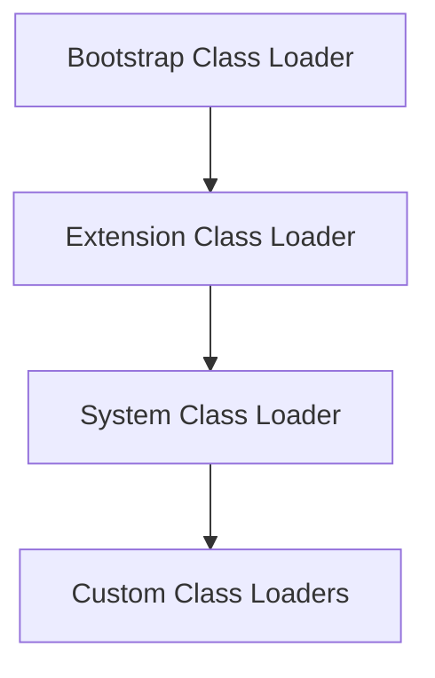

# Overview

The Java Virtual Machine (JVM) is the runtime environment that executes Java bytecode. JVM internals include memory management, garbage collection, and the class loading mechanism. Class loading is the process by which the JVM loads Java classes into memory at runtime, consisting of loading, linking, and initialization phases.

# Detailed Explanation

## JVM Architecture

The JVM consists of several key components:

- **Class Loader Subsystem**: Loads class files
- **Runtime Data Areas**: Method area, heap, stack, PC registers, native method stacks
- **Execution Engine**: Interprets or JIT-compiles bytecode
- **Native Interface**: Interacts with native libraries

## Class Loading Process

Class loading occurs in three main phases:

1. **Loading**: Finding and importing the binary data of a class
2. **Linking**: 
   - Verification: Ensuring bytecode is valid
   - Preparation: Allocating memory for class variables
   - Resolution: Replacing symbolic references with direct references
3. **Initialization**: Executing static initializers and assigning initial values

## Class Loader Hierarchy

Java uses a hierarchical class loading model:

- **Bootstrap Class Loader**: Loads core Java classes (rt.jar)
- **Extension Class Loader**: Loads extension classes (jre/lib/ext)
- **System/Application Class Loader**: Loads application classes



# Real-world Examples & Use Cases

- **Plugin Systems**: Custom class loaders for loading plugins dynamically
- **Application Servers**: Isolating web applications with separate class loaders
- **Hot Code Replacement**: Reloading classes without restarting the JVM
- **OSGi Frameworks**: Modular class loading for bundles

# Code Examples

## Custom Class Loader

```java
public class CustomClassLoader extends ClassLoader {
    @Override
    public Class<?> findClass(String name) throws ClassNotFoundException {
        byte[] b = loadClassFromFile(name);
        return defineClass(name, b, 0, b.length);
    }

    private byte[] loadClassFromFile(String fileName) {
        // Implementation to load class bytes from file
        // Omitted for brevity
        return new byte[0];
    }
}

// Usage
CustomClassLoader loader = new CustomClassLoader();
Class<?> clazz = loader.loadClass("com.example.MyClass");
```

## Class Loading Example

```java
public class ClassLoadingDemo {
    public static void main(String[] args) {
        // Bootstrap loader loads String
        String s = "Hello";
        
        // Extension loader loads classes from ext
        // System loader loads application classes
        ClassLoadingDemo demo = new ClassLoadingDemo();
        
        System.out.println("Class loader: " + demo.getClass().getClassLoader());
    }
}
```

# References

- [Oracle JVM Specification](https://docs.oracle.com/javase/specs/jvms/se17/html/)
- [Java Class Loading](https://www.oracle.com/technetwork/java/javase/classloaders-140200.html)
- [JVM Internals](https://www.baeldung.com/jvm-class-loading)

# Github-README Links & Related Topics

- [Garbage Collection Algorithms](../garbage-collection-algorithms/)
- [JVM Performance Tuning](../jvm-performance-tuning/)
- [Java Class Loaders](../java-class-loaders/)
