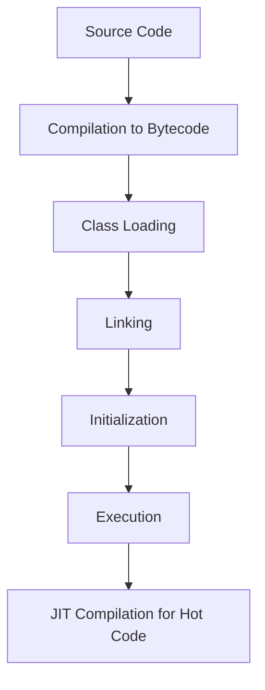

## Overview

JVM Internals & Class Loading delves into the internal workings of the Java Virtual Machine, including class loading mechanisms, bytecode execution, and JIT compilation. Understanding these concepts is crucial for performance tuning and debugging.

## Detailed Explanation

## JVM Architecture

- **Class Loader Subsystem**: Loads classes into memory.
- **Runtime Data Areas**: Heap, Stack, Method Area, PC Registers, Native Method Stacks.
- **Execution Engine**: Interprets or compiles bytecode.
- **JNI & Native Libraries**: Interface with native code.

## Class Loading Process

1. **Loading**: Finding and loading class files.
2. **Linking**: Verification, preparation, resolution.
3. **Initialization**: Executing static initializers.

## Class Loaders

- **Bootstrap Class Loader**: Loads core Java classes.
- **Extension Class Loader**: Loads extension classes.
- **System/Application Class Loader**: Loads application classes.
- **Custom Class Loaders**: User-defined for specific needs.

## Bytecode and JIT Compilation

- **Bytecode**: Platform-independent code executed by JVM.
- **JIT Compiler**: Compiles hot spots to native code for performance.

## Real-world Examples & Use Cases

- **Application Startup**: Understanding class loading for faster boot times.
- **Plugin Systems**: Custom class loaders for dynamic loading.
- **Performance Tuning**: Analyzing JIT compilation for optimization.
- **Security**: Class loader isolation for sandboxing.

## Code Examples

## Custom Class Loader

```java
import java.io.ByteArrayOutputStream;
import java.io.IOException;
import java.io.InputStream;

public class CustomClassLoader extends ClassLoader {
    @Override
    public Class<?> findClass(String name) throws ClassNotFoundException {
        byte[] b = loadClassFromFile(name);
        return defineClass(name, b, 0, b.length);
    }

    private byte[] loadClassFromFile(String fileName) {
        InputStream inputStream = getClass().getClassLoader().getResourceAsStream(fileName.replace('.', File.separatorChar) + ".class");
        ByteArrayOutputStream byteStream = new ByteArrayOutputStream();
        int nextValue;
        try {
            while ((nextValue = inputStream.read()) != -1) {
                byteStream.write(nextValue);
            }
        } catch (IOException e) {
            e.printStackTrace();
        }
        return byteStream.toByteArray();
    }
}
```

## Inspecting Class Loaders

```java
public class ClassLoaderExample {
    public static void main(String[] args) {
        ClassLoader cl = ClassLoaderExample.class.getClassLoader();
        while (cl != null) {
            System.out.println(cl);
            cl = cl.getParent();
        }
    }
}
```

## Journey / Sequence



## Common Pitfalls & Edge Cases

- Class loader leaks causing memory issues.
- ClassNotFoundException due to incorrect classpath.
- PermGen/Metaspace exhaustion.
- Incompatible bytecode versions.

## Tools & Libraries

- **JVM Tools**: jps, jstat, jmap for monitoring.
- **VisualVM**: GUI for JVM analysis.
- **JConsole**: Monitoring and management.

## References

- [Oracle JVM Specification](https://docs.oracle.com/javase/specs/jvms/se8/html/)
- [Understanding the JVM Internals](https://www.oracle.com/technetwork/java/javase/tech/index-jsp-140228.html)

## Github-README Links & Related Topics

- [Java Fundamentals](java-fundamentals/README.md)
- [Garbage Collection Algorithms](garbage-collection-algorithms/README.md)
- [JVM Performance Tuning](java/advanced-java-concepts/jvm-performance-tuning/README.md)