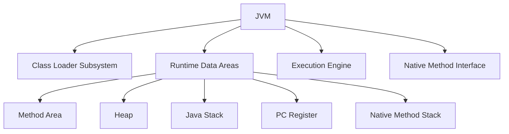
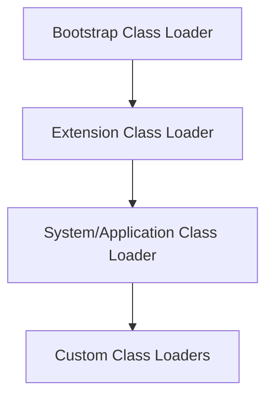

# JVM Internals & Class Loading

## Overview

The Java Virtual Machine (JVM) is the runtime environment that executes Java bytecode. Understanding JVM internals and the class loading mechanism is crucial for optimizing performance, debugging issues, and writing efficient Java applications.

## Detailed Explanation

### JVM Architecture

The JVM consists of several key components:



### Class Loading Process

Class loading is the process of loading class files into the JVM memory. It involves three main phases:

1. **Loading**: Finding and importing the binary data of a class
2. **Linking**: Verifying, preparing, and resolving symbolic references
3. **Initialization**: Executing static initializers and assigning initial values

### Class Loader Hierarchy

Java uses a hierarchical class loading mechanism:



- **Bootstrap Class Loader**: Loads core Java classes from rt.jar
- **Extension Class Loader**: Loads classes from jre/lib/ext
- **System Class Loader**: Loads classes from classpath
- **Custom Class Loaders**: User-defined class loaders

### Runtime Data Areas

#### Method Area
- Stores class-level information (class name, modifiers, method info)
- Stores static variables and constants
- Shared among all threads

#### Heap
- Stores object instances and arrays
- Divided into Young Generation (Eden, Survivor spaces) and Old Generation
- Garbage collected

#### Java Stack
- Stores method call frames
- Each frame contains local variables, operand stack, and frame data
- Thread-specific

#### PC Register
- Stores the address of the currently executing JVM instruction
- Thread-specific

#### Native Method Stack
- Supports native method execution
- Thread-specific

### Class Loading Example

```java
public class ClassLoadingExample {
    public static void main(String[] args) {
        // Class loading happens here when MyClass is first referenced
        MyClass obj = new MyClass();
        obj.display();
    }
}

class MyClass {
    static {
        System.out.println("MyClass is being initialized");
    }
    
    public void display() {
        System.out.println("Hello from MyClass");
    }
}
```

### Custom Class Loader

```java
public class CustomClassLoader extends ClassLoader {
    @Override
    public Class<?> findClass(String name) throws ClassNotFoundException {
        byte[] classData = loadClassData(name);
        if (classData == null) {
            throw new ClassNotFoundException();
        }
        return defineClass(name, classData, 0, classData.length);
    }
    
    private byte[] loadClassData(String name) {
        // Implementation to load class data from custom source
        // e.g., network, encrypted files, etc.
        return null;
    }
}
```

## Real-world Examples & Use Cases

1. **Application Servers**: Custom class loaders for hot deployment and isolation
2. **Plugin Systems**: Dynamic loading of plugins without restarting the application
3. **OSGi Frameworks**: Modular class loading for component-based systems
4. **Web Applications**: Class loading in servlet containers
5. **Testing Frameworks**: Isolated class loading for test environments

## Code Examples

### Class Loading Demonstration

```java
public class ClassLoaderDemo {
    public static void main(String[] args) {
        // Get class loader hierarchy
        ClassLoader systemLoader = ClassLoader.getSystemClassLoader();
        ClassLoader extensionLoader = systemLoader.getParent();
        ClassLoader bootstrapLoader = extensionLoader.getParent();
        
        System.out.println("System Class Loader: " + systemLoader);
        System.out.println("Extension Class Loader: " + extensionLoader);
        System.out.println("Bootstrap Class Loader: " + bootstrapLoader);
        
        // Load a class dynamically
        try {
            Class<?> clazz = Class.forName("java.lang.String");
            System.out.println("Loaded class: " + clazz.getName());
            System.out.println("Class loader: " + clazz.getClassLoader());
        } catch (ClassNotFoundException e) {
            e.printStackTrace();
        }
    }
}
```

### Memory Area Demonstration

```java
public class MemoryDemo {
    public static void main(String[] args) {
        // Method area: static variables
        // Heap: object instances
        StringBuilder sb = new StringBuilder("Hello");
        sb.append(" World");
        
        // Java stack: method frames and local variables
        int localVar = 42;
        
        System.out.println(sb.toString());
        System.out.println("Local variable: " + localVar);
        
        // Demonstrate garbage collection
        sb = null;
        System.gc(); // Suggest garbage collection
    }
}
```

## Common Pitfalls & Edge Cases

1. **ClassNotFoundException**: When class loader cannot find the class
2. **NoClassDefFoundError**: When class was available at compile time but not at runtime
3. **Class loading deadlocks**: Multiple threads loading classes simultaneously
4. **Memory leaks**: Improper class loader management in long-running applications
5. **PermGen/Metaspace exhaustion**: Too many loaded classes

## References

- [Oracle JVM Documentation](https://docs.oracle.com/javase/specs/jvms/se17/html/index.html)
- [Java Class Loading](https://www.baeldung.com/java-classloaders)
- [JVM Internals](https://www.geeksforgeeks.org/jvm-works-jvm-architecture/)

## Github-README Links & Related Topics

- [garbage-collection-algorithms/README.md](../garbage-collection-algorithms/README.md)
- [jvm-internals-and-class-loading/README.md](../java/jvm-internals-and-classloading/README.md)
- [java-memory-model-and-concurrency/README.md](../java/java-memory-model-and-concurrency/README.md)
