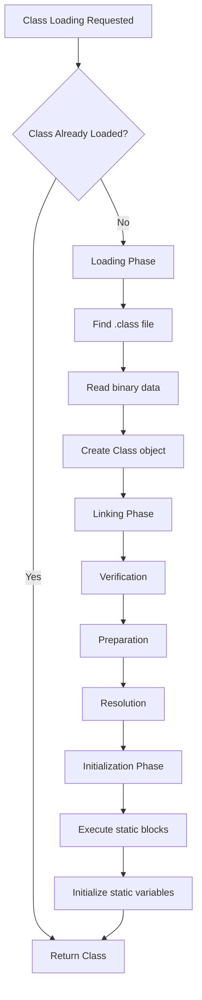

# JVM Internals & Class Loading

## Overview

The Java Virtual Machine (JVM) is the runtime environment that executes Java bytecode. It provides platform independence by acting as an abstraction layer between Java programs and the underlying hardware. Class loading is a crucial part of JVM internals, responsible for loading, linking, and initializing classes at runtime. Understanding JVM internals and class loading is essential for Java developers to optimize performance, troubleshoot issues, and write efficient code.

## Detailed Explanation

### JVM Architecture
The JVM consists of several key components:

1. **Class Loader Subsystem**: Loads class files into memory
2. **Runtime Data Areas**: Memory areas used during program execution
3. **Execution Engine**: Executes the bytecode
4. **Native Method Interface (JNI)**: Interface for native methods
5. **Native Method Libraries**: Libraries of native methods

### Runtime Data Areas
- **Method Area**: Stores class-level data (class name, parent class, methods, variables)
- **Heap**: Stores objects and instance variables
- **Stack**: Stores local variables and method calls (one stack per thread)
- **Program Counter (PC) Register**: Holds address of currently executing JVM instruction
- **Native Method Stack**: Supports native methods

### Class Loading Process
Class loading occurs in three main phases:

1. **Loading**: Finding and importing the binary data of a class
2. **Linking**:
   - Verification: Ensuring the correctness of the loaded class
   - Preparation: Allocating memory for class variables and initializing them to default values
   - Resolution: Replacing symbolic references with direct references
3. **Initialization**: Executing static initializers and assigning initial values to static variables



### Types of Class Loaders
Java uses a hierarchical class loading mechanism:

1. **Bootstrap Class Loader**: Loads core Java classes (rt.jar, etc.)
2. **Extension Class Loader**: Loads classes from extension directories
3. **System/Application Class Loader**: Loads classes from the application classpath
4. **Custom Class Loaders**: User-defined class loaders for specific needs

### Class Loading Delegation Model
When a class loader is asked to load a class, it follows this hierarchy:
1. Delegates to parent class loader
2. If parent can't load, attempts to load itself
This ensures security and prevents loading of malicious classes.

## Real-world Examples & Use Cases

1. **Dynamic Plugin Loading**: Web servers loading plugins at runtime without restart
2. **Application Servers**: Loading multiple web applications in isolation
3. **HotSwap in Development**: Reloading classes during development without restarting JVM
4. **OSGi Frameworks**: Modular class loading for enterprise applications
5. **Custom Class Loaders for Security**: Sandboxing untrusted code

## Code Examples

### Understanding Class Loading
```java
public class ClassLoadingExample {
    public static void main(String[] args) {
        // Class loading happens when we first reference a class
        System.out.println("Main class loaded");
        
        // This will trigger loading of String class (already loaded by bootstrap)
        String str = "Hello World";
        
        // This will trigger loading of our custom class
        CustomClass custom = new CustomClass();
        custom.doSomething();
    }
}

class CustomClass {
    static {
        System.out.println("CustomClass is being initialized");
    }
    
    public void doSomething() {
        System.out.println("Doing something in CustomClass");
    }
}
```

### Custom Class Loader Example
```java
import java.io.ByteArrayOutputStream;
import java.io.IOException;
import java.io.InputStream;
import java.net.URL;
import java.net.URLClassLoader;

public class CustomClassLoader extends ClassLoader {
    private String classPath;
    
    public CustomClassLoader(String classPath) {
        this.classPath = classPath;
    }
    
    @Override
    protected Class<?> findClass(String name) throws ClassNotFoundException {
        try {
            byte[] classData = loadClassData(name);
            return defineClass(name, classData, 0, classData.length);
        } catch (IOException e) {
            throw new ClassNotFoundException("Class " + name + " not found", e);
        }
    }
    
    private byte[] loadClassData(String name) throws IOException {
        String fileName = classPath + "/" + name.replace('.', '/') + ".class";
        try (InputStream inputStream = getClass().getClassLoader().getResourceAsStream(fileName);
             ByteArrayOutputStream buffer = new ByteArrayOutputStream()) {
            int data = inputStream.read();
            while (data != -1) {
                buffer.write(data);
                data = inputStream.read();
            }
            return buffer.toByteArray();
        }
    }
    
    public static void main(String[] args) throws Exception {
        CustomClassLoader loader = new CustomClassLoader("path/to/classes");
        Class<?> clazz = loader.loadClass("com.example.MyClass");
        Object instance = clazz.newInstance();
        // Use reflection to call methods on the loaded class
    }
}
```

### Class Loading Delegation Example
```java
public class ClassLoaderHierarchy {
    public static void main(String[] args) {
        // Get the system class loader
        ClassLoader systemLoader = ClassLoader.getSystemClassLoader();
        System.out.println("System Class Loader: " + systemLoader);
        
        // Get the extension class loader (parent of system loader)
        ClassLoader extensionLoader = systemLoader.getParent();
        System.out.println("Extension Class Loader: " + extensionLoader);
        
        // Get the bootstrap class loader (parent of extension loader)
        ClassLoader bootstrapLoader = extensionLoader.getParent();
        System.out.println("Bootstrap Class Loader: " + bootstrapLoader); // Usually null
        
        // Load a class and see which loader loaded it
        try {
            Class<?> stringClass = Class.forName("java.lang.String");
            System.out.println("String class loader: " + stringClass.getClassLoader());
            
            Class<?> customClass = Class.forName("ClassLoaderHierarchy");
            System.out.println("Custom class loader: " + customClass.getClassLoader());
        } catch (ClassNotFoundException e) {
            e.printStackTrace();
        }
    }
}
```

## Common Pitfalls & Edge Cases

1. **ClassNotFoundException vs NoClassDefFoundError**: Former occurs during loading, latter during linking/initialization
2. **Class loading conflicts**: Multiple versions of same class in different classpaths
3. **Memory leaks from custom class loaders**: Classes can't be garbage collected if loader is reachable
4. **Security issues**: Custom loaders bypassing security checks
5. **Performance overhead**: Excessive class loading in loops

## Tools & Libraries

- **JVM Tools**: jconsole, jvisualvm for monitoring
- **Class Loading Analysis**: Use -verbose:class JVM flag
- **Bytecode Analysis**: javap, ASM library
- **Profiling Tools**: YourKit, JProfiler for class loading performance

## References

- [Oracle JVM Documentation](https://docs.oracle.com/javase/8/docs/technotes/guides/vm/)
- [Java Class Loading](https://www.oracle.com/technetwork/java/javase/classloaders-140200.html)
- [JVM Internals](https://www.artima.com/insidejvm/ed2/)
- [Baeldung Class Loaders](https://www.baeldung.com/java-classloaders)

## Github-README Links & Related Topics

- [Java Fundamentals](../java-fundamentals/README.md)
- [JVM Memory Model](../jvm-memory-model/README.md)
- [Garbage Collection Algorithms](../garbage-collection-algorithms/README.md)
- [JVM Performance Tuning](../jvm-performance-tuning/README.md)
