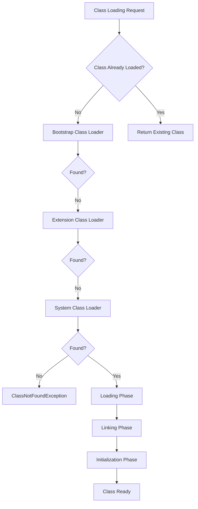

# JVM Internals & Class Loading

## Overview

The Java Virtual Machine (JVM) is the runtime environment that executes Java bytecode, providing platform independence and memory management. The class loading mechanism is responsible for loading, linking, and initializing classes and interfaces at runtime, forming the foundation of Java's dynamic nature.

## Detailed Explanation

### JVM Architecture Components

The JVM architecture includes:

- **Class Loader Subsystem**: Loads class files and creates Class objects
- **Runtime Data Areas**: 
  - Method Area: Stores class structure, method data, constants
  - Heap: Runtime data area for object allocation
  - Java Stack: Thread-specific stack for method execution
  - PC Register: Holds current instruction address
  - Native Method Stack: Supports native method execution
- **Execution Engine**: Interprets bytecode or uses JIT compilation
- **JNI (Java Native Interface)**: Interface for calling native methods
- **Native Method Libraries**: Platform-specific implementations

### Class Loading Process

Class loading occurs in three main phases:

1. **Loading**: 
   - Finding the binary representation of a class or interface
   - Creating a Class object from the binary data
   - Loading by Bootstrap, Extension, or System Class Loaders

2. **Linking**:
   - **Verification**: Ensures bytecode is valid and safe
   - **Preparation**: Allocates memory for class variables and initializes to default values
   - **Resolution**: Resolves symbolic references to actual references

3. **Initialization**: 
   - Executes static initializers
   - Initializes static variables to their specified values

### Types of Class Loaders

| Class Loader | Description | Loads |
|--------------|-------------|-------|
| Bootstrap | Written in native code | Core Java classes (rt.jar) |
| Extension | Loads extension classes | JARs from jre/lib/ext |
| System/Application | Loads application classes | CLASSPATH classes |



## Real-world Examples & Use Cases

- **Plugin Architectures**: Web servers like Tomcat use custom class loaders to load web applications in isolation
- **OSGi Frameworks**: Modular systems where bundles have their own class loaders for dependency management
- **Hot Code Replacement**: IDEs and application servers reload modified classes without restarting
- **Security Sandboxes**: Applet class loaders restrict access to sensitive operations
- **Dynamic Proxies**: Generated proxy classes loaded at runtime for AOP and remoting

## Code Examples

### Basic Class Loading

```java
public class ClassLoadingDemo {
    public static void main(String[] args) {
        try {
            // Load class dynamically
            Class<?> clazz = Class.forName("java.util.ArrayList");
            System.out.println("Class loaded: " + clazz.getName());
            
            // Get class loader hierarchy
            ClassLoader classLoader = clazz.getClassLoader();
            System.out.println("Class Loader: " + classLoader);
            
            // Bootstrap classes have null class loader
            Class<?> stringClass = Class.forName("java.lang.String");
            System.out.println("String Class Loader: " + stringClass.getClassLoader());
            
        } catch (ClassNotFoundException e) {
            e.printStackTrace();
        }
    }
}
```

### Custom Class Loader

```java
public class CustomClassLoader extends ClassLoader {
    
    private String classPath;
    
    public CustomClassLoader(String classPath) {
        this.classPath = classPath;
    }
    
    @Override
    protected Class<?> findClass(String name) throws ClassNotFoundException {
        try {
            byte[] bytes = loadClassBytes(name);
            return defineClass(name, bytes, 0, bytes.length);
        } catch (Exception e) {
            throw new ClassNotFoundException(name, e);
        }
    }
    
    private byte[] loadClassBytes(String name) throws Exception {
        String fileName = classPath + "/" + name.replace('.', '/') + ".class";
        try (FileInputStream fis = new FileInputStream(fileName);
             ByteArrayOutputStream baos = new ByteArrayOutputStream()) {
            byte[] buffer = new byte[1024];
            int bytesRead;
            while ((bytesRead = fis.read(buffer)) != -1) {
                baos.write(buffer, 0, bytesRead);
            }
            return baos.toByteArray();
        }
    }
    
    public static void main(String[] args) {
        CustomClassLoader loader = new CustomClassLoader("/path/to/classes");
        try {
            Class<?> clazz = loader.loadClass("com.example.MyClass");
            System.out.println("Loaded class: " + clazz.getName());
        } catch (ClassNotFoundException e) {
            e.printStackTrace();
        }
    }
}
```

### Static Initialization Order

```java
public class InitializationOrder {
    static {
        System.out.println("Static block 1");
    }
    
    private static int value = initializeValue();
    
    static {
        System.out.println("Static block 2");
    }
    
    private static int initializeValue() {
        System.out.println("Initializing value");
        return 42;
    }
    
    public static void main(String[] args) {
        System.out.println("Main method: " + InitializationOrder.value);
    }
}
// Output:
// Static block 1
// Initializing value
// Static block 2
// Main method: 42
```

## Common Pitfalls & Edge Cases

- **ClassNotFoundException vs NoClassDefFoundError**: Former for loading failures, latter for linking failures
- **Class loader leaks**: Holding references to class loaders in long-running applications
- **Incompatible class loaders**: Classes loaded by different loaders cannot be cast
- **Static initialization deadlocks**: Circular dependencies between classes during initialization

## Tools & Libraries

- **JVM Diagnostic Tools**: jps, jstat, jmap, jstack
- **VisualVM**: Comprehensive JVM monitoring and profiling
- **JConsole**: Built-in JMX monitoring console
- **Bytecode Analysis**: javap, ASM library for bytecode manipulation

## References

- [JVM Specification - Chapter 5: Loading, Linking, and Initializing](https://docs.oracle.com/javase/specs/jvms/se21/html/jvms-5.html)
- [Oracle - Understanding the JVM Architecture](https://www.oracle.com/technetwork/java/javase/tech/index-jsp-140228.html)
- [Baeldung - JVM Internals](https://www.baeldung.com/jvm)
- [GeeksforGeeks - Class Loading and Linking](https://www.geeksforgeeks.org/class-loading-linking-and-initialization-in-java/)

## Github-README Links & Related Topics

- [Java Fundamentals](../java-fundamentals/README.md)
- [Garbage Collection Algorithms](../garbage-collection-algorithms/README.md)
- [JVM Performance Tuning](../jvm-performance-tuning/README.md)
- [Java Memory Management](../java-memory-management/README.md)