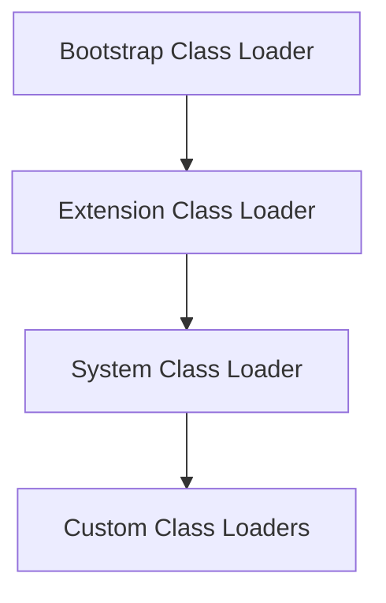

# JVM Internals & Class Loading

## Overview

The Java Virtual Machine (JVM) is the runtime environment that executes Java bytecode. Understanding JVM internals and the class loading mechanism is crucial for Java developers to optimize performance, troubleshoot issues, and write efficient code. This topic covers JVM architecture, memory management, and the class loading process.

## Detailed Explanation

### JVM Architecture

The JVM consists of several key components:

1. **Class Loader Subsystem:** Loads class files into memory
2. **Runtime Data Areas:** Memory areas used during program execution
3. **Execution Engine:** Executes the bytecode
4. **Native Method Interface:** Interface with native libraries
5. **Native Method Libraries:** Platform-specific libraries

### Runtime Data Areas

- **Method Area:** Stores class-level information, constants, static variables
- **Heap:** Stores objects and instance variables
- **Stack:** Stores local variables and method calls (per thread)
- **Program Counter Register:** Contains address of current instruction (per thread)
- **Native Method Stack:** Supports native method execution (per thread)

### Class Loading Process

Class loading is performed in three main phases:

1. **Loading:** Finding and importing the binary data of a class
2. **Linking:** 
   - Verification: Ensuring the correctness of the bytecode
   - Preparation: Allocating memory for class variables and initializing to default values
   - Resolution: Replacing symbolic references with direct references
3. **Initialization:** Executing static initializers and assigning initial values to static variables

### Class Loader Hierarchy

Java uses a hierarchical class loading mechanism:

- **Bootstrap Class Loader:** Loads core Java classes (rt.jar)
- **Extension Class Loader:** Loads classes from extension directories
- **System/Application Class Loader:** Loads classes from classpath



### Class Loading Delegation Model

When a class is requested:
1. The request is delegated to the parent class loader
2. If the parent can't find the class, the child attempts to load it
3. This continues up the hierarchy

## Real-world Examples & Use Cases

- **Plugin Systems:** Using custom class loaders to load plugins dynamically
- **Application Servers:** Isolating web applications with separate class loaders
- **Hot Deployment:** Reloading classes without restarting the application
- **Security:** Sandboxing untrusted code with custom class loaders

## Code Examples

### Understanding Class Loading
```java
public class ClassLoadingExample {
    public static void main(String[] args) {
        // Get the class loader for this class
        ClassLoader classLoader = ClassLoadingExample.class.getClassLoader();
        System.out.println("Class Loader: " + classLoader);
        
        // Get the parent class loader
        ClassLoader parent = classLoader.getParent();
        System.out.println("Parent Class Loader: " + parent);
        
        // Bootstrap class loader
        ClassLoader bootstrap = parent.getParent();
        System.out.println("Bootstrap Class Loader: " + bootstrap); // null
    }
}
```

### Custom Class Loader
```java
import java.io.ByteArrayOutputStream;
import java.io.File;
import java.io.FileInputStream;
import java.io.IOException;

public class CustomClassLoader extends ClassLoader {
    
    private String classPath;
    
    public CustomClassLoader(String classPath) {
        this.classPath = classPath;
    }
    
    @Override
    protected Class<?> findClass(String name) throws ClassNotFoundException {
        byte[] classData = loadClassData(name);
        if (classData == null) {
            throw new ClassNotFoundException("Class " + name + " not found");
        }
        return defineClass(name, classData, 0, classData.length);
    }
    
    private byte[] loadClassData(String className) {
        String fileName = classPath + File.separator + className.replace('.', File.separatorChar) + ".class";
        try (FileInputStream fis = new FileInputStream(fileName);
             ByteArrayOutputStream baos = new ByteArrayOutputStream()) {
            int b;
            while ((b = fis.read()) != -1) {
                baos.write(b);
            }
            return baos.toByteArray();
        } catch (IOException e) {
            return null;
        }
    }
}

// Usage
public class Main {
    public static void main(String[] args) throws Exception {
        CustomClassLoader loader = new CustomClassLoader("/path/to/classes");
        Class<?> clazz = loader.loadClass("com.example.MyClass");
        Object instance = clazz.newInstance();
        // Use the instance
    }
}
```

### Static Initialization Example
```java
public class StaticInitExample {
    static {
        System.out.println("Static block executed");
    }
    
    public static void main(String[] args) {
        System.out.println("Main method executed");
    }
}
```

## Common Pitfalls & Edge Cases

- **ClassNotFoundException vs NoClassDefFoundError:** Former occurs during loading, latter during linking/initialization
- **Class loader leaks:** In application servers, can cause memory leaks
- **Circular dependencies:** Can cause StackOverflowError during initialization
- **Security implications:** Custom class loaders can bypass security restrictions

## References

- [Oracle JVM Documentation](https://docs.oracle.com/javase/specs/jvms/se11/html/)
- [Understanding Class Loading](https://www.baeldung.com/java-classloaders)
- [JVM Architecture](https://www.geeksforgeeks.org/jvm-works-jvm-architecture/)
- [Class Loading in Java](https://www.javatpoint.com/class-loading-in-java)

## Github-README Links & Related Topics

- [Java Fundamentals](../java-fundamentals/README.md)
- [Garbage Collection Algorithms](../garbage-collection-algorithms/README.md)
- [Java Memory Management](../java-memory-management/README.md)
- [JVM Performance Tuning](../jvm-performance-tuning/README.md)
- [Class Loading Mechanism](../class-loading-mechanism/README.md)
