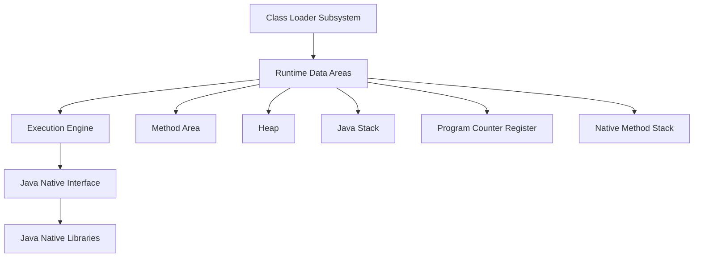

# JVM Internals & Class Loading

## Overview

The Java Virtual Machine (JVM) is the runtime environment that executes Java bytecode. Understanding JVM internals and the class loading mechanism is crucial for Java developers to optimize performance, troubleshoot issues, and write efficient code. This topic covers JVM architecture, memory management, and the class loading process.

## Detailed Explanation

### JVM Architecture

The JVM consists of several key components that work together to execute Java programs:



#### Class Loader Subsystem

Responsible for loading, linking, and initializing classes.

#### Runtime Data Areas

- **Method Area**: Stores class-level information, constants, static variables.
- **Heap**: Stores objects and instance variables.
- **Java Stack**: Stores method calls, local variables, and partial results.
- **Program Counter Register**: Contains address of currently executing JVM instruction.
- **Native Method Stack**: Supports native methods written in languages other than Java.

#### Execution Engine

Interprets or compiles bytecode into machine code.

#### Java Native Interface (JNI)

Allows Java code to call native methods and vice versa.

### Class Loading Process

Class loading is the process of finding and loading class files into the JVM. It involves three main steps:

1. **Loading**: Finding and importing the binary data of a class.
2. **Linking**: 
   - Verification: Ensuring the correctness of the loaded class.
   - Preparation: Allocating memory for class variables and initializing them to default values.
   - Resolution: Converting symbolic references to direct references.
3. **Initialization**: Executing static initializers and assigning initial values to static variables.

### Class Loaders

Java uses a hierarchical class loading mechanism:

1. **Bootstrap Class Loader**: Loads core Java classes (rt.jar, etc.).
2. **Extension Class Loader**: Loads classes from extension directories.
3. **System/Application Class Loader**: Loads classes from the application classpath.

#### Class Loader Delegation Model

When a class loader is asked to load a class, it delegates the request to its parent class loader first. Only if the parent cannot load the class does the child attempt to load it.

### Memory Management

#### Heap Memory

- **Young Generation**: Where new objects are allocated.
  - Eden Space
  - Survivor Spaces (S0, S1)
- **Old Generation**: Long-lived objects.
- **Permanent Generation/Metaspace**: Class metadata (Java 8+).

#### Garbage Collection

Automatic memory management that reclaims heap space occupied by objects that are no longer in use.

## Real-world Examples & Use Cases

1. **Application Startup Optimization**: Understanding class loading to reduce startup time.
2. **Memory Leak Diagnosis**: Analyzing heap dumps to identify memory issues.
3. **Performance Tuning**: Configuring JVM parameters for optimal performance.
4. **Custom Class Loaders**: Implementing dynamic plugin systems.
5. **Security**: Understanding class loading for sandboxing applications.

## Code Examples

### Custom Class Loader

```java
public class CustomClassLoader extends ClassLoader {
    @Override
    public Class<?> findClass(String name) throws ClassNotFoundException {
        byte[] classData = loadClassData(name);
        if (classData == null) {
            throw new ClassNotFoundException();
        }
        return defineClass(name, classData, 0, classData.length);
    }
    
    private byte[] loadClassData(String name) {
        // Implementation to load class data from custom source
        // For example, from a database or network
        return null;
    }
}
```

### JVM Memory Monitoring

```java
public class MemoryMonitor {
    public static void main(String[] args) {
        Runtime runtime = Runtime.getRuntime();
        
        long totalMemory = runtime.totalMemory();
        long freeMemory = runtime.freeMemory();
        long usedMemory = totalMemory - freeMemory;
        
        System.out.println("Total Memory: " + totalMemory / (1024 * 1024) + " MB");
        System.out.println("Free Memory: " + freeMemory / (1024 * 1024) + " MB");
        System.out.println("Used Memory: " + usedMemory / (1024 * 1024) + " MB");
        
        // Force garbage collection
        runtime.gc();
        
        freeMemory = runtime.freeMemory();
        usedMemory = totalMemory - freeMemory;
        
        System.out.println("After GC - Free Memory: " + freeMemory / (1024 * 1024) + " MB");
        System.out.println("After GC - Used Memory: " + usedMemory / (1024 * 1024) + " MB");
    }
}
```

### Class Loading Example

```java
public class ClassLoadingExample {
    public static void main(String[] args) {
        try {
            // Load class dynamically
            Class<?> clazz = Class.forName("java.util.ArrayList");
            System.out.println("Class loaded: " + clazz.getName());
            
            // Get class loader
            ClassLoader classLoader = clazz.getClassLoader();
            System.out.println("Class Loader: " + classLoader);
            
            // Create instance
            Object instance = clazz.newInstance();
            System.out.println("Instance created: " + instance.getClass().getName());
            
        } catch (ClassNotFoundException | InstantiationException | IllegalAccessException e) {
            e.printStackTrace();
        }
    }
}
```

## Common Pitfalls & Edge Cases

1. **ClassNotFoundException**: Class not found in classpath.
2. **NoClassDefFoundError**: Class was available at compile time but not at runtime.
3. **OutOfMemoryError**: Insufficient heap or metaspace memory.
4. **Class loading deadlocks**: Circular dependencies between classes.
5. **PermGen/Metaspace exhaustion**: Too many classes loaded, especially in application servers.

## Tools & Libraries

- **VisualVM**: GUI tool for monitoring JVM.
- **JConsole**: JMX-based monitoring tool.
- **jmap**: Memory map tool.
- **jstack**: Stack trace tool.
- **MAT (Memory Analyzer Tool)**: For heap dump analysis.

## References

- [JVM Specification](https://docs.oracle.com/javase/specs/jvms/se17/html/)
- [Oracle JVM Documentation](https://docs.oracle.com/en/java/javase/17/vm/)
- [Java Performance: The Definitive Guide by Scott Oaks](https://www.amazon.com/Java-Performance-Definitive-Guide-Getting/dp/1449358454)

## Github-README Links & Related Topics

- [Java Fundamentals](../java-fundamentals/README.md)
- [Garbage Collection Algorithms](../garbage-collection-algorithms/README.md)
- [Java Memory Management](../java-memory-management/README.md)
- [JVM Internals Class Loading](../jvm-internals-class-loading/README.md)
