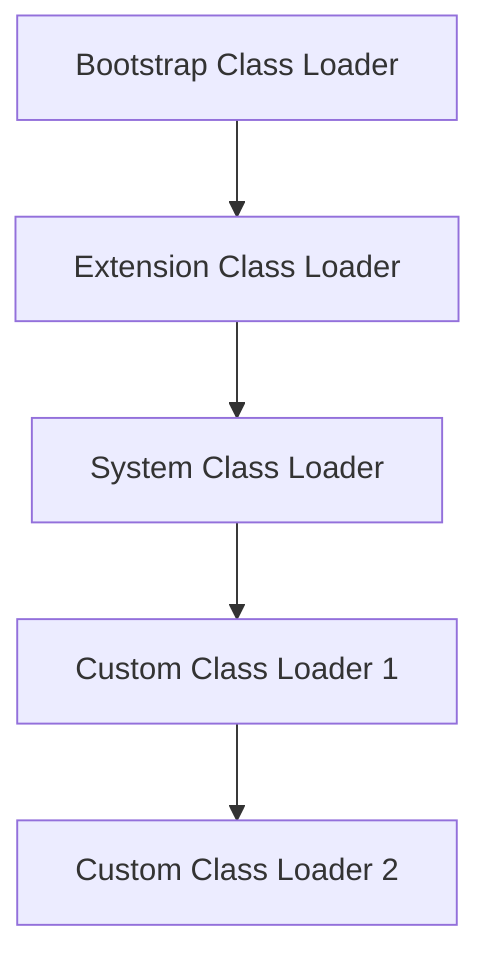

# JVM Internals & Class Loading

## Overview

The Java Virtual Machine (JVM) is the runtime environment that executes Java bytecode. Understanding JVM internals and the class loading mechanism is crucial for Java developers to optimize performance, troubleshoot issues, and write efficient code. This topic covers the JVM architecture, class loading process, and related concepts.

## Detailed Explanation

### JVM Architecture

The JVM consists of several key components:

1. **Class Loader Subsystem:** Loads class files into memory
2. **Runtime Data Areas:** Method Area, Heap, Java Stack, PC Registers, Native Method Stack
3. **Execution Engine:** Interprets or compiles bytecode for execution
4. **JNI (Java Native Interface):** Allows interaction with native code
5. **Garbage Collector:** Manages memory automatically

```mermaid
graph TD
    A[Java Source Code] --> B[Java Compiler]
    B --> C[Bytecode (.class files)]
    C --> D[Class Loader]
    D --> E[Runtime Data Areas]
    E --> F[Execution Engine]
    F --> G[Operating System]
```

### Class Loading Process

Class loading is the process of loading class files into JVM memory. It involves three main steps:

1. **Loading:** Finding and importing the binary data of a class
2. **Linking:** 
   - Verification: Ensuring the bytecode is valid
   - Preparation: Allocating memory for class variables
   - Resolution: Converting symbolic references to direct references
3. **Initialization:** Executing static initializers and assigning initial values

### Types of Class Loaders

Java uses a hierarchical class loading mechanism:

1. **Bootstrap Class Loader:** Loads core Java classes (rt.jar, etc.)
2. **Extension Class Loader:** Loads classes from extension directories
3. **System/Application Class Loader:** Loads classes from classpath
4. **Custom Class Loaders:** User-defined class loaders



### Runtime Data Areas

- **Method Area:** Stores class-level information, static variables, method data
- **Heap:** Stores objects and instance variables
- **Java Stack:** Stores method calls, local variables, partial results
- **PC Registers:** Holds the address of the current instruction
- **Native Method Stack:** Supports native method execution

## Real-world Examples & Use Cases

- **Plugin Systems:** Custom class loaders for loading plugins dynamically
- **Application Servers:** Isolated class loading for different web applications
- **Hot Deployment:** Reloading classes without restarting the application
- **Security:** Sandboxing untrusted code with custom class loaders

## Code Examples

### Custom Class Loader

```java
import java.io.ByteArrayOutputStream;
import java.io.File;
import java.io.FileInputStream;
import java.io.IOException;

public class CustomClassLoader extends ClassLoader {
    
    private String classPath;
    
    public CustomClassLoader(String classPath) {
        this.classPath = classPath;
    }
    
    @Override
    protected Class<?> findClass(String name) throws ClassNotFoundException {
        byte[] classData = loadClassData(name);
        if (classData == null) {
            throw new ClassNotFoundException("Class " + name + " not found");
        }
        return defineClass(name, classData, 0, classData.length);
    }
    
    private byte[] loadClassData(String className) {
        String fileName = classPath + File.separator + className.replace('.', File.separatorChar) + ".class";
        try (FileInputStream fis = new FileInputStream(fileName);
             ByteArrayOutputStream baos = new ByteArrayOutputStream()) {
            
            int b;
            while ((b = fis.read()) != -1) {
                baos.write(b);
            }
            return baos.toByteArray();
        } catch (IOException e) {
            return null;
        }
    }
    
    public static void main(String[] args) {
        CustomClassLoader loader = new CustomClassLoader("path/to/classes");
        try {
            Class<?> clazz = loader.loadClass("com.example.MyClass");
            Object instance = clazz.newInstance();
            System.out.println("Loaded class: " + clazz.getName());
        } catch (Exception e) {
            e.printStackTrace();
        }
    }
}
```

### Class Loading Demonstration

```java
public class ClassLoadingDemo {
    
    static {
        System.out.println("Static block executed during class loading");
    }
    
    public static void main(String[] args) {
        System.out.println("Main method executed");
        
        // Demonstrate different class loaders
        System.out.println("Bootstrap Class Loader: " + String.class.getClassLoader());
        System.out.println("System Class Loader: " + ClassLoadingDemo.class.getClassLoader());
        System.out.println("Parent Class Loader: " + ClassLoadingDemo.class.getClassLoader().getParent());
    }
}
```

### Memory Areas Example

```java
public class MemoryDemo {
    
    private int instanceVariable; // Stored in Heap
    private static int staticVariable; // Stored in Method Area
    
    public void method() {
        int localVariable = 10; // Stored in Java Stack
        System.out.println("Local variable: " + localVariable);
    }
    
    public static void main(String[] args) {
        MemoryDemo obj = new MemoryDemo(); // Object created in Heap
        obj.method();
        
        System.out.println("Static variable: " + staticVariable);
    }
}
```

## Common Pitfalls & Edge Cases

- **ClassNotFoundException vs NoClassDefFoundError:** Understanding the difference is crucial for debugging
- **Class Loader Leaks:** Can cause memory leaks in long-running applications
- **Circular Dependencies:** Can cause StackOverflowError during initialization
- **Security Issues:** Malicious code can exploit custom class loaders

## Tools & Libraries

- **JVM Tools:** jps, jstat, jmap, jstack for monitoring JVM internals
- **VisualVM:** GUI tool for JVM monitoring and profiling
- **JConsole:** JMX-based monitoring tool

## References

- [Oracle JVM Documentation](https://docs.oracle.com/javase/8/docs/technotes/guides/vm/index.html)
- [Java Language Specification - Chapter 12: Execution](https://docs.oracle.com/javase/specs/jls/se17/html/jls-12.html)
- [Baeldung - JVM Internals](https://www.baeldung.com/jvm)

## Github-README Links & Related Topics

- [Java Memory Management](../java-memory-management/README.md)
- [Garbage Collection Algorithms](../garbage-collection-algorithms/README.md)
- [JVM Performance Tuning](../jvm-performance-tuning/README.md)
- [Class Loading Mechanism](../class-loading-mechanism/README.md)