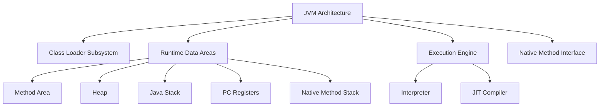
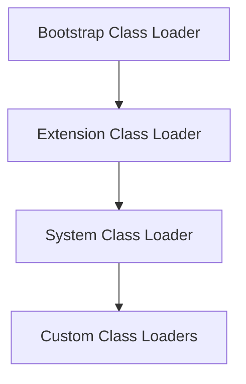

# JVM Internals & Class Loading

## Overview

The Java Virtual Machine (JVM) is the runtime environment that executes Java bytecode. Understanding JVM internals and the class loading mechanism is crucial for Java developers to optimize performance, troubleshoot issues, and implement advanced features like custom class loaders.

## Detailed Explanation

### JVM Architecture

The JVM consists of several key components:

- **Class Loader Subsystem:** Loads class files into memory
- **Runtime Data Areas:** Method area, heap, stack, PC registers, native method stacks
- **Execution Engine:** Interprets or JIT-compiles bytecode
- **Native Interface:** Interacts with native libraries



### Class Loading Process

Class loading occurs in three main phases:

1. **Loading:** Finding and importing the binary data of a class
2. **Linking:** 
   - Verification: Ensuring the bytecode is valid
   - Preparation: Allocating memory for class variables
   - Resolution: Converting symbolic references to direct references
3. **Initialization:** Executing static initializers and assigning initial values

### Class Loader Hierarchy

Java uses a hierarchical class loading mechanism:

- **Bootstrap Class Loader:** Loads core Java classes (rt.jar)
- **Extension Class Loader:** Loads extension classes (jre/lib/ext)
- **System/Application Class Loader:** Loads application classes



### Class Loader Delegation Model

When loading a class, the JVM follows this delegation hierarchy:
1. Check if the class is already loaded
2. Delegate to parent class loader
3. If parent can't load, attempt to load itself

This ensures security and prevents loading malicious classes.

## Real-world Examples & Use Cases

- **Plugin Systems:** Custom class loaders for loading plugins dynamically
- **Application Servers:** Isolated class loading for different web applications
- **Hot Deployment:** Reloading classes without restarting the JVM
- **OSGi Frameworks:** Modular class loading for component-based systems

## Code Examples

### Basic Class Loading Example

```java
public class ClassLoadingExample {
    public static void main(String[] args) {
        try {
            // Load a class dynamically
            Class<?> clazz = Class.forName("java.lang.String");
            System.out.println("Class loaded: " + clazz.getName());
            
            // Get class loader information
            ClassLoader classLoader = clazz.getClassLoader();
            System.out.println("Class Loader: " + classLoader);
            
        } catch (ClassNotFoundException e) {
            e.printStackTrace();
        }
    }
}
```

### Custom Class Loader

```java
import java.io.ByteArrayOutputStream;
import java.io.IOException;
import java.io.InputStream;
import java.net.URL;
import java.net.URLClassLoader;

public class CustomClassLoader extends URLClassLoader {
    
    public CustomClassLoader(URL[] urls) {
        super(urls);
    }
    
    @Override
    protected Class<?> findClass(String name) throws ClassNotFoundException {
        try {
            // Custom loading logic
            byte[] classData = loadClassData(name);
            if (classData == null) {
                throw new ClassNotFoundException(name);
            }
            return defineClass(name, classData, 0, classData.length);
        } catch (IOException e) {
            throw new ClassNotFoundException(name, e);
        }
    }
    
    private byte[] loadClassData(String className) throws IOException {
        String path = className.replace('.', '/') + ".class";
        try (InputStream inputStream = getResourceAsStream(path);
             ByteArrayOutputStream outputStream = new ByteArrayOutputStream()) {
            if (inputStream == null) {
                return null;
            }
            byte[] buffer = new byte[4096];
            int bytesRead;
            while ((bytesRead = inputStream.read(buffer)) != -1) {
                outputStream.write(buffer, 0, bytesRead);
            }
            return outputStream.toByteArray();
        }
    }
    
    public static void main(String[] args) {
        try {
            URL[] urls = {new URL("file:///path/to/classes/")};
            CustomClassLoader loader = new CustomClassLoader(urls);
            
            // Load a class using custom loader
            Class<?> clazz = loader.loadClass("com.example.MyClass");
            System.out.println("Loaded class: " + clazz.getName());
            
        } catch (Exception e) {
            e.printStackTrace();
        }
    }
}
```

### Inspecting Class Loaders

```java
public class ClassLoaderInspection {
    public static void main(String[] args) {
        ClassLoader current = ClassLoaderInspection.class.getClassLoader();
        
        while (current != null) {
            System.out.println("Class Loader: " + current);
            System.out.println("Parent: " + current.getParent());
            current = current.getParent();
        }
        
        // Bootstrap class loader
        System.out.println("Bootstrap Class Loader: " + String.class.getClassLoader());
    }
}
```

## References

- [Oracle JVM Documentation](https://docs.oracle.com/javase/8/docs/technotes/guides/vm/index.html)
- [Java Class Loading - Baeldung](https://www.baeldung.com/java-classloaders)
- [JVM Internals - GeeksforGeeks](https://www.geeksforgeeks.org/jvm-works-jvm-architecture/)
- [Understanding Class Loaders - Oracle](https://docs.oracle.com/javase/tutorial/ext/basics/load.html)

## Github-README Links & Related Topics

- [Java Fundamentals](../java-fundamentals/)
- [Garbage Collection Algorithms](../garbage-collection-algorithms/)
- [JVM Performance Tuning](../jvm-performance-tuning/)
- [Java Memory Management](../java-memory-management/)
