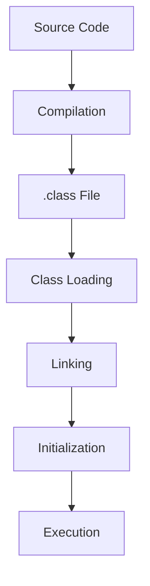

# JVM Internals & Class Loading

## Overview

The Java Virtual Machine (JVM) is the runtime environment for Java applications. Class loading is the process by which Java classes are loaded into the JVM's memory. Understanding JVM internals and class loading is essential for performance tuning and debugging.

## Detailed Explanation

### JVM Architecture

The JVM consists of the Class Loader Subsystem, Runtime Data Areas (Heap, Stack, Method Area), Execution Engine, and JNI.

### Class Loading Process

1. **Loading**: Finding and importing the binary data of a class.
2. **Linking**: Verifying, preparing, and resolving.
3. **Initialization**: Executing static initializers.

### Types of Class Loaders

- **Bootstrap Class Loader**: Loads core Java classes.
- **Extension Class Loader**: Loads extension classes.
- **System/Application Class Loader**: Loads application classes.

## Real-world Examples & Use Cases

- Custom class loaders for dynamic plugin loading in applications like IDEs.
- Understanding class loading in web servers for hot deployment.

## Code Examples

```java
// Custom Class Loader
public class CustomClassLoader extends ClassLoader {
    @Override
    public Class<?> findClass(String name) throws ClassNotFoundException {
        // Implement custom loading logic
        return super.findClass(name);
    }
}
```

## Journey / Sequence



## References

- [Oracle JVM Architecture](https://docs.oracle.com/javase/specs/jvms/se8/html/jvms-2.html)
- [Baeldung Class Loading](https://www.baeldung.com/java-classloaders)

## Github-README Links & Related Topics

- [Java Fundamentals](../java-fundamentals)
- [Garbage Collection Algorithms](../garbage-collection-algorithms)
