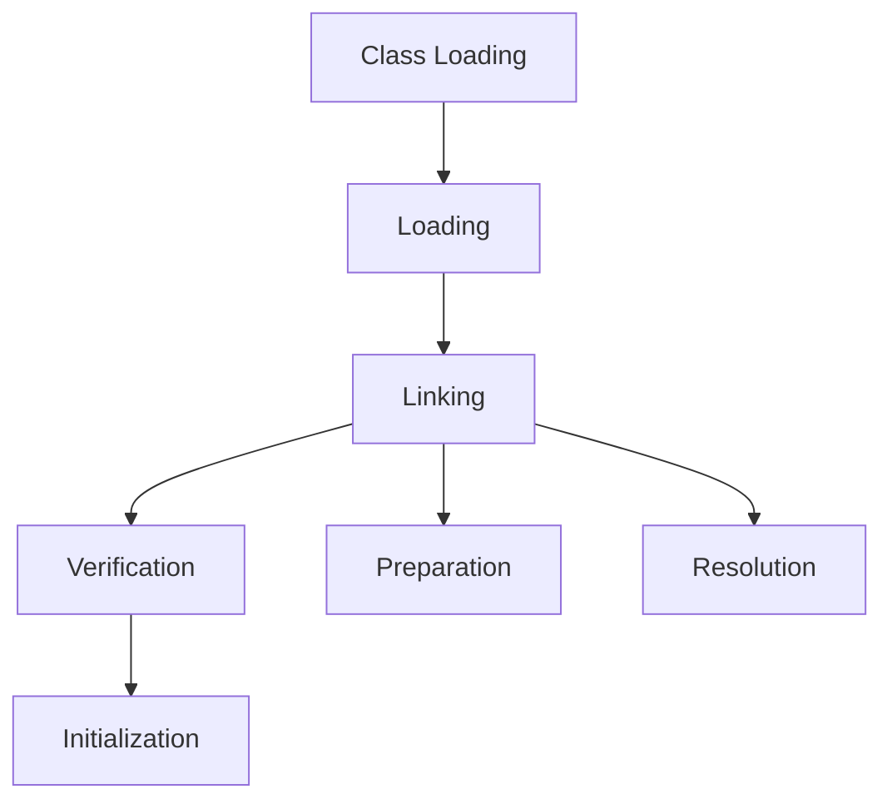

# JVM Internals & Class Loading

## Overview

The Java Virtual Machine (JVM) is the runtime environment that executes Java bytecode. Class loading is the process by which the JVM loads, links, and initializes classes at runtime.

## Detailed Explanation

### JVM Architecture

- **Class Loader Subsystem**: Loads classes into memory.

- **Runtime Data Areas**: Method area, heap, stack, PC registers, native method stacks.

- **Execution Engine**: Interprets or JIT compiles bytecode.

- **Native Interface**: Interacts with native libraries.

### Class Loading Process

1. **Loading**: Finding and importing the binary data of a class.

2. **Linking**: Verifying, preparing, and resolving symbolic references.

3. **Initialization**: Executing static initializers.

### Types of Class Loaders

- **Bootstrap Class Loader**: Loads core Java classes.

- **Extension Class Loader**: Loads extension classes.

- **System/Application Class Loader**: Loads application classes.



## Real-world Examples & Use Cases

- **Dynamic Loading**: Loading plugins at runtime.

- **Modular Applications**: Using custom class loaders for isolation.

- **Hot Swapping**: Reloading classes in development.

## Code Examples

### Custom Class Loader

```java
public class CustomClassLoader extends ClassLoader {
    @Override
    public Class<?> findClass(String name) throws ClassNotFoundException {
        // Custom loading logic
        return super.findClass(name);
    }
}
```

### Class Loading Example

```java
public class ClassLoadingExample {
    public static void main(String[] args) {
        try {
            Class<?> clazz = Class.forName("java.lang.String");
            System.out.println("Class loaded: " + clazz.getName());
        } catch (ClassNotFoundException e) {
            e.printStackTrace();
        }
    }
}
```

## References

- [Oracle JVM Specification](https://docs.oracle.com/javase/specs/jvms/se8/html/)
- [Baeldung Class Loading](https://www.baeldung.com/java-classloaders)

## Github-README Links & Related Topics

- [Java Fundamentals](java-fundamentals/)
- [JVM Memory Model](jvm-memory-model/)
- [Class Loading Mechanism](class-loading-mechanism/)
