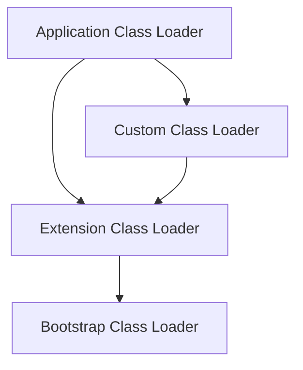

# Overview

The Java Virtual Machine (JVM) is responsible for loading, linking, and initializing classes and interfaces in Java applications. Class loading is the process by which the JVM finds and loads class files into memory, making them available for execution. Understanding JVM internals and class loading is crucial for Java developers to optimize performance, troubleshoot issues, and write efficient code.

# Detailed Explanation

## JVM Architecture Overview

The JVM consists of several key components:

- **Class Loader Subsystem**: Loads class files into memory
- **Runtime Data Areas**: Method area, heap, stack, PC registers, native method stacks
- **Execution Engine**: Executes bytecode using interpreter or JIT compiler
- **Native Interface**: Interacts with native libraries

## Class Loading Process

Class loading involves three main phases: Loading, Linking, and Initialization.

### Loading Phase

During loading, the JVM:

1. Reads the class file into memory
2. Creates a `Class` object representing the class
3. Loads all referenced classes

```java
public class ClassLoadingExample {
    public static void main(String[] args) {
        // This triggers loading of String and System classes
        System.out.println("Hello World");
    }
}
```

### Linking Phase

Linking consists of three sub-phases:

#### Verification
- Ensures the class file is structurally correct
- Checks bytecode for validity
- Verifies type safety

#### Preparation
- Allocates memory for static fields
- Initializes static fields to default values
- Creates method tables

#### Resolution
- Resolves symbolic references to actual memory locations
- Loads referenced classes if not already loaded

### Initialization Phase

- Executes static initializers
- Initializes static fields to their specified values
- Runs static blocks in the order they appear

```java
public class InitializationExample {
    static {
        System.out.println("Static block executed");
    }
    
    static int value = 42;
    
    public static void main(String[] args) {
        System.out.println("Value: " + value);
    }
}
// Output:
// Static block executed
// Value: 42
```

## Class Loaders

Java uses a hierarchical class loader system:

### Bootstrap Class Loader
- Loads core Java classes (rt.jar, etc.)
- Written in native code
- Loads classes from JAVA_HOME/jre/lib

### Extension Class Loader
- Loads extension classes
- Loads from JAVA_HOME/jre/lib/ext

### System/Application Class Loader
- Loads application classes
- Loads from classpath

### Custom Class Loaders
- User-defined class loaders
- Can implement custom loading strategies

```java
public class CustomClassLoader extends ClassLoader {
    @Override
    public Class<?> findClass(String name) throws ClassNotFoundException {
        // Custom loading logic
        byte[] classData = loadClassData(name);
        if (classData == null) {
            throw new ClassNotFoundException();
        }
        return defineClass(name, classData, 0, classData.length);
    }
    
    private byte[] loadClassData(String name) {
        // Implementation to load class bytes
        return null;
    }
}
```

## Class Loading Delegation Model

Class loaders follow a delegation hierarchy:

1. When a class loader is asked to load a class, it first delegates to its parent
2. If parent can't load, it attempts to load itself
3. This ensures core classes are loaded by bootstrap loader



## Run-Time Constant Pool

The JVM maintains a run-time constant pool for each class:

- Stores constants and symbolic references
- Used during resolution phase
- Contains entries like class references, field references, method references

## Loading Constraints

Loading constraints ensure type safety across class loaders:

- Prevent type confusion when multiple class loaders load the same class
- Enforced during preparation and resolution
- Violations result in `LinkageError`

## Modules and Layers (Java 9+)

Java 9 introduced the module system:

- Classes are organized into modules
- Each module declares dependencies and exports
- Class loaders work within module boundaries

```java
// module-info.java
module com.example.myapp {
    requires java.base;
    requires com.example.library;
    
    exports com.example.myapp.api;
}
```

# Real-world Examples & Use Cases

## Dynamic Class Loading

```java
public class DynamicLoader {
    public static void main(String[] args) throws Exception {
        // Load class dynamically
        Class<?> clazz = Class.forName("com.example.MyClass");
        
        // Create instance
        Object instance = clazz.getDeclaredConstructor().newInstance();
        
        // Invoke method
        Method method = clazz.getMethod("sayHello");
        method.invoke(instance);
    }
}

class MyClass {
    public void sayHello() {
        System.out.println("Hello from dynamically loaded class!");
    }
}
```

## Plugin Architecture

```java
public interface Plugin {
    void execute();
}

public class PluginManager {
    private List<Plugin> plugins = new ArrayList<>();
    
    public void loadPlugin(String pluginClassName) throws Exception {
        Class<?> clazz = Class.forName(pluginClassName);
        Plugin plugin = (Plugin) clazz.getDeclaredConstructor().newInstance();
        plugins.add(plugin);
    }
    
    public void executeAllPlugins() {
        for (Plugin plugin : plugins) {
            plugin.execute();
        }
    }
}

// Usage
public class PluginLoaderExample {
    public static void main(String[] args) throws Exception {
        PluginManager manager = new PluginManager();
        
        // Load plugins dynamically
        manager.loadPlugin("com.example.LoggingPlugin");
        manager.loadPlugin("com.example.SecurityPlugin");
        
        manager.executeAllPlugins();
    }
}
```

## Class Loader Isolation

```java
public class IsolatedClassLoader extends URLClassLoader {
    public IsolatedClassLoader(URL[] urls) {
        super(urls);
    }
    
    @Override
    protected Class<?> loadClass(String name, boolean resolve) throws ClassNotFoundException {
        // Check if class is already loaded
        Class<?> loadedClass = findLoadedClass(name);
        if (loadedClass != null) {
            return loadedClass;
        }
        
        // Try to load application classes ourselves
        if (name.startsWith("com.example.app")) {
            return findClass(name);
        }
        
        // Delegate to parent for everything else
        return super.loadClass(name, resolve);
    }
}
```

# Code Examples

## Class Loading Lifecycle

```java
public class ClassLoadingLifecycle {
    static {
        System.out.println("1. Static initializer block");
    }
    
    {
        System.out.println("2. Instance initializer block");
    }
    
    public ClassLoadingLifecycle() {
        System.out.println("3. Constructor");
    }
    
    public static void main(String[] args) {
        System.out.println("4. Main method start");
        new ClassLoadingLifecycle();
        System.out.println("5. Main method end");
    }
}

// Output:
// 1. Static initializer block
// 4. Main method start
// 2. Instance initializer block
// 3. Constructor
// 5. Main method end
```

## Custom Class Loader Example

```java
public class EncryptedClassLoader extends ClassLoader {
    private String key;
    
    public EncryptedClassLoader(String key) {
        this.key = key;
    }
    
    @Override
    protected Class<?> findClass(String name) throws ClassNotFoundException {
        try {
            // Load encrypted class data
            byte[] encryptedData = loadEncryptedClassData(name);
            
            // Decrypt the data
            byte[] classData = decrypt(encryptedData, key);
            
            // Define the class
            return defineClass(name, classData, 0, classData.length);
        } catch (Exception e) {
            throw new ClassNotFoundException(name, e);
        }
    }
    
    private byte[] loadEncryptedClassData(String name) {
        // Implementation to load encrypted class files
        return new byte[0];
    }
    
    private byte[] decrypt(byte[] data, String key) {
        // Simple XOR decryption for demonstration
        byte[] result = new byte[data.length];
        byte keyByte = (byte) key.hashCode();
        
        for (int i = 0; i < data.length; i++) {
            result[i] = (byte) (data[i] ^ keyByte);
        }
        
        return result;
    }
}
```

## Class Loader Hierarchy Demonstration

```java
public class ClassLoaderHierarchy {
    public static void main(String[] args) {
        // Get class loaders for different classes
        ClassLoader systemLoader = ClassLoader.getSystemClassLoader();
        ClassLoader extensionLoader = systemLoader.getParent();
        ClassLoader bootstrapLoader = extensionLoader.getParent();
        
        System.out.println("System Class Loader: " + systemLoader);
        System.out.println("Extension Class Loader: " + extensionLoader);
        System.out.println("Bootstrap Class Loader: " + bootstrapLoader);
        
        // Check which loader loaded specific classes
        System.out.println("String loaded by: " + String.class.getClassLoader());
        System.out.println("ClassLoaderHierarchy loaded by: " + ClassLoaderHierarchy.class.getClassLoader());
    }
}
```

# Common Pitfalls & Edge Cases

## ClassNotFoundException vs NoClassDefFoundError

```java
public class ClassLoadingErrors {
    public static void main(String[] args) {
        try {
            // This throws ClassNotFoundException
            Class.forName("com.example.NonExistentClass");
        } catch (ClassNotFoundException e) {
            System.out.println("Class not found: " + e.getMessage());
        }
        
        try {
            // This might throw NoClassDefFoundError if class was
            // available at compile time but not at runtime
            Class<?> clazz = com.example.CompiledButMissingClass.class;
        } catch (NoClassDefFoundError e) {
            System.out.println("Class definition not found: " + e.getMessage());
        }
    }
}
```

## Static Initialization Order

```java
public class StaticInitOrder {
    static {
        System.out.println("A static block");
    }
    
    static int a = initA();
    
    static {
        System.out.println("B static block");
    }
    
    static int b = initB();
    
    static int initA() {
        System.out.println("Initializing A");
        return 1;
    }
    
    static int initB() {
        System.out.println("Initializing B");
        return 2;
    }
    
    public static void main(String[] args) {
        System.out.println("Main method");
    }
}

// Output:
// A static block
// Initializing A
// B static block
// Initializing B
// Main method
```

## Class Loader Memory Leaks

```java
public class ClassLoaderLeak {
    public static void main(String[] args) throws Exception {
        while (true) {
            // Create a new class loader each time
            URLClassLoader loader = new URLClassLoader(new URL[]{});
            
            // Load a class
            Class<?> clazz = loader.loadClass("java.lang.String");
            
            // The class loader cannot be garbage collected
            // because the loaded class holds a reference to it
            // This can cause memory leaks in application servers
            
            // Don't do this in production code!
            Thread.sleep(1000);
        }
    }
}
```

# Tools & Libraries

## JVM Diagnostic Tools

- **jcmd**: Send diagnostic commands to JVM
- **jconsole**: GUI monitoring tool
- **jvisualvm**: Advanced profiling and monitoring
- **jmap**: Memory map tool
- **jstack**: Stack trace tool

## Class Loading Monitoring

```bash
# Enable class loading verbose output
java -verbose:class MyApplication

# Monitor with jcmd
jcmd <pid> VM.classloader_stats
jcmd <pid> VM.class_hierarchy
```

## Bytecode Analysis Tools

- **javap**: Java class file disassembler
- **ASM**: Bytecode manipulation library
- **Byte Buddy**: Code generation library

# References

- [Java Virtual Machine Specification: Chapter 5 - Loading, Linking, and Initializing](https://docs.oracle.com/javase/specs/jvms/se21/html/jvms-5.html)
- [Oracle Java Tutorials: Understanding ClassLoaders](https://docs.oracle.com/javase/tutorial/ext/basics/load.html)
- [JVM Internals](https://shipilev.net/jvm/)

# Github-README Links & Related Topics

- [java-fundamentals](java-fundamentals/)
- [jvm-memory-management](jvm-memory-management/)
- [garbage-collection-algorithms](garbage-collection-algorithms/)
- [java-modules](java-modules/)
