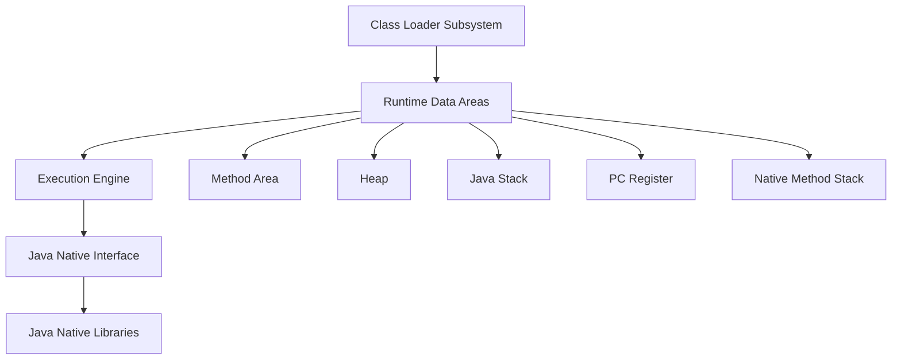

# JVM Internals & Class Loading

## Overview
The Java Virtual Machine (JVM) is the runtime environment that executes Java bytecode. Understanding JVM internals and the class loading mechanism is crucial for Java developers to optimize performance, troubleshoot issues, and write efficient code.

## Detailed Explanation

### JVM Architecture
The JVM consists of several key components:



- **Class Loader Subsystem**: Loads class files into memory
- **Runtime Data Areas**: Memory areas used during program execution
- **Execution Engine**: Executes the bytecode
- **Java Native Interface (JNI)**: Interface for native methods
- **Java Native Libraries**: Platform-specific libraries

### Class Loading Process
Class loading is the process of loading class files into the JVM memory. It involves three main steps:

1. **Loading**: Finding and importing the binary data of a class
2. **Linking**: 
   - Verification: Ensuring the correctness of the bytecode
   - Preparation: Allocating memory for class variables
   - Resolution: Converting symbolic references to direct references
3. **Initialization**: Executing static initializers and assigning initial values

### Types of Class Loaders
- **Bootstrap Class Loader**: Loads core Java classes (rt.jar)
- **Extension Class Loader**: Loads classes from extension directories
- **System/Application Class Loader**: Loads classes from classpath

## Real-world Examples & Use Cases
- **Application Startup**: Understanding class loading helps in optimizing application startup time
- **Plugin Systems**: Custom class loaders for loading plugins dynamically
- **Hot Swapping**: In development environments for code changes without restart
- **Security**: Class loader isolation for sandboxing untrusted code

## Code Examples

### Custom Class Loader
```java
public class CustomClassLoader extends ClassLoader {
    @Override
    public Class<?> findClass(String name) throws ClassNotFoundException {
        byte[] b = loadClassFromFile(name);
        return defineClass(name, b, 0, b.length);
    }
    
    private byte[] loadClassFromFile(String fileName) {
        // Implementation to load class bytes from file
        // This is a simplified example
        return new byte[0];
    }
}
```

### Class Loading Demonstration
```java
public class ClassLoadingDemo {
    public static void main(String[] args) {
        System.out.println("Class Loading Demo");
        
        // Print class loader hierarchy
        ClassLoader cl = ClassLoadingDemo.class.getClassLoader();
        while (cl != null) {
            System.out.println(cl);
            cl = cl.getParent();
        }
    }
}
```

## Common Pitfalls & Edge Cases
- **ClassNotFoundException**: When a class cannot be found
- **NoClassDefFoundError**: When a class was available at compile time but not at runtime
- **Class loading deadlocks**: In multi-threaded environments
- **Memory leaks**: Due to improper class loader management in long-running applications

## References
- [JVM Specification](https://docs.oracle.com/javase/specs/jvms/se17/html/)
- [Oracle JVM Internals](https://docs.oracle.com/javase/8/docs/technotes/guides/vm/)
- "Inside the Java Virtual Machine" by Bill Venners

## Github-README Links & Related Topics
- [java-class-loaders](../java-class-loaders/)
- [garbage-collection-algorithms](../garbage-collection-algorithms/)
- [jvm-performance-tuning](../java/jvm-performance-tuning/)
