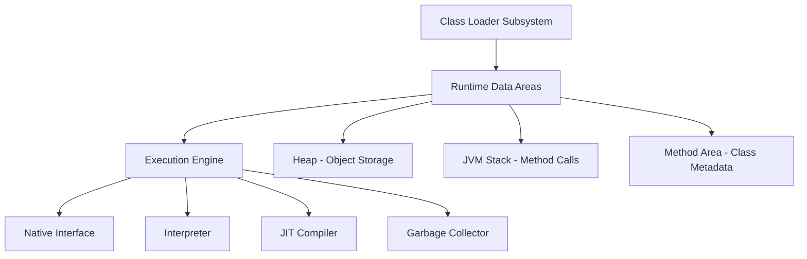
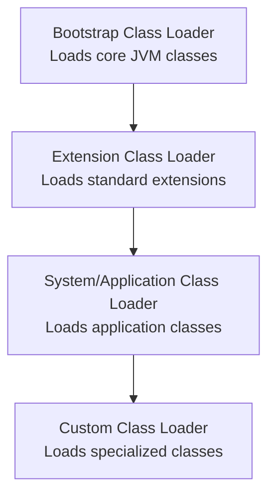

## Overview

The Java Virtual Machine (JVM) is the runtime environment that executes Java bytecode. JVM internals encompass its architecture, including memory management, execution engine, and garbage collection mechanisms. Class loading is a critical component of JVM internals, responsible for dynamically loading, linking, and initializing classes and interfaces at runtime. This process supports features like dynamic linking, runtime extensibility, and security through namespace isolation.

## Detailed Explanation

### JVM Architecture

The JVM is composed of several subsystems that work together to execute Java programs:

- **Class Loader Subsystem**: Responsible for loading class files, verifying bytecode, and preparing classes for execution.
- **Runtime Data Areas**: Divided into method area (for class metadata), heap (for objects), JVM stack (for method frames), program counter (for instruction tracking), and native method stacks.
- **Execution Engine**: Includes the interpreter (for initial execution), Just-In-Time (JIT) compiler (for performance optimization), and garbage collector (for memory management).
- **Native Interface**: Enables interaction with native libraries via JNI (Java Native Interface).



### Class Loading Process

Class loading in the JVM occurs in three interconnected phases: Loading, Linking, and Initialization. This process ensures classes are properly prepared for execution while maintaining security and performance.

#### Loading Phase
- The class loader locates the binary representation of the class (typically a .class file from the filesystem, network, or other sources).
- It reads the binary data and creates a `Class` object in the method area.
- If the class has dependencies, those are loaded recursively.

#### Linking Phase
- **Verification**: Checks that the bytecode is structurally correct, adheres to JVM specifications, and doesn't violate security constraints.
- **Preparation**: Allocates memory for static fields and initializes them to default values (e.g., 0 for primitives, null for references).
- **Resolution**: Converts symbolic references (e.g., method names) into direct references to actual memory locations or other classes.

#### Initialization Phase
- Executes the class's static initializer method (`<clinit>`), which sets static fields to their initial values and runs static blocks.
- Ensures thread-safe initialization using locks to prevent race conditions.

### Class Loader Hierarchy and Delegation Model

JVM employs a hierarchical class loader system with a delegation model to ensure security and avoid class conflicts:



| Class Loader | Description | Typical Load Sources | Parent |
|--------------|-------------|----------------------|--------|
| Bootstrap | Native code, loads essential JVM classes | `rt.jar`, `java.lang.*`, core APIs | None |
| Extension | Loads standard extensions and libraries | `jre/lib/ext`, endorsed standards | Bootstrap |
| System/Application | Loads application and library classes | `CLASSPATH`, application JARs | Extension |
| Custom | User-defined for specific requirements | Files, networks, databases, encrypted sources | System or other custom |

The delegation model works as follows:
1. When a class is requested, the loader delegates to its parent first.
2. If the parent can't load the class, the child attempts to load it.
3. This ensures core classes are loaded by trusted loaders and prevents malicious code from overriding system classes.

## Real-world Examples & Use Cases

- **Plugin Architectures**: IDEs like Eclipse and IntelliJ IDEA use custom class loaders to load plugins dynamically, allowing users to extend functionality without restarting the application.
- **Application Servers**: Web servers like Tomcat employ custom class loaders to isolate web applications, enabling different apps to use different versions of the same library without conflicts.
- **Hot Swapping in Development**: Tools like JRebel use class loaders to reload modified classes at runtime, speeding up the development cycle.
- **Security Sandboxes**: Applet containers and sandboxed environments load untrusted code with restricted class loaders to prevent access to sensitive system resources.
- **OSGi Frameworks**: Modular systems like Eclipse Equinox use sophisticated class loading to manage module dependencies and versions.
- **Dynamic Code Generation**: Libraries like ASM or Byte Buddy use custom class loaders to load generated bytecode at runtime for AOP (Aspect-Oriented Programming) or mocking frameworks.

## Code Examples

### Basic Custom Class Loader

```java
import java.io.ByteArrayOutputStream;
import java.io.IOException;
import java.io.InputStream;
import java.net.URL;
import java.net.URLClassLoader;

public class CustomClassLoader extends ClassLoader {
    private String basePath;

    public CustomClassLoader(String basePath) {
        this.basePath = basePath;
    }

    @Override
    protected Class<?> findClass(String name) throws ClassNotFoundException {
        try {
            byte[] classData = loadClassData(name);
            return defineClass(name, classData, 0, classData.length);
        } catch (IOException e) {
            throw new ClassNotFoundException("Could not load class: " + name, e);
        }
    }

    private byte[] loadClassData(String name) throws IOException {
        String path = basePath + "/" + name.replace('.', '/') + ".class";
        try (InputStream is = getClass().getResourceAsStream(path);
             ByteArrayOutputStream baos = new ByteArrayOutputStream()) {
            if (is == null) {
                throw new IOException("Class file not found: " + path);
            }
            byte[] buffer = new byte[4096];
            int bytesRead;
            while ((bytesRead = is.read(buffer)) != -1) {
                baos.write(buffer, 0, bytesRead);
            }
            return baos.toByteArray();
        }
    }

    public static void main(String[] args) throws Exception {
        CustomClassLoader loader = new CustomClassLoader("/custom/classes");
        Class<?> clazz = loader.loadClass("com.example.MyClass");
        Object instance = clazz.getDeclaredConstructor().newInstance();
        System.out.println("Loaded and instantiated: " + instance.getClass().getName());
    }
}
```

### Inspecting Class Loader Hierarchy

```java
public class ClassLoaderHierarchy {
    public static void main(String[] args) {
        ClassLoader current = ClassLoaderHierarchy.class.getClassLoader();
        System.out.println("Class Loader Hierarchy:");
        while (current != null) {
            System.out.println("  " + current.getClass().getName() + ": " + current);
            current = current.getParent();
        }
    }
}
```

### URL Class Loader Example

```java
import java.net.URL;
import java.net.URLClassLoader;

public class URLClassLoaderExample {
    public static void main(String[] args) throws Exception {
        URL[] urls = {new URL("file:///path/to/classes/")};
        URLClassLoader urlLoader = new URLClassLoader(urls);
        Class<?> clazz = urlLoader.loadClass("com.example.DynamicClass");
        Object instance = clazz.getDeclaredConstructor().newInstance();
        System.out.println("Loaded from URL: " + clazz.getName());
        urlLoader.close();
    }
}
```

### Handling Class Loading Exceptions

```java
public class ClassLoadingErrorHandling {
    public static void main(String[] args) {
        try {
            Class<?> clazz = Class.forName("com.example.NonExistentClass");
        } catch (ClassNotFoundException e) {
            System.err.println("Class not found: " + e.getMessage());
            // Handle: Check classpath, dependencies, etc.
        } catch (NoClassDefFoundError e) {
            System.err.println("Class definition not found: " + e.getMessage());
            // Handle: Class present at compile-time but missing at runtime
        } catch (ExceptionInInitializerError e) {
            System.err.println("Error in static initializer: " + e.getCause());
            // Handle: Issues in <clinit> method
        }
    }
}
```

## References

- [Java Virtual Machine Specification - Chapter 5: Loading, Linking, and Initializing](https://docs.oracle.com/javase/specs/jvms/se21/html/jvms-5.html)
- [Understanding Java Class Loaders](https://www.oracle.com/java/technologies/javase/classloaders.html)
- [The Java Virtual Machine Whitepaper](https://www.oracle.com/java/technologies/javase/jvm-whitepaper.html)
- [Baeldung: Java Class Loaders](https://www.baeldung.com/java-classloaders)
- [Oracle: The Class Loading Mechanism](https://docs.oracle.com/javase/tutorial/ext/basics/load.html)

## Github-README Links & Related Topics

- [Java Memory Management](../java-memory-management/README.md)
- [Garbage Collection Algorithms](../garbage-collection-algorithms/README.md)
- [JVM Performance Tuning](../java/jvm-performance-tuning/README.md)
- [Class Loading Mechanism](../../class-loading-mechanism/README.md)
- [Java Reflection](../java-reflection/README.md)
- [Java Memory Model and Concurrency](../java-memory-model-and-concurrency/README.md)